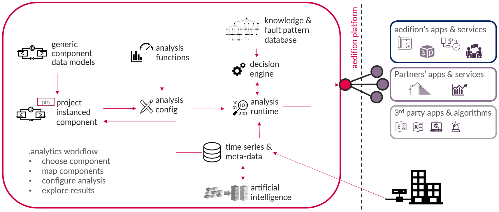

# aedifion.analytics

## Introduction

aedifion.analytics is a framework for data analytics of heating, ventilation & air conditioning \(HVAC\) systems, energy-related plants, buildings, as well as energy networks such as district heating and cooling grids. The framework has a special focus on scalable analytics of large sets of time series data.

The goal of aedifion.analytics is to support technicians and engineers who want to optimize \(or commission\) systems in terms of indoor comfort, energy efficiency, and maintenance and operation costs. For this purpose, aedifion.analytics aims at profound transparency and interpretation of system operation at a deep, data-driven level. aedifion continuously extends its scope.

 Its configuration and analysis workflow is straightforward:

1. [Instance components](aedifion.analytics.md#instance-components) of the energy system.
2. [Map datapoints](aedifion.analytics.md#mapping) to instanced components.
3. [Configure analysi](aedifion.analytics.md#configuring-analysis)s on instanced components.
4. Get and [explore analytics results](aedifion.analytics.md#explore-analysis-results).

Please refer to the figure below for a schematic overview of the aedifion.analytics framework.

In the following, we will explain first the ingredients and second the processes of aedifion.analytics. Finally we provide an application example and its various use cases.

## Technical overview

The framework aedifion.analytics consists of a [component data model](glossary.md#component-data-model) library, a library of [analysis functions](glossary.md#analysis-function), a knowledge & fault pattern database, a decision engine, an analysis configuration pattern, and an analysis runtime environment. Results are provided via API.

All required interaction is available via APIs. 

### Component data model library


_Short summary on terminology:_ 

* [Components ****](glossary.md#component)are virtual or logical objects within a building or energy-related plants, such as e.g. pumps, boilers, thermal zones, control loops and so forth.
* \*\*\*\*[Component data models](glossary.md#component-data-model) are generic data models of components.
* [Instanced components](glossary.md#instanced-component) are component data models instanced for a specific project. They can be [mapped ](aedifion.analytics.md#mapping)to adapt them to specific projects.
* [Mapping ](glossary.md#mapping)is the process of linking [datapoints ](glossary.md#datapoint)to [pins ](glossary.md#pin)of the component data model and adding meta data [tags](glossary.md#tag).


All contemporary available component ****data models are collected in the aedifion component data model library. The component data models needed for a specific project can be chosen from this library. As soon as a component gets [instanced](aedifion.analytics.md#instance-components) to a specific project, it can be [mapped](aedifion.analytics.md#mapping) to specify it for that project. [Configuring ](aedifion.analytics.md#configuring-analysis)an instanced component with [analysis functions ](aedifion.analytics.md#analysis-functions)enables its analysis.

_Learn more? Explore the_ [_available components_](engineers/specifications/analytics.md)_._

### Analysis functions

Analysis functions are granular and generic functions to analyse the operation of [components](glossary.md#component). The aedifion analysis function library inherits all contemporary available analysis functions within aedifion.analytics.

Analysis functions are available per component data model and get executed on [mapped ](glossary.md#mapping)[pins ](glossary.md#pin)and meta data of [instanced components](glossary.md#instanced-component). E.g., an analysis of plant cycles is available for several instanced components like heat pumps, air handling units, boilers and so forth. This analysis requires a [mapping ](aedifion.analytics.md#mapping)of the pin _operating message_ of the analyzed instanced component.

_Learn more? Explore the_ [_available analysis functions_](engineers/specifications/analytics.md)_._

### Analysis runtime

The analysis runtime is the engine which executes analysis determinations. It utilizes the [stream ](aedifion.io/features.md#stream-processing)and [batch ](aedifion.io/features.md#batch-processing)processing services of the aedifion.io platform and performs evaluations of the [analysis configuration](aedifion.analytics.md#configuring-analysis) on demand. If an interpretation of the analysis results is required, the analysis runime calls the [decision engine](aedifion.analytics.md#decision-engine).

### Decision engine

The decision engine is the part of the analytics process which interprets a determined analytics result. It takes digitized engineering knowledge from the [knowledge & fault pattern database](aedifion.analytics.md#knowledge-and-fault-pattern-database) into account in order to decide either the operation of the instanced components is okay, sub-optimal, faulty, dangerous, etc. Interpretations of the operational quality and recommendations on how to optimize it are based on this decision. 


_Example:_

* A heat pump cycles several times per hour.
* This can easily be identified via the KPI _number of cycles per hour_.
* The decision engine decides at which threshold value this is too frequent is made in the decision engine.
* If the decision is _too frequent_, recommendation on how to increase the cycle time is queried from the [knowledge & fault pattern database](aedifion.analytics.md#knowledge-and-fault-pattern-databse) by the decision engine.
* The decision and recommendations are returned to the [analytics runtime](aedifion.analytics.md#analysis-runtime).


### Knowledge & fault pattern database

The knowledge & fault pattern database is the gathered engineering knowledge used to interpret analysis results, identify faulty component operation and give recommendations of optimization measures.

## Process 

The aedifion.analytics framework process starts with _instancing a component_: assigning of a component data model __to a specific [project](glossary.md#project). An instanced component gets project individualized by _mapping the component_ which assigns [datapoints ](glossary.md#datapoint)and meta data to the instanced component. _Configuring an analysis_ describes the process of choosing analysis functions which shall be run on the instanced component. _Exploring results_ demonstrates how to query results from a configured analysis and how to explore them.

### Instancing a component

Instancing a component describes the process of assigning a generic [component data model](glossary.md#component-model) to a specific [project](glossary.md#project). Colloquially expressed: Choose the [components ](glossary.md#component)of your [building/project](glossary.md#project) from the [component data model library](aedifion.analytics.md#component-data-model-library).

### Mapping a component

Mapping a component is the process which individualizes the generic [instanced component](glossary.md#instanced-component) data model for a specific project. This comprise linking [datapoints, ](glossary.md#datapoint)respectively their time series,to the [pins ](glossary.md#pin)of the instanced component and adding meta data [tags](glossary.md#tag) to it. A mapped component is ready for analysis.


[Ingested ](aedifion.io/features.md#data-ingress)as well as [AI-generated](aedifion.io/features.md#ai-generated-meta-data) meta data can be used to support the mapping, especially the linking of datapoints and pins.


### Configuring an analysis

Configuring analysis is the process to individualize the analysis which should be run on an [instanced component](glossary.md#instanced-component). Choices are:

* Which [analysis functions](aedifion.analytics.md#analysis-functions) shall be run on the component? This can be a subset of the analysis functions available for the [component data model](glossary.md#component-data-model).
* It is possible to define several configurations on the same instanced component and thus create individual analysis sets.
* Advanced settings: analyse multi-time intervals. This option allows to perform analyses over a fixed number of time intervals, a fixed interval length or a combination of both. 
  * _Learn more on multi-time intervals? Try the_ [_API tutorial_](developers/api-documentation/guides-and-tutorials/analytics.md)_._

The analysis configuration will be passed to the [analytics runtime](aedifion.analytics.md#analysis-runtime) when [analysis results](aedifion.analytics.md#results) of this configuration are queried.

### Exploring results

Querying results is easy: Choose a start and end time and an [analysis config](aedifion.analytics.md#configuring-an-analysis) which shall be executed. The [analytics runtime](aedifion.analytics.md#analysis-runtime) will evaluate the [analysis functions](aedifion.analytics.md#analysis-functions) of the config and return its results within the next seconds.

Depending on the utilized analysis functions, the result type differentiates. A set of key performance indicators, restructured or virtually determined time series, qualitative evaluations - e.g. in traffic light colors -, notification types, interpretations and recommendations is returned.

**Key performance indicators:** Known indicators from engineering and thermodynamics in order to get a quick, comparable overview over a components operation and performance, e.g., the coefficient of performance.

**Restructured time series:** Restructuring time series helps to focus on a certain aspect of the time series and allows visual analysis of this aspect. E.g., the overall load distribution of a component can easily be analysed via a load duration graph which is just a restructured power time series.

**Virtually determined time series:** Some analysis functions determine time series via mathematical correlations. E.g., a fluid heat flux via two temperature sensors, a volume flow sensor, and knowledge of the fluid medium.

**Qualitative evaluation:** Sometimes _green_, _yellow_, _red_ is all what is required to get an overview over the components operation.

**Notification types:** Notification types help to priorities results. They come in the dimensions _indoor comfort_, _energy efficiency_, _maintenance_, and _system integration_ with the escalation information _ok_, _notice_, _warning_, _and critical_.

**Interpretation:** This is the interpretation of the analysis results by the decision machine. E.g., "The component is pulsing in extremely high frequency."

**Recommendation:** This is the recommendation of optimization measures given by the decision engine. E.g., "Reduce component pulsing by throttling the output heat power. Throttling can be realized by partial-load operation of the component or installation of an input power choke."

Learn more? _Explore the_ [_available analysis functions_](engineers/specifications/analytics.md)_._

## Example

_School A_ has extraordinary high primary energy consumption for heating. A technician is asked to optimize this system. After the technician plug and play installed [aedifion.io ](aedifion.io/)at _School A_, the analysis of the building can start: One condensing boiler, and three heat distribution circuits shall be analysed.

The technician adds one _boiler_, and three _heating loop_ [component data models](glossary.md#component-data-model) to the _School A_ project and [maps ](glossary.md#mapping)the [datapoints](glossary.md#datapoint) to the [pins ](glossary.md#pin)of the [instanced components ](glossary.md#instanced-component)- supported by the provided meta data on data points. Since the technician suspects something might be wrong with the temperature levels, the _set-point compliance_ analysis function is run on the heat distribution circuits and on the boiler.

The analysis results confirm the assumption: All three circuits exceed their temperature levels while the boiler meets its set-point temperature quiet fine. The reason for that is identified by the decision engine of aedifion.analytics: The heating curve of the boiler is not designed according to demand. Therefore, the analytics results recommend an adjustment of the heat curve which the technician does right away.

This means that not only can the boiler be operated with a significantly lower load, but also overheating of the classrooms can also be avoided. The school principal is glad about the saved energy costs. And the pupils and teachers are happy about the fact that they don't have to constantly open the window in winter, because it is too warm in the room.

## Use cases

The use of aedifion.analytics is beneficial in several scenarios and business cases. Just to mention a few:

* **Optimization projects:** aedifion.analytics provides deep system transparency and recommendations to optimize operations in the dimensions of energy service delivery, indoor comfort, energy efficiency, and maintenance expanses. Therefore aedifion.analytics can be used by technicians or engineers to support their optimization projects.
* **Original equipment manufacturers \(OEMs\):** aedifion.analytics provides scalable analysis which can be offered as additional data service to end customers of OEMs. Furthermore, aedifion.analytics supports R&D departments of OEMs with deep insights on actual operational behavior and usage of their equipment in the field - of course without revealing the individuals behind the data.
* **Enhancement of existing software:** Existing data applications and cloud services can be extended with aedifion.analytics functionalities. Integration of the API endpoints is all it requires
* **Operation and energy monitoring:** aedifion.analytics provides durable energy and maintenance efficiency throughout the whole building/plant life time, identifies aging phenomenons of components and recommends fixes. Therefore, aedifion.analytics significantly lowers operating costs. Furthermore, aedifion.analytics enables energy monitoring.
* **Commissioning project:** aedifion.analytics supports commissioning via field layer and component functional tests.

You have further ideas or questions if your use case can be supported by aedifion.analytics? [Contact us](contact.md#support)!

_This documentation continuous with an introduction of our product aedifion.controls._

