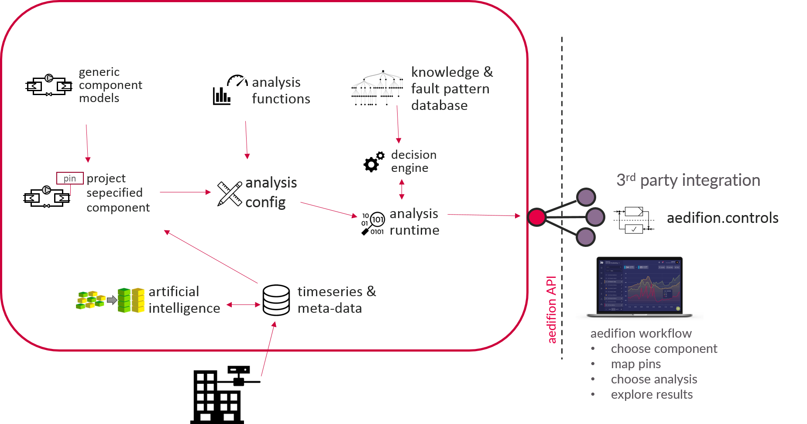

# aedifion.analytics

## Introduction

aedifion.analytics is a framework for data analytics of heating, ventilation & air conditioning \(HVAC\) systems, energy-related plants, buildings, as well as energy networks such as district heating and cooling grids. The framework has a special focus on scalable analytics of large sets of time series data.

The goal of aedifion.analytics is to support technicians and engineers who want to optimize \(or commission\) systems in terms of indoor comfort, energy efficiency, and maintenance and operation costs. For this purpose, aedifion.analytics aims at profound transparency and interpretation of system operation at a deep, data-driven level. aedifion continuously extends its scope.

 Its configuration and analysis workflow is straightforward:

1. Instantiate [components ](aedifion.analytics.md#components)of the energy system.
2. [Map datapoints](aedifion.analytics.md#mapping) to components.
3. Choose [analysis functions](aedifion.analytics.md#analysis-functions) of interest to [configure analysis](aedifion.analytics.md#analysis-config) on the chosen components.
4. Get and [explore analytics results](aedifion.analytics.md#explore-analysis-results).


[Ingested ](aedifion.io/features.md#data-ingress)as well as [AI-generated](aedifion.io/features.md#ai-generated-meta-data) meta data can be used to support the mapping between components and datapoints.


Please refer to the figure below for a schematic overview of the aedifion.analytics framework.

In the following, we will explain first the ingredients and second the process of aedifion.analytics. Finally we provide an application example and its various use cases.

## Technical overview

The framework aedifion.analytics consists of a component library, a library of algorithms for data analytics, a knowledge & fault pattern database, a decision engine, an analysis configuration pattern, and an analysis run-time environment. Results are provided via API.

All required interaction is available via APIs. 

### Components

Components are generic data models of physical, virtual or logical objects within a building or energy-related plants, such as e.g. pumps, boilers, thermal zones, control loops and so forth. The aedifion component library inherits all contemporary available components within aedifion.analytics.

A component can be instantiated for a specific project. This means that e.g. a _project A_ has a component _B_, e.g. a _control loop_. After instantiating, time series data can be [mapped ](aedifion.analytics.md#mapping)to the **pins** of a component, e.g. the _set point_, the _system_ _output_, and the _manipulated variable \(i.e. controller output\)_. Further, **meta data**, i.e. the component's characteristics or parameters, can be added to the component, e.g. a _proportional gain_ for a _control loop_.

A **pin** of a component represents thus an placeholder for a time series of a respective datapoint for this component. It is a generic placeholder used for [mapping ](aedifion.analytics.md#mapping)a datapoint to an instantiated component within a specific project. 

Analyses are performed on these generic pins in combination with component's meta data based on [analysis algorithms](aedifion.analytics.md#analysis-algorithms).

_Learn more? Explore the_ [_available components_](engineers/specifications/analytics.md) _and_ corresponding __[_API endpoints_](developers/api-documentation/guides-and-tutorials/analytics.md)_._

### Analysis algorithms

Analysis algorithms are granular and generic algorithms to analyse the operation of building equipment or energy-related plants. The aedifion analysis function library inherits all contemporary available analysis functions within aedifion.analytics.

Analysis functions are available per component model and get executed on [mapped ](aedifion.analytics.md#mapping)pins and meta-data of instanced [components](aedifion.analytics.md#components). E.g., an analysis of plant cycles is available for several components like heat pump, air handling unit, boiler and so forth. This analysis requires a [mapping ](aedifion.analytics.md#mapping)of the pin _operating message_ of the analyzed component.

_Learn more? Explore the_ [_available analysis functions_](engineers/specifications/analytics.md) _and corresponding_ [_API endpoints_](developers/api-documentation/guides-and-tutorials/analytics.md)_._

### Analysis run-time

The analysis run-time is the engine which executes the analysis determinations. It utilizes the [stream ](aedifion.io/features.md#stream-processing)and [batch ](aedifion.io/features.md#batch-processing)processing services of the aedifion.io platform and performs evaluations of the [analysis configuration](aedifion.analytics.md#configuring-analysis) on demand. If an interpretation of the analysis results is required, the analysis run-time calls the [decision engine](aedifion.analytics.md#decision-engine).

### Decision engine

The decision engine is the part of the analytics process which interprets a determined analytics result. It takes digitized engineering knowledge from the [knowledge & fault pattern database](aedifion.analytics.md#knowledge-and-fault-pattern-databse) into account in order to decide either the analyzed components operation is okay, sub-optimal, faulty, or even dangerous. Interpretations of the operational quality and recommendations on how to optimize it are based on this decision. E.g., a heat pump cycles several times per hour, which can easily be identified via the KPI _number of cycles per hour_. The decision at which threshold value this is too frequent is made in the decision engine. If the decision is _too frequent_, recommendation on how to increase the cycle time is queried from the [knowledge & fault pattern database](aedifion.analytics.md#knowledge-and-fault-pattern-databse) and returned together with the decision to the [analytics run-time](aedifion.analytics.md#analysis-runtime).

### Knowledge & fault pattern database

The knowledge & fault pattern database is the gathered engineering knowledge used to interpret analysis results, identify faulty component operation and give recommendations of optimization measures.

### Results

Results are KPIs known from engineering and thermodynamics, rearranged or virtually determined time series and interpretations thereof. Interpretations can be composed of qualitative ratings such as traffic lights, notification types, and free texts for the interpretation and recommendations for action. The results determined are depending on the [analysis functions](aedifion.analytics.md#analysis-functions) executed.

Learn more? _Explore the_ [_available analysis functions_](engineers/specifications/analytics.md) _and corresponding_ [_API endpoints_](developers/api-documentation/guides-and-tutorials/analytics.md)_._

## Process 

### Instantiating components

Instantiating components is the process of adding [components ](aedifion.analytics.md#components)from the aedifion component library to a specific project.

By [mapping ](aedifion.analytics.md#mapping)data points and meta data to the generic component data model it becomes project individual and is ready for analysis.

_Learn more? Try the_ [_API tutorial_](developers/api-documentation/guides-and-tutorials/analytics.md)_._

### Mapping

Mapping is the process of connecting a components pin to a data point, respectively its time series.

To adjust a [generic component model](aedifion.analytics.md#components) to a specific project it only requires the mapping of data points to the corresponding pins of this component. The [data management functionalities](aedifion.io/features.md#data-management-and-structuring) and [meta-data](aedifion.io/features.md#meta-data) available on aedifion.io are supporting this process.

_Learn more? Try the_ [_API tutorial._](developers/api-documentation/guides-and-tutorials/analytics.md)\_\_

### Configuring analysis

Configuring analysis is the process to individualize the analysis which should be run on an instanced [component](aedifion.analytics.md#components). Choices are:

* Which [analysis functions](aedifion.analytics.md#analysis-functions) shall be run on the component? This can be a subset of the analysis functions available for the component model.
* It is possible to define several configurations on one instanced component and thus create individual analysis sets.
* Advanced settings: Analyse multi-time intervals. This option allows to perform analyses over a fixed number of time intervals, a fixed interval length or a combination of both. _Learn more on multi-time intervals? Try the_ [_API tutorial_](developers/api-documentation/guides-and-tutorials/analytics.md)_._

The configuration will be passed to the [analytics run-time](aedifion.analytics.md#analysis-runtime) when [analysis results](aedifion.analytics.md#results) of this configuration are queried.

_Learn more? Try the_ [_API tutorial_](developers/api-documentation/guides-and-tutorials/analytics.md)_._

## Example

_School A_ has extraordinary high primary energy consumption for heating. A technician is asked to optimize this system. After the technician plug and play installed [aedifion.io ](aedifion.io/)at _School A_, the analysis of the building can start: One condensing boiler, and three heat distribution circuits shall be analysed.

The technician adds one _boiler_, and three _heating loop_ components to the _School A_ project and maps the correct data points to the pins of the components - supported by the provided meta data on data points. Since the technician suspects something might be wrong with the temperature levels, the _set-point compliance_ analysis function is run on the heat distribution circuits and on the boiler.

The analysis results confirm the assumption: All three circuits exceed their temperature levels while the boiler meets its set-point temperature quiet fine. The reason for that is identified by the decision engine of aedifion.analytics: The heating curve of the boiler is not designed according to demand. Therefore, the analytics results recommend an adjustment of the heat curve which the technician does right away.

This means that not only can the boiler be operated with a significantly lower load, but overheating of the classrooms can also be avoided. The school principal is glad about the saved energy costs. the pupils and teachers are happy about the fact that they don't have to constantly open the window in winter, because it is too warm in the room.

## Use cases

The use of aedifion.analytics is beneficial in several scenarios and business cases. Just to mention a few:

* **Optimization projects:** aedifion.analytics provides deep system transparency and recommendations to optimize operations in the dimensions of energy service delivery, indoor comfort, energy efficiency, and maintenance expanses. Therefore aedifion.analytics can be used by technicians or engineers to support their optimization projects.
* **Original equipment manufacturer:** aedifion.analytics provides scale-able analysis which can be offered as additional data service to end customers of OEMs. Furthermore, aedifion.analytics supports R&D departments of OEMs with deep insights on actual operational behavior and usage of their equipment in the field - of course without revealing the individuals behind the data.
* **Enhancement of existing software:** Existing data applications and cloud services can be extended with aedifion.analytics functionalities. All that is necessary for this is the integration of the API.

You have further ideas or questions if your use case can be supported by aedifion.analytics? [Contact us](contact.md#support)!

