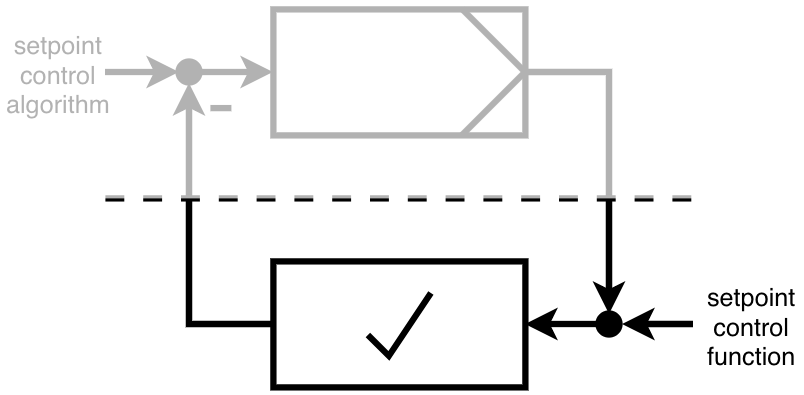
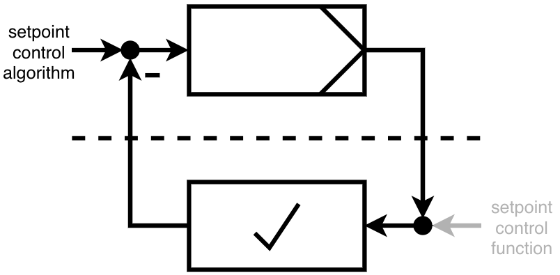
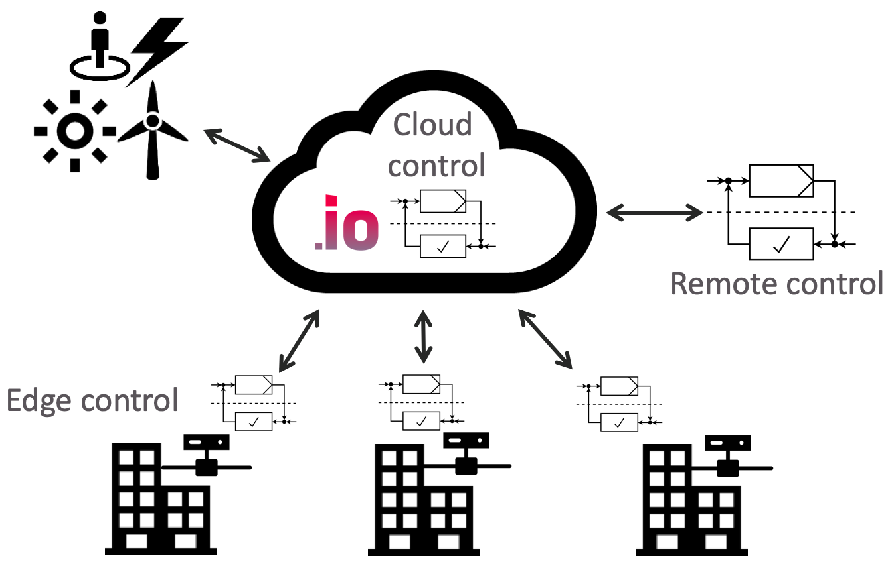

# aedifion.controls

## Introduction

aedifion.controls consists of basic control functions whenever a datapoint is generally controllable in the field and control algorithms that can be operated edge- and cloud-based.

[Control functionalities ](aedifion.controls.md#control-functionalities)cover simple set point writing as well as manipulating local control loops or even overruling local system output. Further, aedifion provides  a decent scheduling functionality that allows you to robustly execute control sequences on the aedifion edge device and monitor and control the execution from cloud as well as to even chain control to our integrations such as Alexa or chatbots. 


In extreme cases, local control hardware can be reduced to in-out-devices whereas all logic is operated in the cloud.



Safety of cloud-based controls is critical. aedifion.io offers various, locally executed, safety mechanisms that handle, e.g., connection loss, crashes, and human error.


[Control algorithms](aedifion.controls.md#control-algorithms) are virtually embedded control algorithms. In future, the user can choose control algorithms from the aedifion control library and set it up by adding parameters system outputs and controller outputs/manipulated variables. The algorithm is then operated as-a-service within aedifion.io. All interaction will be available via API.

For now, aedifion staff sets up the control algorithms from the aedifion control library according to the users need.

In the following we introduce control functionalities and algorithms in more detail. Visit [control specifications](engineers/specifications/controls.md) on in-depth information on the o[ffered control algorithms](engineers/specifications/controls.md#available-algorithms).

## Control functionalities

Control functionalities are defined actions with no automatic feedback usage, like

* writing setpoints, e.g. turning ventilation on or defining the reference for a closed control loop like a volumeflow control algorithm
* defining schedules, which is a set of various setpoints per time that is provided to the system, e.g. turning ventilation on and off in case of weekdays and weekends.
* defining simple fallback functionalities, e.g. in case of a sensor is broken, open a certain valve

Therefore control functionalities are in the meaning of the classic control theory open loop control systems. In the picture below you can see such a system. The controlled system has a setpoint input, but the output of the system is not being used to generate the next input.

To get an overall idea of how to use the control functionalities please check this high level summary of API-based [controls](developers/api-documentation/guides-and-tutorials/setpoints-and-schedules.md).

## Control algorithms

Control algorithms are defined as automatically generated actions with feedback usage.

In the meaning of the classic control theory, control algorithms are defined as closed loop control systems. Find a schematic diagram of such a system below. The difference between the feedback of the controlled system and the setpoint is the input to the system's controller. The generated algorithms output is the input to the controlled system.

Find the detailed descriptions of our currently available control algorithms [here](engineers/specifications/controls.md).

## Place of implementation

aedifion.controls enables remote and cloud control. Moreover, aedifion tailors edge control solutions if required. See the schematic below for a basic differentiation of these control concepts.

#### Remote control

Using the remote control functionalities, you can directly operate local plants via the aedifion.io platform, e.g. by self-hosted control algorithms, by control functionalities or even manually via API.

#### Cloud control

aedifion.controls features various control algorithms that we operate within the aedifion.io platform. See section[ control algorithms](engineers/specifications/controls.md) for an introduction of available control algorithms.

As custom service, aedifion deploys and hosts your proprietary control algorithms as cloud control algorithm. It is now possible to easily manage your estate and buildings in order realize an overall demand side management. Please do not hesitate to [contact us](contact.md) to discuss your needs. 

#### Edge control

In edge control, control algorithms run directly on the aedifion edge device. This accounts for low communication latency. At the same time, it lowers the risks of down times due to communication issues between the edge device and the cloud.

_This documentation continues with an introduction of aedifion.custom._ 

