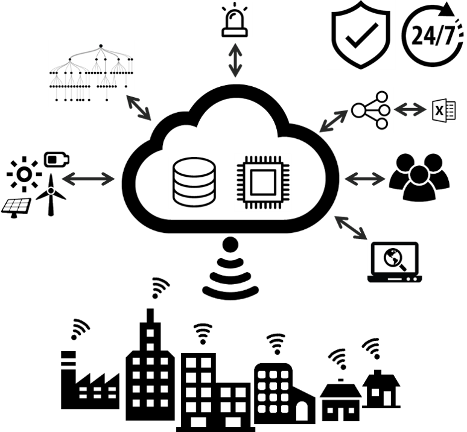

# aedifion.io

## Introduction

aedifion.io offers plant-, building- and district-wide data acquisition. compatible to many bus communication standards. Moreover, it integrates all IP-available data sources, replicates local data bases and connects to existing data servers. In addition, users or devices can stream their data directly into aedifion.io.


aedifion.io works fully plug-and-play for BACnet system. 


The Data•Storage•Processing•Provision•Integration•Integrability•Visualization•Structuring & management•Meta data handling and normalization•Advanced notifications & alarming•IT security & privacy \(according to GDPR\)•Guaranteed availability

aedifion.**io** enables building and district-wide as well as plant-specific acquisition of operational data, data transfer and storage as well as location-, device- and platform-independent data retrieval. Furthermore, aedifion.**io** offers data management functions and various visualization options. aedifion.io offers access control and fine-grained user, role and rights management in accordance with recent IT security standards. This comprises a web server certification, a complete TLS encryption of the data transfer as well as a user authentication mechanism. 

The alarm system integrated in aedifion.**io** allows different types of alarms to be set up flexibly for individual data points or entire projects. Alarm messages can be sent via various output channels, such as email or the usual instant messengers. In addition, Alarm messages can be sent via various output channels, such as email or the usual instant messengers. 

Furthermore, aedifion.**io** enables the merging of data from different sources, for example from different building automation manufacturers, weather data providers or other devices installed in buildings. Room occupancy lists can also be integrated, for example via Microsoft Exchange. With aedifion.io, data can be made accessible at a central location, especially across buildings and properties. 

aedifion.**io** offers a high-performance writing functionality with which setpoints can be set remotely or system controllers can be overwritten by cloud-based controllers. This feature also makes it possible to define long-lasting schedules that guarantee reliable and consistent control of the building even if internet connectivity is lost.

## Use Cases

aedifion.io can be used in various ways. In the following you find typical use cases.

### Technical Monitoring \(VDI 6041, AMEV\)

### Energy Management \(ISO 50 001\)

### Data Management

### Big Data analytics

### Middelware for App development

### Control applications

