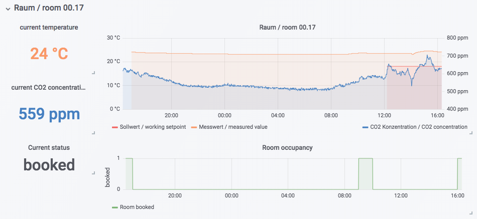

# Data

## Overview

The aedifion.io platform is all about collecting, storing, processing, and visualizing _data_ with the goal to optimize the operation of buildings, plants, or even whole districts w.r.t. their primary energy consumption.  To this end, aedifion continuously collects fine-grained time series and meta data directly from the building automation technology in the targeted plants, buildings, and districts. This primary, _native_ dataset is complemented by further useful data from third party sources such as weather predictions or room occupancy. 

In this article, we first lay out the [data model](./#data-model) of the aedifion.io platform, then provide an overview of the [native](./#native-data) and [third party data](./#third-party-data) it provides.

## Data model

All data on aedifion.io is separated into two categories: time series data and meta data. In the following, we briefly explain how these two types of data are structured.

### Time series data

Time series data refers to all data that continuously changes over time. This applies, e.g., to real measurements collected from sensors and actors in the field, but also to stream aggregation functions that generate continuous outputs.

The set of time series data is structured into many single time series, where each time series is related to a single physical or virtual datapoint.



```javascript
HeadQuarters
  -> Office01_RoomTemperature
  -> Office01_CO2  
  -> Office02_RoomTemperature
  -> ...
  -> Office10_RoomTemperature  
  -> Office10_CO2
  -> Offices_RoomTemperature_average
  -> Offices_CO2_average
```



In the above example, we have the time series data set for the building _Headquarters_, that consists of 22 individual time series. The first twenty of those, `Office01_RoomTemperature` to `Office10_CO2` correspond to physical sensors while the last two, `Offices_RoomTemperature_average` and `Offices_CO2_average`, correspond to virtual datapoints that are generated by computing the average over the other sensors.

A single time series has a name and a list of observations, i.e., \(time, value\) tuples, with an optional set of tags per observation.



```
Name: Office10_RoomTemperature
Time                 | Value | Tags
---------------------+-------------------------
2019-02-06T12:00:00Z |  20.1 | 
2019-02-06T12:01:30Z |  20.3 |  
2019-02-06T12:03:00Z |  20.2 | 
2019-02-06T12:04:30Z |  20.5 | maintenance=True
2019-02-06T12:06:00Z |  20.8 | maintenance=True
2019-02-06T12:07:30Z |  21.1 | maintenance=True
...
2019-02-06T23:30:00Z |   0.0 | outOfService=True
2019-02-06T23:30:00Z |   0.0 | outOfService=True
```



In the above example, the sensor `Office10_RoomTemperature` is read every 1,5 minutes. The time-dependent tags mark a maintenance period and when the sensor reported an error.

### Meta data

Meta data refers to all data that remains largely unchanged over time such as units and descriptions of datapoints, but also user-generated meta-data such as favorites, renamings, or custom plot views.

Most meta data is stored within tags that can then be freely assigned to projects, devices, or datapoints. The main ingredients of a single tag are a short \(string\) key and an arbitrarily long \(string\) value. A tag can be as short and simple as `'unit'='°C'` or as long and complex as a JSON-encoded configuration of a custom plotview, e.g.,

```javascript
'plotView':'{"chart":{"type":"line","datapoints":[{"plotPosition":"0","dataPointID":"bacnet100-4120-CO2","project_id":"4","interpolation":"zero-order-hold","marker":"","dashstyle":"solid"},{"plotPosition":"1","dataPointID":"bacnet100-4120-Humidity-HUM","project_id":"4","interpolation":"zero-order-hold","marker":"","dashstyle":"solid"},{"plotPosition":"2","dataPointID":"bacnet100-4120-Window-Closed-WIN","project_id":"4","interpolation":"zero-order-hold","marker":"","dashstyle":"solid"},{"plotPosition":"3","dataPointID":"bacnet100-4120-Ambient-air-temperature-T_Amb","project_id":"4","interpolation":"zero-order-hold","marker":"","dashstyle":"solid"}]}}'
```

Tags allow filtering through projects, devices, and datapoints using a range of high-level criteria, e.g., _"show me all CO2 sensors"_, or _"filter out every datapoint that has a fault"_. And, tags can be used to specify access control policies, e.g., _"user A gets access to all datapoints that correspond to temperature sensors"._ 

## Native data

Native data refers to all time series and meta data that is directly collected or generated by aedifion and does not come from third party sources.

### Data from building automation

Most of the native data is collected automatically from your building automation network by the [aedifion edge device](../gateway.md). This includes time series data for all discovered datapoints as well as meta data for all discovered devices and datapoints.

#### Time series

A typical non-residential building has between 1000 and 15 000 datapoints that can be automatically discovered and logged by the aedifion edge device. This typically includes, among many others, the following types of data:

* Room temperatures
* CO2 concentrations
* Setpoints and schedules
* Alarm states
* ...

_Want to see in detail which datapoints are discovered?_ The following is a complete list of datapoints that the aedifion edge device has discovered in the main building of the EON ERC.



#### Meta data

Most building automation networks such as BACnet provide a set of meta data that can be automatically collected. This meta data is logged daily and ingested into the aedifion.io platform where it is stored as tags on devices and datapoints.

The following example shows the set of meta data tags that have been automatically collected from a real BACnet datapoint. As we can see, this already contains a lot of useful information, such as min and max values, units, and error flags.



```javascript
Key               | Value
------------------+--------------------------------------
bacnet_id         | 514
description       | 'Ventil Kühler Besprechung-3'
deviceType        | 'AO OUT9'
minPresValue      | 0.0
maxPresValue      | 100.0
objinstance       | 3000563
objtype           | 'analogOutput'
outOfService      | 'False'
priorityArray     | ['null', 'null', ..., 'null', 100.0]
reliability       | 'noFaultDetected'
resolution        | 1.0
relinquishDefault | 0.0
statusFlags       | [0, 0, 0, 0]
units             | 'percent'
```



### Virtual datapoints

A virtual datapoint is a datapoint not gathered from a local plant but denotes a predefined stream or batch process that runs on one or multiple datapoints. The virtual datapoint makes the output continuously available in the form of a new datapoint in aedifion.io's time series database. 

The time series based on the virtual datapoint's result exactly handles the same as[ time series data](./#time-series-data). Virtual datapoints are denoted as such in their datapoint key according to customers conventions. 

### AI-generated meta data

The aedifion.io platform uses state-of-the-art machine learning and AI techniques to augment the already provided data. From the already given observations and metadata collected from the edge devices it regularly predicts additional tags \(e.g. the type of the data point\) and provides them via the API or the frontend. The AI system is able to learn and is therefore expanded perpetually to further improve the quality of the annotations.

The latest classifier we provide, classifies the datapoints with a set of 22 classes used in [current research](http://dx.doi.org/10.1016/j.egypro.2017.07.428). Each class represents a type of datapoint commonly found within building automation systems, these are:

1. Alarm message
2. Counter 
3. CO2 concentration
4. Heat flow
5. Operational message
6. Power
7. Pressure
8. Revolutions
9. Relative humidity
10. Setpoint for operation
11. Set Point in percent
12. Setpoint of temperature
13. Setpoint of temperature of potential meter
14. Temperature of gas
15. Temperature of liquid
16. Volume flow for gases
17. Volume flow for liquids
18. Volatile organic compounds
19. Valve Position
20. Electric work
21. Working set point in percent
22. Working set point for temperature.

Each time the classifier runs, a tag for the datapoint is created, which looks as follows:



```javascript
{
  "id": 92807,
  "key": "ClassesV1",
  "probability": 0.857322,
  "protected": true,
  "source": "ai",
  "value": "CO2 concentration"
}
```



The _key_ of the tag is "ClassesV1", which indicates the classification system it is using. The _value_ of this tag is "CO2 concentration", which indicates that the analyzed datapoint is recognized as a CO2 sensor. A complete list of all the possible values and their meaning you can find within the [engineers' specification section](https://docs.aedifion.io/docs/engineers/specifications/artificial-intelligence). With just those properties you can easily filter the set of datapoints. 

The tag has as _source_ "ai", since it is originating from an AI-based classifier. Each classifier also provides the property _probability._ In this example the classifier has a confidence of 85.73% that the given classification is correct.

For more information on the classification process refer to the section on [artificial intelligence based meta data generation](ai-meta-data-generation.md).

## Third party data

### Microsoft Exchange

On request, data from Microsoft Exchange can be integrated into the aedifion.io platform. This currently includes only the booking status of rooms that are available as a resource in Microsoft Exchange. Booking status is made available for the past and future as a boolean time series on aedifion.io.



### Weather data

aedifion.io uses the data services of [the Dark Sky Company, LLC](https://darksky.net/) for weather data integration. Therefore, both current and predicted weather conditions localized by geocoordinates are available on aedifion.io.

_Learn more? Explore the_ [_weather data specifications_](../../engineers/specifications/weather-data.md)_._


_On the next subsubpage, we introduce our AI-based meta data generation. On the next subpage we introduce integrations to aedifion.io._

