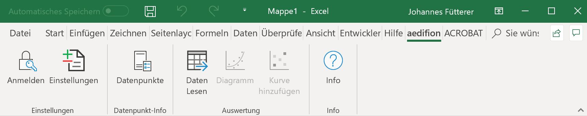

# Features

## Advanced data ingress

aedifion.io offers plant-, building- and district-wide data acquisition compatible to many bus communication standards, partially with auto discovery of [datapoints ](https://docs.aedifion.io/docs/glossary#datapoint)and [devices](https://docs.aedifion.io/docs/glossary#device). Moreover, it integrates all IP-available data sources, replicates local data bases and connects to existing data servers. In addition, users or devices can stream their data directly into aedifion.io. Of course, historic data can be uploaded via a CSV API.

| Type | Example |
| :--- | :--- |
| Bus communication | BACnet, Modbus, KNX, M-Bus,... |
| Data servers | OPC DA, OPC UA |
| Local data bases | MS SQL, mySQL, pgSQL, ... |
| Rest APIs | MS Exchange, weather data, weather forecasts,... |
| User | MQTT stream, CSV upload |


We aspire to integrate &lt;&lt;everything that is IP-based available&gt;&gt;.



aedifion.io works fully plug-and-play for BACnet system. All it needs is a gateway that operating personnell can easily connect to local networks. Once plugged in, the gateway connects automatically to our servers and we start data integrations.


## Metadata acquisition

For each integrated [datapoint ](https://docs.aedifion.io/docs/glossary#datapoint)and for each integrated[ device](https://docs.aedifion.io/docs/glossary#device), aedifion.io is able to acquire comprehensive metadata which originates either from standards like BACnet, from Modbus plat descriptions, from local databases or data servers as OPC. This metadata is automatically processed into aedifion.io's data structuring.  Metadata is added to each datapoint via [tags](https://docs.aedifion.io/docs/glossary#tag). Integrated devices are semantically modelled as [components](https://docs.aedifion.io/docs/glossary#component).  

## Data storage and resolution

aedifion.io uses databases specialized on [time series](https://docs.aedifion.io/docs/glossary#time-series) as well as additional databases for other data. The time series database uses Change-of-Value \(CoV\) as basic concept for data storage. Preconfigured threshold is 0.

Integrated [devices](https://docs.aedifion.io/docs/glossary#device) define the lowest sample rates of data acquisition and, thus, the data resolution. Typically, aedifion.io reaches 5 seconds for BACnet devices. With recent BACnet devices this can decrease to below 1 second. The same accounts for Modbus devices.


Don't you worry! The sample rate can be flexible adjusted during data provision. Same accounts for the interpolation method.


## Data provision

aedifion.io offers various ways of data provision.

### Via API

#### HTTP API

The HTTP [API](https://en.wikipedia.org/wiki/Application_programming_interface) functions cover download of timeseries as well as of meta data. Within the time series download, users can flexibly choose the sample rate, the start and end dates as well as the number of returned observation. 

The API can be flexibly integrated into development environments or programming languages. At [https://api.aedifion.io/ui/](https://api.aedifion.io/ui/) users find a web environment for user‐friendly testing and compilation of API interactions. In addition, other retrieval methods can be provided for e.g. MATLAB upon request.

#### Websockets

Websocktes offer the direct retrieval of live data.

### Via web application \(beta\)

A web-based graphical users interface is available under www.aedifion.io. it offers datapoint search, \(multi-\)line plotting, carpet/heatmap plotting, plot and CSV exporting, saving plot views for fast access, high level data management, such as adding favorits, renaming datapoints, and using variable datapointkeys. 

aedifion will release a version 1.0 in 2019 with better user experience and more functionality.

### Excel plugin

Available open source, the aedifion.io Excel plugin enables to query data from multiple datapoints over multiple projects. Users can directly query raw data or synchronize asynchronous CoV-based observations with adjustable sample rates. Moreover, different interpolation methods, such as zero-order-hold \(step interpolation\) and linear interpolation are offered. In addition, different plots can be auto-generated.


The aedifion.io Excel plugin is completly open-source, no strings attached. Feel free to use our code as you like and integrate aedifion.io in existing Excel sheets.


### Grafana

For each [project](https://docs.aedifion.io/docs/glossary#project), aedifion.io provides an instance of the open-source visualization environment [Grafana](%20https://grafana.com/) under https://dashboards.aedifion.io/_project\_name_/. User admins can build own dashboards using all functionalities of Grafana. Using this powerful, toolkit meaningful dashboards are easy to develop. 


aedifion offers training and engineering for Grafana to build your desired dashboard.


## Data processing

aedifion.io directly offers data processing such as resampling via api. Furthermore, two kinds of processes, i.e. stream and batch processes can be set up. Stream provesses cover Use cases as nominal-actual-comparisons as required in the German VDI 6041 "Technical Monitoring" or standard calculation methods, as well as statistic algorithms are covered by stream processes. Batch processes cover more complex calculations. They account for use cases according to ISO 50 001 "Energy Management".


aedifion.io handles calculations as required by the German VDI 6041 "Technical Monitoring" or ISO 50 001 "Energy Management" with stream and batch processing, respectively.


### Stream processing

A stream process runs a calculation of a free-to-choose mathematical relationship on each new event/observation of a referred datapoint. Stream processes relate to one or more datapoints.


Examples for stream process: 

* Heat flow calculation: 
  * $$\dot{Q} = \dot{m} c_p (\vartheta_{out} - \vartheta_{in})$$
* Coefficient of performance: 
  * $$\eta = \frac{\dot{Q{th}}}{P_{el}}$$ 
* System sanity/operation checks 
  * $$\mathrm{actual value} == \mathrm{expected value}$$ 


A stream process can be linked to a virtual datapoint or used as an input for alarms and notifications.

### Batch processing

A batch process is not operated continuously - like stream processes - but on a certain trigger. I.e. a pre-set time or up on request. This process runs complex calculation using historical data.


Examples for batch processes: 

* Energy Efficiency Ratio \(heat pump\)
* Energy reporting over long periods 
* Control loop analysis


### Virtual data points

A virtual datapoint is a datapoint not gathered from a local plant but resulting of a mathematical calculation. Despite, it appears exactly like a physical datapoint in aedifion.io's time series database. In aedifion.io, a virtual datapoint typically originates from a stream process. Of course, all alarming and notification paradigms can be used with physical as well as virtual datapoints.


Set up flexible alarms on complex relationships using stream processes and virtual datapoints!


## Data management & structuring

Since managing large amounts of datapoints from one 

### Favorites 

### Tagging

### Renaming

•Konzept der „Tags“•Tag ist ein Tupel:  
 {Key, Value, Source, Timestamp…}•Beispiele•{Messgröße, Vorlauftemperatur, AI, 2019-11-22}•{Einheit, ° C, BACnet, 2019-11-21}••Konzept ermöglicht Datenfeldbezeichung nach gängigen Standards \(VDI 3815, BUDO, ISE-Schlüssel, Bricks-Schema…\)

Renaming

## Project management - rule based access control

•Rollenkonzept•Definition von Rollen•Zuordnen von Rechten für Datenpunkte und Funktionen•Lesen•Schreiben•Nutzen•Zuordnen von Rollen zu Nutzern

## Alarming and notifications

•Standardisierte Alarm-Konzepte per API verfügbar•Throughput•Threshold•Siehe [https://api.aedifion.io/ui/](https://api.aedifion.io/ui/)••Maßgeschneiderte Alarme:•Stream-Prozesse•Virtuelle Datenpunkte•Nutzung Alarm-Konzepte••Viele Ausgabekanäle unterstützt

## Integrations

sum up all integrations done so far. \(Alexa, Microsoft Exchange, Excel tool features\)

### Weather and weather forecast data

sum it up here.

## Controls

kurze beschreibung von Controls

### Controls runtime environment

## Comprehensive APIs

Users can interact with all features via our documentented REST APIs. This makes the platform's functionalities flexibly integrateble in users' own scripts, programms or applications. 

### Customized APIs

aedifion offers customized backend features for special purposes of users. Such backend features come with customized APIs. 

## Authentification mechanisms

summarize the possibilities.

## Data privacy

show the possibilities.

## Availability and quality assurance

•Kontinuierliche Überwachung des Systemstatus•Messpunkte entlang der gesamten Pipeline•Kombiniert mit ingenieurswissenschaftlichem Know-How••Redundanz & Backups•Komplett gespiegelte Pipeline und Backend•Zusätzliche nächtliche Full-Backups••Alarming•Überwachung der kompletten Pipeline•Intern, per Instant Messenger

