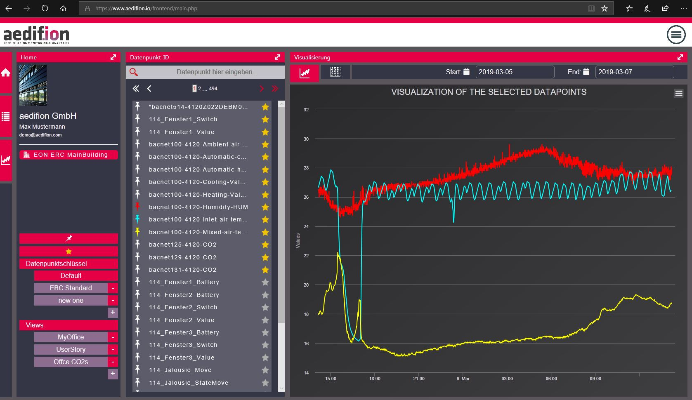
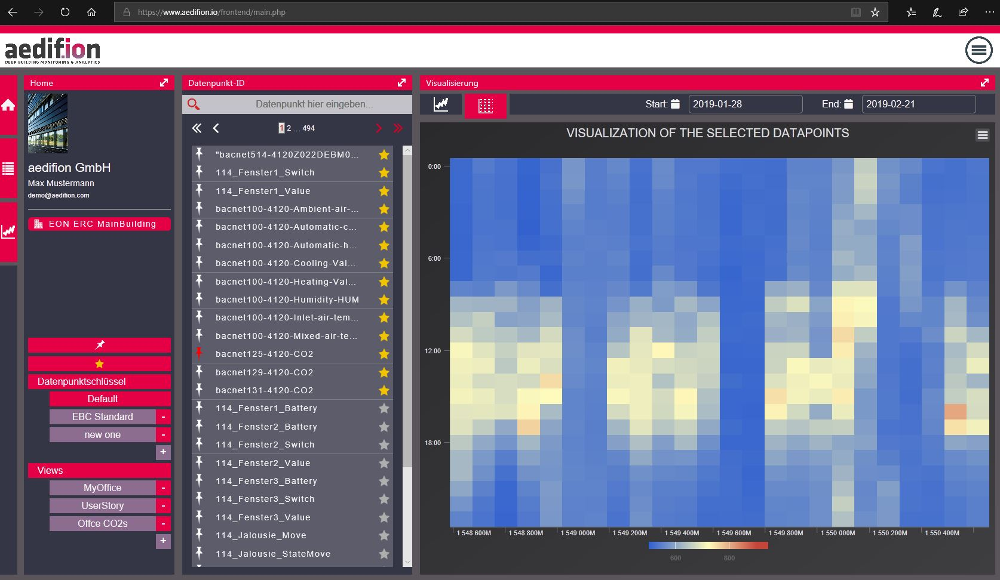
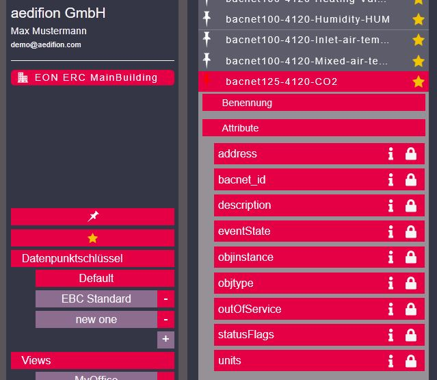

# Frontend

## Overview

At the moment, aedifion provides a beta version of its web frontend offering access to some functionalities of aedifion.io, i.e. data exploration and limited data management, such as plotting, saving and calling saved plots, so-called views, adding favorites, adding [datapoint keys](../glossary.md#datapointkey) and renaming [datapoints](../glossary.md#datapoint).


aedifion is currently developing an all-new frontend for holistic platform management and data access. 


## Data exploration

The frontend visualizes historical data and almost real time data using line and heat map plots. It plots up to seven lines in one line plot. One datapoint at a time can be plotted as heat map.

The datapoint list is searchable.

## Overall Handling

In this beta frontend the screen is mainly devided in three windows. Starting from left to right, first of all there is the Home-Window with user information and overall project handling, then the list of available datapoints and finally the visualisation of the selected datapoints. The three buttons on the left edge of the screen belong to those three windows. By clicking on one of them the respective window will close and the remaining windows share the whole screen.

### Home Window

Company and user information of the logged-in user are provided on top of this window. The frontend supports switching projects as soon as one user has access to multiple projects. By clicking on the drawing pin all selected datapoints get deselected and the visualisation window is empty again. By clicking on the star the datapoints list gets sorted by the selected favorites.

#### Datapoint keys

The frontend supports multiple [datapoint keys](../glossary.md#datapointkey). A user can add new datapoint keys and can rename each datapoint. He can alter the datapoints list by datapoint keys.

#### Saved views

After a user has generated a certain plot, he can add this plot to his so-called "saved views". This guarantees for easy-access to the most important views.

### Window with List of datapoints

Select up to seven datapoints to be plotted in one view. In order to do so, click on the drawing pin on the left hand side of the datapoint ID. The selected datapoints are shown in the visualisation window. The datapoint list is searchable.

#### Favorites

A datapoint can be marked as favorite by clicking on the star on the right hand side of the datapoints ID. Once marked, the datapoint list can be sorted by favorites by clicking on the star-button in the home-window as described above. Each favorite will be pinned at the top end of the list. This serves for easy access to the most important datapoints.

#### Meta data

Within the datapoint list, the frontend shows available meta data for each datapoint. 

### Visualisation Window

In the top left corner of this window you can select a line plot view with up to seven timeseries or a heat map plot for one selected datapoint. In the top right corner select the start and end time of the respective view. It is always possible to zoom in a certain time period by dragging over visualisation with the mouse. By hovering over the timeline the timestamp, value and ID of the datapoint is shown. By clicking on the chart context menu it is possible to print the actual visualisation or download it in your favourite format such as .png, .jpeg, .pdf or .svg.

_This documentation continues with an introduction of the used data models in aedifion.io_

