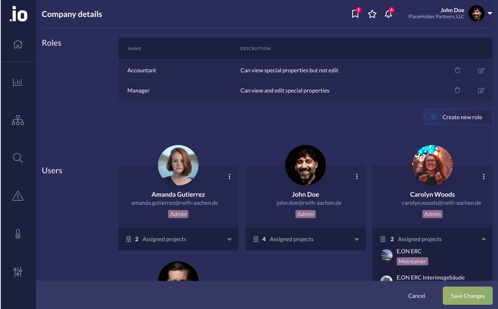
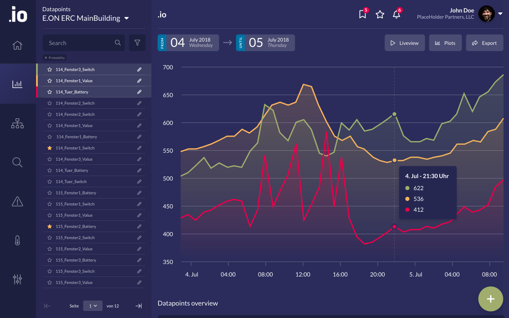
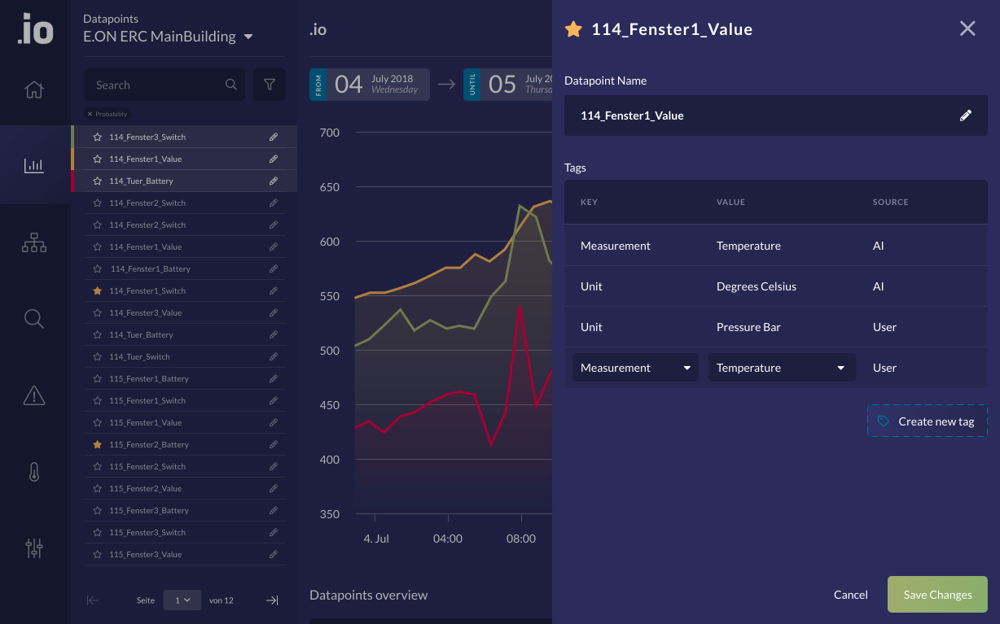
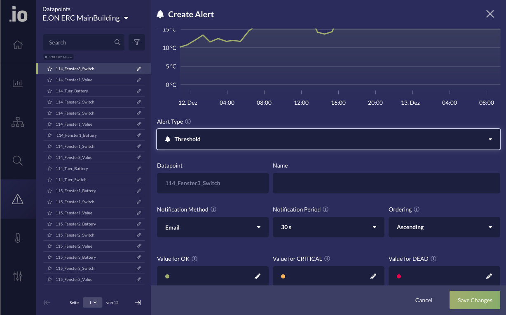
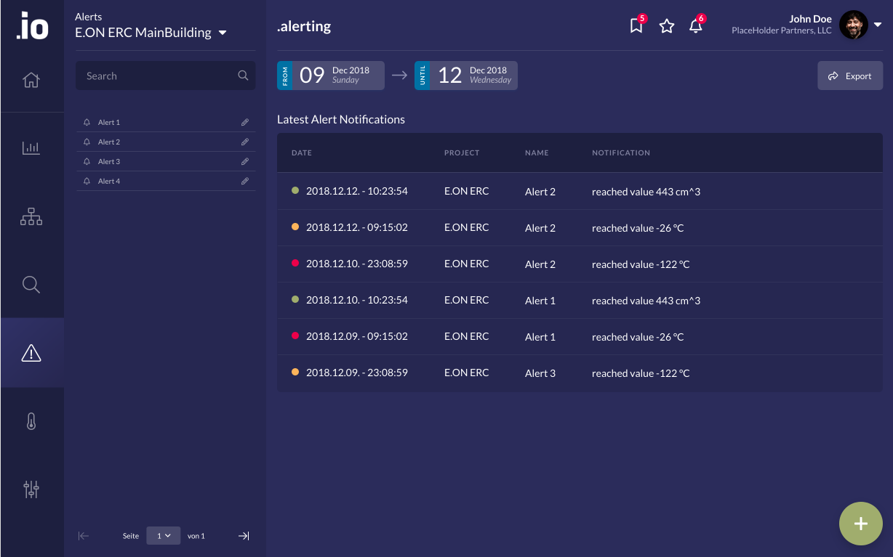
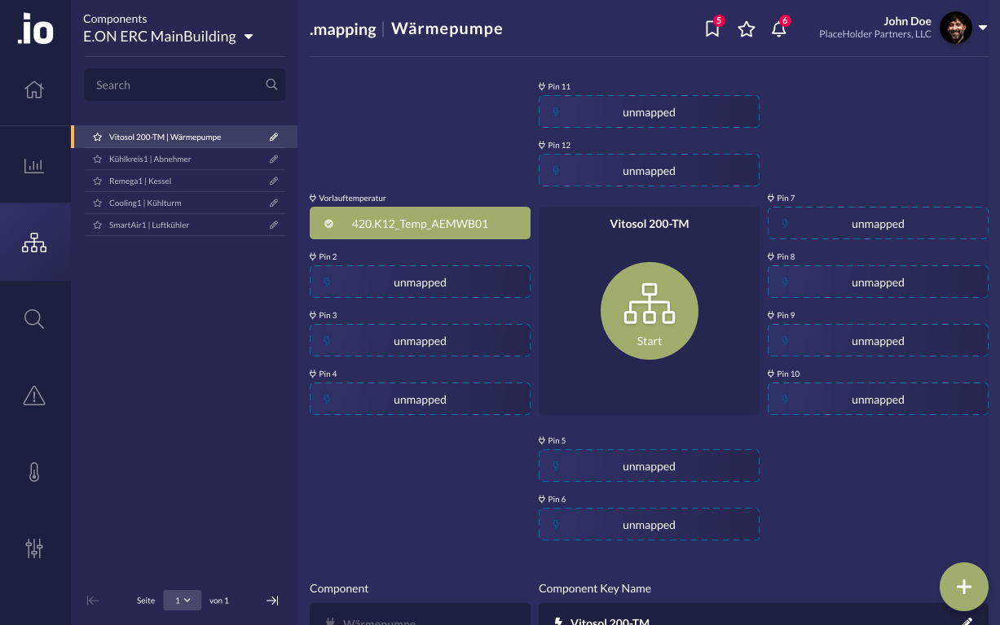
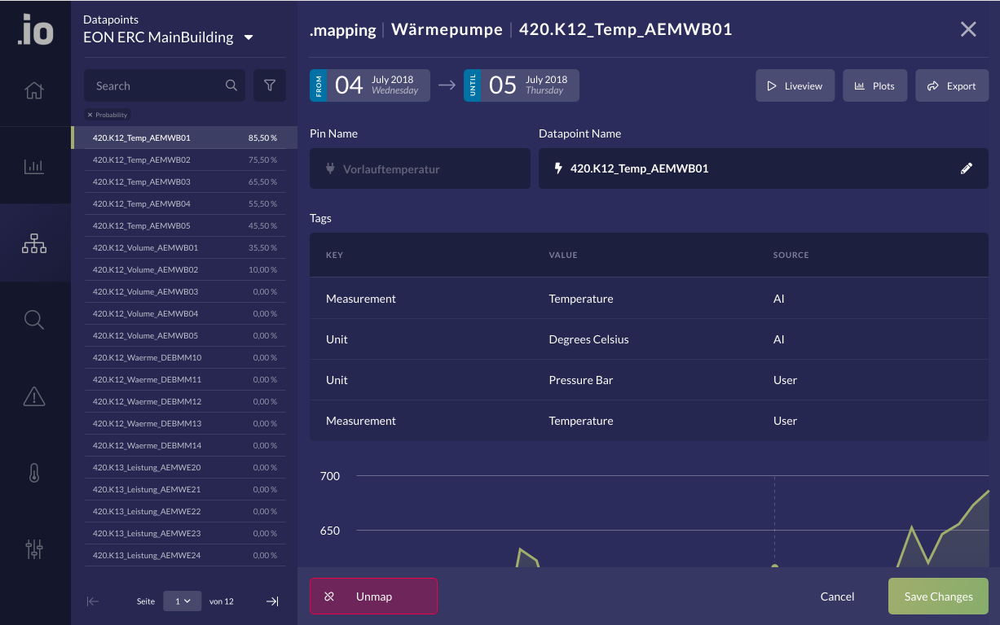
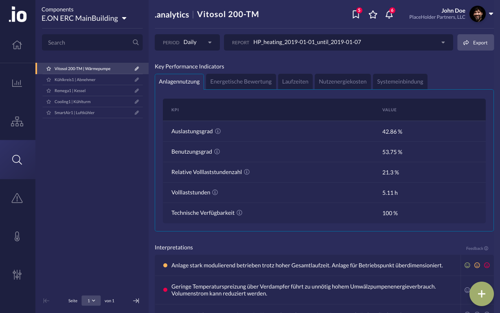

# Frontend

## Overview

aedifion provides a web frontend for the core functionality of the aedifion.io platform and the products built on it:

* [Project and user management:](frontend.md#project-and-user-management) Adding and removing users and projects, role based access control, ...
* [Data management and exploration:](frontend.md#data-management-and-exploration) Plotting, favorites, searching and filtering, tagging, renaming, ...
* [Alerting:](frontend.md#alerting) Configure and add custom alerts, view alert history, ...
* [Mapping:](frontend.md#mapping) Definition of components, \(automatic\) mapping of datapoints to components, ...
* [Analytics:](frontend.md#analytics) Analysis of components KPIs over variable time ranges, periodic reports, recommendations, ...
* [Controls:](frontend.md#controls) Write setpoints and schedules, build custom control algorithms, ...


The frontend is continuously evolving with the features and functionality of aedifion**.io**, aedifion**.analytics,** and aedifion**.controls**. The first version of the frontend will be available end of February.


## Project and user management

The frontend includes management dashboards for companies, projects, and users that allow, e.g., modifying names, contact details and profile pictures, creating new projects, assigning users to projects, creating roles within the company or specific projects, and much more.

## Data management and exploration

The data exploration dashboard contains a list of all datapoints in the project on the left and leaves most space for plotting. Use the full text search field to find the datapoints of interest and plot them in the time range of your choice. Up to seven datapoints can be plotted at the same time and their configuration saved as personal views.

Project with thousands of datapoints are not unusual. The datapoints filter helps you to find exactly those datapoints that you need. You can filter by different kinds of meta data, e.g., name, type, class, associated component, direction and origin. Part of that meta data is automatically generated by aedifion's artificial intelligence \(AI\).

The datapoint subpage presents detailed information and meta data for any data point of interest. You can assign a different name, add tags, and view and confirm the tags generated by aedifion's AI.

## Alerting

Alerts are a simple yet handy method to supervise your building's operations and our frontend lets you define alerts in no time. Different alert types, thresholds, and notification methods are available. Get notified, e.g., when critical components are switched off or when office temperatures or CO2 concentrations exceed certain thresholds.

The alerts dashboards provides an overview of all alerts, their status \(active or paused\) and lists the most recent alarms as well as their severity. The same alerts can be received through mail, instant messengers, web hooks and other channels.

## Mapping

The mapping dashboard presents a choice of components predefined by aedifion \(main area\) as well as a list of models that have already been instantiated into your project \(left side\).

Components models abstract from the different details of real components and distill their core functionality. When instantiating a model in your project, you will need to pin about 5 to 20 datapoints to the component instance \(depending on the model\).

The mapping tool supports you with AI generated proposals for the mapping of datapoints to component model pins \(left side datapoints list\). Before following the AI's recommendation to map a datapoint to a pin, you can view its details to confirm that its the right choice. Pinning datapoints to components can be a time consuming process - aedifion's AI and mapping tool let you pin a component within minutes.

## Analytics

Once a component has been [mapped](frontend.md#mapping), you can run a growing selection of analytics algorithms on it ranging from monitoring KPIs to predictive maintenance. The detailed insights are summarized in periodic reports or can be generated for custom time ranges on demand. The detailed insights are condensed to high level guidance on optimizing the components operations.

## Controls

The aedifion.io platform offers [HTTP APIs for writing setpoint and schedules](../developers/api-documentation/guides-and-tutorials/setpoints-and-schedules.md) and we are currently developing a frontend for intuitive handling of these APIs. Additionally, we are actively developing and testing automated cloud-based building controls based on the configured [alerts](frontend.md#alerting) and [analytics](frontend.md#analytics).

If you are interested in this feature, please [contact us](../contact.md). 

