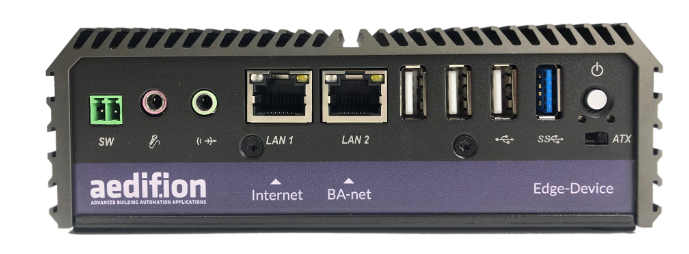

# Edge device

## Introduction

The aedifion edge device is an industrial PC enabling data connection between local devices as well as local data sources and the aedifion.io cloud platform. It uses most IP based industry bus communication standards and is able to automatically ingest data from your plant, building or district using auto-discovery of all available [datapoints ](https://docs.aedifion.io/docs/glossary#datapoint)and [devices](https://docs.aedifion.io/docs/glossary#device) for easy set-up.

The edge device is connected to the internet. If a plant's automation network has no internet connection, it uses its second Ethernet adapter to connect to the Building Automation Network.

The edge device operates fully plug-and-play from a customers perspective. Once connected to the internet, the edge device connects to the aedifion.io platform where aedifion's staff take care of its configuration.

The edge device offers very high security since its communication is **unidirectional** only. Clients do not need to open up their firewall for incoming connections. For outgoing connections only a few standard ports are necessary, such as 22 \(SSH\), 123 \(NTP\), 443 \(HTTPS\) and 8884 \(MQTT\).  In special cases, this can even be limited to HTTPS only.


The edge device offers multi-core computation power accounting for divers edge services, such as cloud-control, fallback functions, operation of local control algorithms, data buffering and so forth.


_Learn more? Go through the_ [_security section_ ](security/)_for further information on how we approach IT security and take a look at the_ [_edge device subpage for system integrators and IT admins_](../system-integrators-and-it-admins/it-admins.md)_._ 

\_\_

_On the next subpage, we introduce available APIs of aedifion.io._

