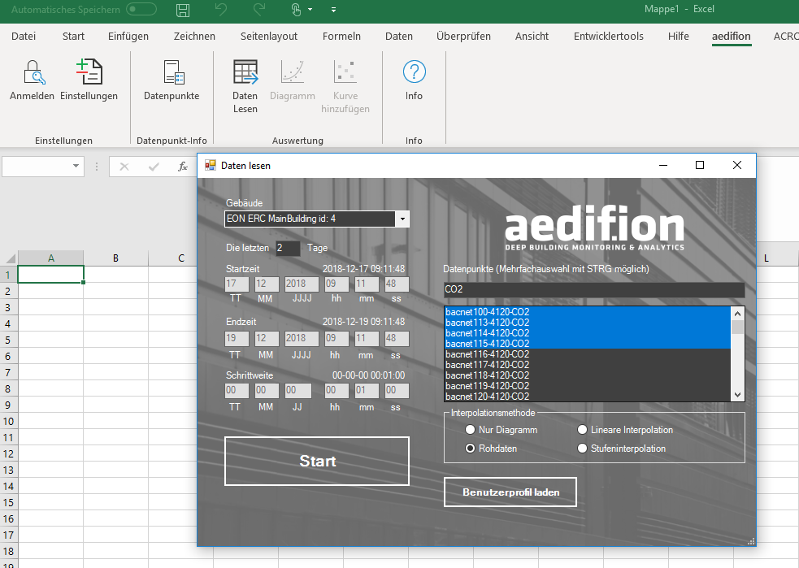
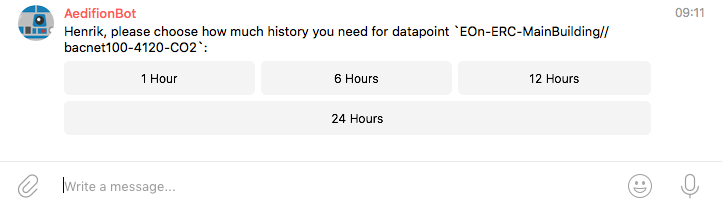
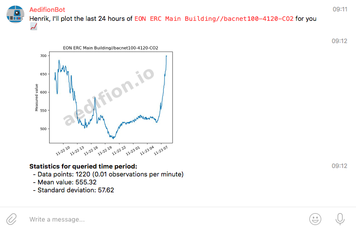
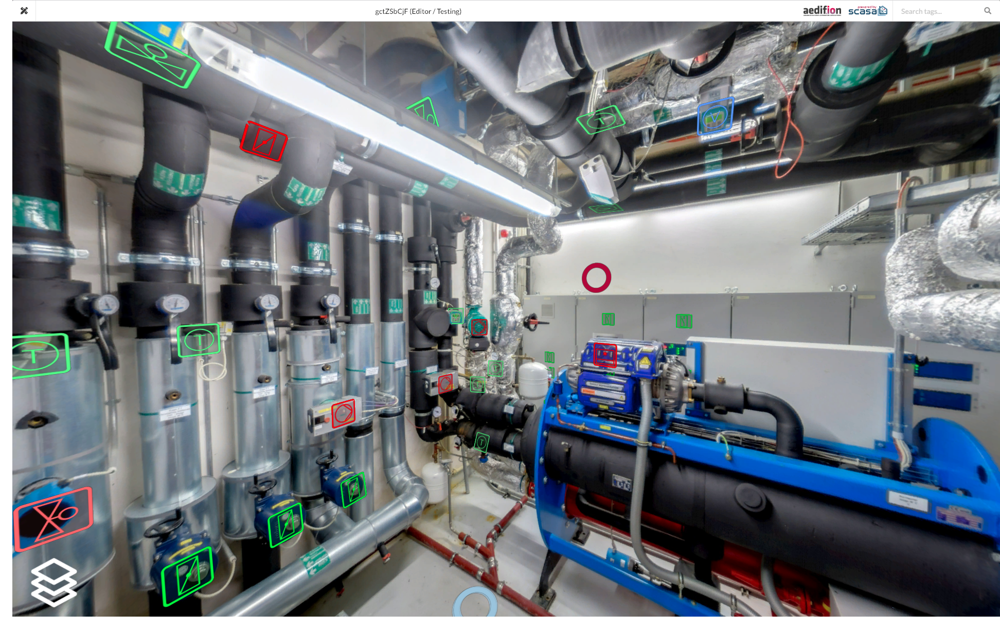
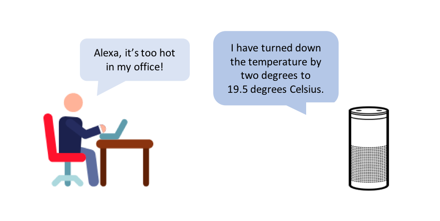
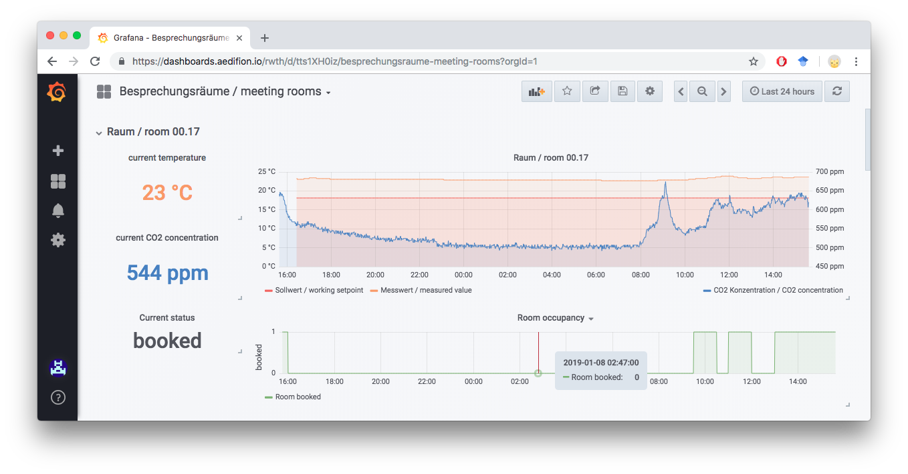

# Integrations

## Excel

With aedifion's open source [Excel Plugin](https://github.com/aedifion/aedifion-excel-plugin), you can import data from aedifion.io using its [HTTP API](../developers/api-documentation/) directly into your Excel sheet. You can query data from multiple datapoints over multiple projects and synchronize asynchronous CoV-based observations with adjustable sample rates and different interpolation methods, such as zero-order-hold \(step interpolation\). The retrieved data can be visualized in different types of automatically generated plots. The plugin is currently available for Windows and can be installed without admin rights.

## Chatbots

Our Telegram Chatbot receives [real-time alerts](../developers/api-documentation/guides-and-tutorials/alarming.md) from the aedifion.io platform and sends them to private or group chats. Typical use cases are notifying about unwanted or even dangerous system conditions or detecting unscheduled shut-downs and outages. To facilitate a quick assessment and response to potential emergency conditions, the chatbot offers further interactive features that, e.g., allow quickly plotting critical datapoints and querying basic statistics directly from within the chat. Integration with other messengers such as Slack, or Teams is available on request.

_Learn more? Start a conversation with_ [_@aedifion\_bot_](https://telegram.me/aedifion_bot) _or go to our_ [_tutorial on real-time alarms_](../developers/api-documentation/guides-and-tutorials/alarming.md) _to explore its features._    

## 3D HMI

Together with [SCASA](http://scasa.eu), aedifion offers high resolution 3D Visualizations with centimeter accuracy of your offices, installation rooms, or factory floor. aedifion augments 3D Visualizations with [live data](../developers/mqtt-api/) from the aedifion.io platform and even integrates [controls](../developers/api-documentation/guides-and-tutorials/setpoints-and-schedules.md). With this product, you can take virtual tours of your local site, e.g., to monitor and control components or determine a component's build to order a replacement -- with a browser from anywhere just as like being on site. By searching a device with tag search you literally fly to the selected device. 

_Learn more? Experience the video of a_ [_3D visualization_](https://www.youtube.com/watch?v=knJPzOOzjfg) _or_ [_request a personal demo_](../contact.md)_._

## Alexa

We have built skills for Amazon's Alexa to integrate with the [HTTP API]() of the aedifion.io platform allowing you to query and control your surroundings using natural language. E.g., you may turn down the heating in your office with a simple dialogue.

_Learn more? Watch_ [_our demo video_](https://www.linkedin.com/feed/update/urn:li:activity:6424532222916726784/) _or_ [_request a personal demo_](../contact.md)_._

## Grafana

On demand, aedifion provides a separate instance of the [Grafana](%20https://grafana.com/) visualization environment for each [project](../glossary.md#project). Grafana allows you to easily build your own dashboards on your project's data dragging-and-dropping from a wide range of plots, charts, and widgets.

## Cloud services

The aedifion.io platforms integrates with multiple cloud services for data ingress and egress. You can, e.g., ingest data from devices connected to [Cumulocity](http://www.cumulocity.com), run analytics on it on the aedifion.io platform, and export data and results to your AWS S3 Bucket.

## Third party data

We integrate different free third-party data sources with the aedifon.io platform that allow to augment your building's data with, e.g., weather data.

### Weather data

We integrate localized weather data from the [DarkSky weather service](https://darksky.net).  Weather data is accessible and visualizable on the platform like any other datapoint on the platform. It includes measured data as well as predictions with different horizons of several meteorological conditions such as temperature or dew point.

_Learn more? Explore the_[ _current weather conditions at the aedifion office_](https://darksky.net/forecast/50.789,6.051/us12/en) _or check out the_[ _integration specifications_](../engineers/specifications/weather-data.md)_._

### **Microsoft Exchange**

aedifion.io is able to connect to customers Microsoft Exchange servers. A typical use case is to take information on resources to find better control decisions, e.g. such as bookings of seminar rooms to control their HVAC systems.

_This documentation continues with a discussion of IT security and our approaches towards it._

