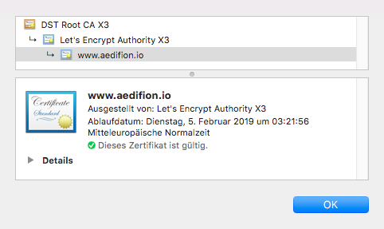

# Security

## Overview

aedifion.io provides cloud-based data acquisition, analytics, and control. Inevitably, these services require a connection between your, the customer's, building automation network and the aedifion.io platform as well as to store and process data on it.

Some of our customers have initially been concerned about connecting their building network to the Internet, if only to our platform. Typical reactions are:

> _"The building automation network is not connected to the Internet for security reasons."_  
>   
>                                         - Large german real estate operator

> _"80 % of our customers insist on a physical separation of building automation network and Internet for example via serial communication."_
>
>                                         - Provider of cloud-based control algorithms

> _"We need more information to convince the building operator."_  
>   
>                                          - Energy service company

Many of our existing customers concerns were settled once they had understood exactly which connections are made, how they are established, and for what reasons. In this article, we thus explain and review the precautions and security measures aedifion takes to protect your building network and data.

## The edge device

### Hardware

The [aedifion edge device](gateway.md) is a small industrial PC hardened against splash water, extreme temperatures, vibrations, shocks, etc. It can be mounted on standard DIN rails. The edge device has been designed, assembled, and approved according to German standards. We currently use the following hardware:

* [Spectra Powerbox 3000 - Series](https://www.spectra.de/files/produkte/KA001477/web/spectra/Datasheet-Spectra-PowerBox-3000_Series.pdf)
* [Logic Supply CL210](http://static.logicsupply.com/resources/spec-sheets/logic-supply-cl200-series-spec-sheet-120618.pdf)

### Software

The edge device runs Ubuntu 18.04.1 LTS server and receives automatic security updates daily. Login to the device is only available through SSH and the root user's account is deactivated. Each edge device must pass an extensive series of functional and penetration tests before it is sent out for deployment.


On request, the edge device's software can run on your own hardware and operating system.


### Connecting to the building network

The edge device has two built-in network adapters. The first network adapter must be directly connected to the local building automation network. This is important to support auto-discovery of devices and their datapoints as many building communication protocols such as BACnet use broadcasts in the local network for auto discovery and these broadcasts are per standard not forward outside of the local network. The edge device will only communicate on the port\(s\) corresponding to the targeted building automation network protocol, e.g., port 47808 for BACnet. 


The installation and connection of the edge device is done by the customer's local technician. In particular, aedifion will never require physical access to your networks.


If certain data points or entire areas of the building must not to be read out, this can either be technically prevented in advance \(e.g. by network masks or VLANs\) or handled flexibly within the settings of the edge device. Together with you, we select data points which should be written or stored, and which should not be, since they can be classified as critical or privacy sensitive.

### Connecting to aedifion.io

The second network adapter of the edge device must be connected to a network with Internet access. Through this network interface, the edge device establishes a connection to the servers that host the aedifion.io platform. This connection is required, e.g., for data acquisition and remote administration. All communication between the edge device and aedifion.io is secured via [TLS](https://tools.ietf.org/html/rfc5246) or [SSH](https://tools.ietf.org/html/rfc4253). 

In most deployment scenarios, local networks with Internet access are placed behind a firewall that limits outgoing connections. In this firewall, the following ports need to be opened:

* **22/TCP Secure Shell \(SSH\)**  Used only on-demand to establish a secure connection from the edge device to one of two dedicated servers for remote administration, e.g., to carry out software updates without manual interaction on location. SSH is the de-facto standard protocol for remote administration in cloud environments and used in millions of IT systems world wide.
* **123/TCP - Network Time Protocol \(NTP\)**  NTP is a standard protocol for system time synchronization and establishes an outgoing connection to a pool of time servers. On request, the edge device can use customer-provided time servers, e.g., on the local network, for time synchronization. In this case, port 123/TCP may remain closed in the customer's firewall. Per default, the aedifion edge device uses Ubuntu's standard time servers.
* **443/TCP Hypertext Transfer Protocol Secure \(HTTPS\)** 
  * The edge device sends periodic heartbeats to two dedicated servers. Based on this feedback, aedifion monitors the accessibility, status, and functionality of its fleet of edge devices. All communication is carried over HTTPS \(HTTP over TLS\) which is the standard for secure communication on the Internet, e.g., used to secure online banking, mail accounts, and so forth. It is well understood by firewalls, intrusion detection, and deep packet inspection systems.
  * The edge device contacts the Ubuntu package repository to check for security updates every night. Available updates are automatically installed. All communication with the Ubuntu package repository is carried securely over HTTPS.
* **8884/TCP Message Queuing Telemetry Transport Secure \(MQTTS\)**  MQTT is an increasingly popular [standardized protocol](http://docs.oasis-open.org/mqtt/mqtt/v3.1.1/os/mqtt-v3.1.1-os.html) for Internet of Things and is used by aedifion to stream measurement data collected from the building network to aedifion.io's message broker in near real time. All MQTT messages are transported exclusively over TLS. As an alternative to MQTTS, measurement data can be collected and uploaded in batches through HTTPS. This option, however, sacrifices the near real-time availability of the collected data.


For deployments with critical security requirements, e.g., hospitals or banks, the listed requirements can be reduced down to opening only port 443/TCP for HTTPS traffic and additional security measures such as VPN tunnels can be employed.


Communication on the above listed ports only has to be opened towards a fixed set of aedifion's servers, i.e., all other than the following destinations can be blocked by the firewall.

<table>
  <thead>
    <tr>
      <th style="text-align:left">Port/Protocol</th>
      <th style="text-align:left">Main servers</th>
      <th style="text-align:left">Backup servers</th>
    </tr>
  </thead>
  <tbody>
    <tr>
      <td style="text-align:left">22/TCP - SSH</td>
      <td style="text-align:left">
        
ssh2.aedifion.io

        
IP: 94.130.225.123

      </td>
      <td style="text-align:left">
        
ssh3.aedifion.io

        
IP: 88.99.34.202

      </td>
    </tr>
    <tr>
      <td style="text-align:left">123/TCP - NTP</td>
      <td style="text-align:left">
        
0.ubuntu.pool.ntp.org

        
1.ubuntu.pool.ntp.org

        
2.ubuntu.pool.ntp.org

        
3.ubuntu.pool.ntp.org

        
ntp.ubuntu.com

      </td>
      <td style="text-align:left"></td>
    </tr>
    <tr>
      <td style="text-align:left">443/TCP - HTTPS</td>
      <td style="text-align:left">
        
discovery2.aedifion.io
           IP: 94.130.225.123
           
        

        
security.ubuntu.com

        
archive.ubuntu.com

      </td>
      <td style="text-align:left">
        
discovery3.aedifion.io

        
IP: 88.99.34.202

      </td>
    </tr>
    <tr>
      <td style="text-align:left">8884/TCP - MQTTS</td>
      <td style="text-align:left">mqtt.aedifion.io
         mqtt3.aedifion.io</td>
      <td style="text-align:left">mqtt-dev.aedifion.io</td>
    </tr>
  </tbody>
</table>
All communication is established unidirectionally, i.e., from the edge device to the aedifion.io platform, and can be cleared or blocked accordingly in your firewalls. No external access to your network ever takes place. Your networks can remain completely closed and thus protected against external access by your existing firewalls. Thus there is no direct connection of the building automation network and hardware to the Internet.


## The aedifion.io platform

### Hosting

The aedifion.io platform and all services built on top are hosted on dedicated and virtual servers by the [Hetzner Online GmbH](https://www.hetzner.com/), based in Gunzenhausen, Germany. Hetzner is certified according to DIN ISO/IEC 27001 for its IT security standards and has won numerous awards. Hetzner operates data centers in Germany and Finland. aedifion.io is hosted on servers located in their data centers at Nürnberg and Falkenstein, Germany.


On demand, aedifion stores and processes your data on dedicated servers thereby excluding residual risks due to co-location of virtual machines.


### Server authentication

All our servers and services are authenticated using standard X.509 certificates issued by Let's Encrypt that are renewed each quarter. As of January 2019, Let's Encrypt has a market share of more than 50%.

### Service availability

All servers have DoS protection and multi-redundant connectivity to guarantee high availability. aedifion guarantees 97% uptime for the aedifion.io platform.


Custom Service Level Agreements \(SLAs\) with higher uptime guarantees can be negotiated.


### Storage and Processing

All storage and processing of data on aedifion.io is strictly encapsulated and separated - down to the system level. In practical terms, this means in the first instance that a dedicated database is operated for each customer - the customer data is therefore separated. In the second instance, this means that virtual users in the backend, such as micro services, but also real users, only receive those rights \(privileges\) by default that they need for their intended purpose. For example, a data-evaluating, i.e. reading, service may not write data points by default. In the third instance, all processes at system level are separated from each other using Docker containers and only interconnected in dedicated virtual networks if necessary.  For example, the analysis of one customer's data is strictly separated from the analysis of another customer's data.

### User authentication and authorization

By default, user authentication takes place via username and password. Other identity providers, e.g., LDAP and Active Directory, can be integrated through OpenID connect, OAuth, and SAML. Thus, company-wide single sign-ons and integration of existing user databases are possible. 

After a user is authenticated, all his/her accesses to the aedifion.io cloud platform are authorized through a comprehensive role-based access control \(RBAC\) system. Predefined, standardized roles are available but you can also freely define new roles with individual authorizations in a fine granular manner through the APIs.


Access can be controlled down to the granularity of allowing read or write access on single datapoints. E.g., you can grant users rights to modify the temperature in their office but nowhere else.


## Our promise of security

We are convinced that digitization, and, in particular, the use of cloud and IoT technology, are key to enable and implement resource-conserving, energy-efficient, and user-expanding solutions. In this process, security and data protection are not _nice-to-have,_ but a non-negotiable requirement that must be addressed and built into the design of IT systems right from the start.

That is why aedifion commits to permanently guarantee highest security and data protection standards.  If at any time there is any uncertainty about the function of our services, the guarantee of security and data protection, you are welcome to [contact](../contact.md) us with your questions at any time. 

And, we are willing to walk the talk: aedifion is currently in the process of obtaining TÜV certification for the aedifion.io platform.

_This documentation continues with a our products aedifion.analytics and .controls._

