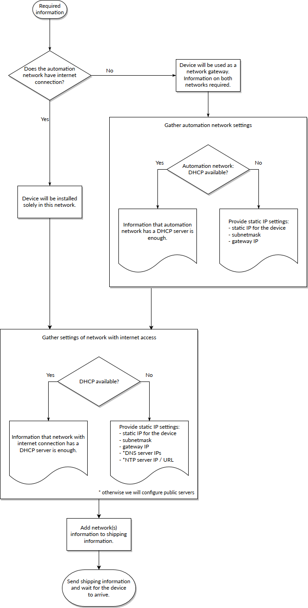

# IT Admins

## Overview

The [aedifion edge device](../aedifion.io/gateway.md) is an industrial PC which covers functionality such as being an automation network gateway \(therefore it has two ethernet ports\) and providing computing power for those aedifion services, which are sensitive to internet connection losses. For plug and play installation of the device, we preconfigure its network interfaces before shipping it to you. Therefore please send us the [required shipping information](it-admins.md#required-shipping-information). About firewall security: Only outgoing connections from the device to the aedifion servers are need. Set the firewall settings to these [minimum requirements](it-admins.md#firewall-settings) to enable the aedifion services. The[ installation guide](it-admins.md#installation-guide) gives the necessary information on how to wire the aedifion edge device. Spoilers: First connect the ethernet cables to the right ports, and at last the power plug!

For any support or if you have any concerns about the security of your networks, please do not hesitate to [contact ](../contact.md#support)us!

## Required shipping information

Besides the post address and name of the contact person we send the aedifion edge device to, we require information about the settings of the network\(s\) the device will be connected to. Please work your way through the flow chart below and send us the gathered information.  


**Example:**

Imagine the following setup:

* The aedifion headquarter ordered an aedifion edge device.
* The automation network in the headquater is separated from any other network with internet access.
* _Network1_ has internet access and a DHCP server running.
* The _automation network_ has no DHCP server running.

Now, which information do we need to preconfigure the aedifion edge device?

* The _automation network_ does not have internet access. The aedifion edge device will be used as a gateway between the _automation network_ and _Network1_.
* Static IP settings for the _automation network_:
  * Static IP the aedifion edge device will be using: 192.168.100.100
  * Netmask: 255.255.255.0
  * Gateway: 192.168.100.1
* In order to provide internet access the aedifion edge device will be connected to _Network1,_ which has a DHCP server.
* Ship the device to:

aedifion GmbH; Kupferstr. 14; 52070 Aachen; Germany

Contact person: Jane Doe


## Firewall settings

ICT security is very important to us. For detailed information on the precautions we take, please read the corresponding section [ICT securtiy](../aedifion.io/ict-security.md).

At this point, we simply summarize the firewall settings required to use the aedifion Edge device in your networks:


**Minimum firewall requirements:**

* Only outgoing connections! At no time we need access to your network from the outside!
* Outgoing connections on the following ports \(can be limited to our server IPs\):
  * :443 \(HTTPS\)
  * :22 \(SSH\)
  * :8884 \(MQTTS\)
  * :123 \(NTP to Ubuntu standard timeservers - not neccessary, in case of a NTP in your network\)


[Contact us](../contact.md#support) in case of firewall complience issues.

## Installation guide

We use different industrial PCs for the aedifion edge device to meet the requirements of your project. Every package of an aedifion edge device shipped comes with an idividual installation manual. Have a look at the picture below to get an idea how we lable ethernet ports:

To install your aedifion edge device please execute the installation in the order of the flow chart:


**Trouble shooting:** 

Restarting the aedifion edge device solved 99 % of the issues which occured during installation in the past.


