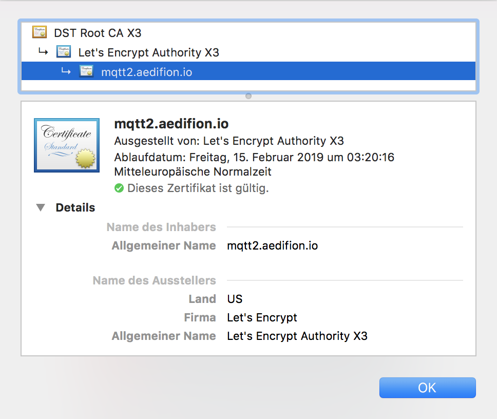

# Specifications

## Overview

Part of the aedifion.io platform is a MQTT broker which serves as the single logical point of data ingress to the aedifion.io, e.g., all data collected in the field through the aedifion edge devices is ingested to aedifion.io through this MQTT broker and, in turn, can also be subscribed to. The MQTT broker is clustered, i.e., distributed over multiple independent servers, to ensure seamless scalability and high availability.

## MQTT Broker 

aedifion currently maintains two MQTT brokers:

* Production
  * Stable broker that receives updates and new features only after an intensive testing phase in our development environment.
  * Host: mqtt2.aedifion.io
  * Ports: 
    * 8884 - MQTT over TLS 1.2 \(use in standalone clients\)
    * 9001 - MQTT over websockets over TLS 1.2 \(use from within browsers\)
* Development
  * Semi-stable __broker that receives updates and new features after a short internal testing phase.
  * Host: mqtt-dev.aedifion.io
  * Ports: 
    * 8884 - MQTT over TLS 1.2 \(use in standalone clients\)
    * 9001 - MQTT over websockets over TLS 1.2 \(use from within browsers\)

Both brokers only accepts TLS 1.2 encrypted connections, i.e., all plain TCP connections are rejected. The brokers certificate can be viewed, e.g., by connecting to [https://mqtt2.aedifion.io](https://mqtt2.aedifion.io) or [https://mqtt-dev.aedifion.io](https://mqtt-dev.aedifion.io) from any browser.



Your operating system \(OS\) will accept this certificate if the DST Root CA X3 certificate is installed as a trusted root certification authority \(CA\) in your OS \[1\]. Don't worry, this is probably the case and you don't have to do anything. You can test if the certificate is accepted by navigating to [https://mqtt2.aedifion.io](https://mqtt2.aedifion.io) or [https://mqtt-dev.aedifion.io](https://mqtt-dev.aedifion.io) - if your browser doesn't issue a warning, you're fine.

Both brokers accept connections on two ports: 8884 and 9001. Port 8884 accepts _plain_ MQTT, i.e., connections that transport MQTT directly via TLS. This is the standard case and, if in doubt, this port is the right choice. Port 9001 accepts websockets connections, i.e., connections that transport the MQTT protocol within the websockets protocol which in turn is transported via TLS. MQTT via websockets is the right choice when you want to send/receive MQTT data directly from a web browser \[2,3\].

**Summary:**

* Two MQTT brokers available: production and development
* Test the connection:
  * Point a browser to [https://mqtt2.aedifion.io](https://mqtt2.aedifion.io) or [https://mqtt-dev.aedifion.io](https://mqtt-dev.aedifion.io)

    No warnings should occur.

  * If you have openssl installed, open a command line and execute

    ```text
    openssl s_client -connect mqtt2.aedifion.io:8884 -servername mqtt2.aedifion.io
    ```

    Check that the TLS handshake is ok.

    * There will be warning `verify error:num=20:unable to get local issuer certificate` at the top which can be fixed by providing option `-CAfile` or `-CApath` and pointing to the right locations depending on your OS, e.g., `-CAfile /etc/ssl/cert.pem` on Mac OS.

**Sources and further resources:**  
\[1\] Let's encrypt's chain of trust: [https://letsencrypt.org/certificates/](https://letsencrypt.org/certificates/)  
\[2\] MQTT over websockets: [https://www.hivemq.com/blog/mqtt-essentials-special-mqtt-over-websockets/](https://www.hivemq.com/blog/mqtt-essentials-special-mqtt-over-websockets/)  
\[3\] MQTT over websockets: [http://www.steves-internet-guide.com/mqtt-websockets/](http://www.steves-internet-guide.com/mqtt-websockets/)

### Authentication

The MQTT brokers only accepts connections from _authenticated_ clients.

After having established a TLS connection, the MQTT client has to present login credentials \(`username` and `password`\) to the MQTT broker. Client credentials can be obtained with limited and unlimited validity.


Credentials with unlimited validity are provided only on request by the aedifion staff. Please email us at support@aedifion.io.


Credentials with limited validity can be created through the aedifion.io [HTTP API](../api-documentation/) using the `POST /v2/project/{project_id}/mqttuser` endpoint. This endpoint requires the following parameters:

<table>
  <thead>
    <tr>
      <th style="text-align:left"><b>Parameter</b>
      </th>
      <th style="text-align:center">Datatype</th>
      <th style="text-align:center">Type</th>
      <th style="text-align:center">Required</th>
      <th style="text-align:left">Description</th>
      <th style="text-align:left">Example</th>
    </tr>
  </thead>
  <tbody>
    <tr>
      <td style="text-align:left"><b>project_id</b>
      </td>
      <td style="text-align:center">integer</td>
      <td style="text-align:center">path</td>
      <td style="text-align:center">yes</td>
      <td style="text-align:left">The numeric id of the project for which to add a new MQTT user account.</td>
      <td
      style="text-align:left">1</td>
    </tr>
    <tr>
      <td style="text-align:left"><b>username</b>
      </td>
      <td style="text-align:center">string</td>
      <td style="text-align:center">
        <p>body</p>
        <p>(JSON)</p>
      </td>
      <td style="text-align:center">yes</td>
      <td style="text-align:left">The username of the new MQTT user. If that username exists, the request
        is rejected.</td>
      <td style="text-align:left">my_mqtt_user</td>
    </tr>
    <tr>
      <td style="text-align:left"><b>password</b>
      </td>
      <td style="text-align:center">string</td>
      <td style="text-align:center">
        <p>body</p>
        <p>(JSON)</p>
      </td>
      <td style="text-align:center">yes</td>
      <td style="text-align:left">The password for the new MQTT user.</td>
      <td style="text-align:left">mys3cr3tp4ssw0rd</td>
    </tr>
    <tr>
      <td style="text-align:left"><b>rights</b>
      </td>
      <td style="text-align:center">string</td>
      <td style="text-align:center">
        <p>body</p>
        <p>(JSON)</p>
      </td>
      <td style="text-align:center">no</td>
      <td style="text-align:left">Grant read or write permissions to this account. Note that write permission
        imply read permissions. Defaults to read.</td>
      <td style="text-align:left">read</td>
    </tr>
    <tr>
      <td style="text-align:left"><b>validity</b>
      </td>
      <td style="text-align:center">int</td>
      <td style="text-align:center">
        <p>body</p>
        <p>(JSON)</p>
      </td>
      <td style="text-align:center">no</td>
      <td style="text-align:left">This user account will expire after this many seconds. Maximum validity
        is 2 hours = 7200 seconds.</td>
      <td style="text-align:left">3600</td>
    </tr>
    <tr>
      <td style="text-align:left"><b>description</b>
      </td>
      <td style="text-align:center">string</td>
      <td style="text-align:center">
        <p>body</p>
        <p>(JSON)</p>
      </td>
      <td style="text-align:center">no</td>
      <td style="text-align:left">Human readable description what this account is about.</td>
      <td style="text-align:left">A new test account just for reading.</td>
    </tr>
  </tbody>
</table>Explore our [HTTP API tutorials](../api-documentation/guides-and-tutorials/) or the [HTTP API developer articles](../api-documentation/) to learn how to build, authenticate, and post a corresponding HTTP request to the `POST /v2/project/{project_id}/mqttuser` endpoint. A successful response looks likes this:

```javascript
{
  "operation": "create",
  "resource": {
    "description": "A new test account just for reading.",
    "id": 42,
    "topics": [
      {
        "id": 123,
        "rights": "read",
        "topic": "lbg01/mybuilding/#"
      }
    ],
    "username": "my_mqtt_user",
    "valid_until": "2019-01-18T16:23:01.707344Z"
  },
  "success": true
}
```

The response is in [JSON](https://www.json.org/) format  which can be easily parsed in any programming language. The _resource_ field contains the details of the newly created user \(not the password, of course, for security reasons\). Note that this request was posted at 16:23h CET and with a requested validity of 1 hour, i.e., exactly 16:23h UTC since CET = UTC + 1.

After the MQTT account expires it will be automatically removed. You can either create a new account with the same username afterwards or renew the existing account before it expires using the `PUT /v2/project/{project_id}/mqttuser/{mqttuser_id}` endpoint. This endpoint generally allows you to modify the MQTT user account. It accepts the following parameters:

<table>
  <thead>
    <tr>
      <th style="text-align:left"><b>Paramater</b>
      </th>
      <th style="text-align:center">Datatype</th>
      <th style="text-align:center">Type</th>
      <th style="text-align:center">Required</th>
      <th style="text-align:left">Description</th>
      <th style="text-align:left">Example</th>
    </tr>
  </thead>
  <tbody>
    <tr>
      <td style="text-align:left"><b>project_id</b>
      </td>
      <td style="text-align:center">integer</td>
      <td style="text-align:center">path</td>
      <td style="text-align:center">yes</td>
      <td style="text-align:left">The numeric id of the project for which to edit an MQTT user account.</td>
      <td
      style="text-align:left">1</td>
    </tr>
    <tr>
      <td style="text-align:left"><b>mqttuser_id</b>
      </td>
      <td style="text-align:center">integer</td>
      <td style="text-align:center">path</td>
      <td style="text-align:center">yes</td>
      <td style="text-align:left">The id of the existing MQTT user account to apply changes to.</td>
      <td
      style="text-align:left">42</td>
    </tr>
    <tr>
      <td style="text-align:left"><b>password</b>
      </td>
      <td style="text-align:center">string</td>
      <td style="text-align:center">
        <p>body</p>
        <p>(JSON)</p>
      </td>
      <td style="text-align:center">no</td>
      <td style="text-align:left">The changed password for the given MQTT user account.</td>
      <td style="text-align:left">ch4ng3dp4ssw0rd</td>
    </tr>
    <tr>
      <td style="text-align:left"><b>rights</b>
      </td>
      <td style="text-align:center">string</td>
      <td style="text-align:center">
        <p>body</p>
        <p>(JSON)</p>
      </td>
      <td style="text-align:center">no</td>
      <td style="text-align:left">The changed read or write permissions to this account. Note that write
        permission imply read permissions.</td>
      <td style="text-align:left">read</td>
    </tr>
    <tr>
      <td style="text-align:left"><b>validity</b>
      </td>
      <td style="text-align:center">int</td>
      <td style="text-align:center">
        <p>body</p>
        <p>(JSON)</p>
      </td>
      <td style="text-align:center">no</td>
      <td style="text-align:left">The expiry of the given MQTT user account will be extended by this many
        seconds into the future from the time of the update. Maximum validity is
        2 hours = 7200 seconds.</td>
      <td style="text-align:left">7200</td>
    </tr>
    <tr>
      <td style="text-align:left"><b>description</b>
      </td>
      <td style="text-align:center">string</td>
      <td style="text-align:center">
        <p>body</p>
        <p>(JSON)</p>
      </td>
      <td style="text-align:center">no</td>
      <td style="text-align:left">The changed human readable description what this account is about.</td>
      <td
      style="text-align:left">A new test account just for reading with a new password.</td>
    </tr>
  </tbody>
</table>A successful response looks like this:

```javascript
{
  "operation": "",
  "resource": {
    "description": "A new test account just for reading with a new password.",
    "id": 42,
    "topics": [
      {
        "id": 123,
        "rights": "read",
        "topic": "lbg01/mybuilding/#"
      }
    ],
    "username": "my_mqtt_user",
    "valid_until": "2019-01-18T17:28:39.392003Z"
  },
  "success": true
}
```

As you can see, the expiry date of the MQTT user account was extended by 7200 seconds = 2 hours from the time of the update \(in this example, the update was sent roughly five minutes after the initial creation of the account\).

### Client Identifiers

Clients are identified by their `client_id`. There can only be one connection per `client_id` per Broker and older connections are terminated in favor of newer connections. While you can just open multiple connections using the same login credentials, you must use a different `client_id` for each parallel connection. 

The `client_id` usually consist of the companyname and the projectname, for example `NewCo_simu01`. It is good practice to append a random integer to your `client_id` as part of your individual postfix.

### **Authorization**

The MQTT broker _authorizes_ clients to subscribe and publish based on _topics._

Once connected and authenticated, the client can publish or subscribe to one or multiple topics \[1,2\] - but not without authorization. To subscribe, the client needs _read access_ to that topic. To publish, the client needs _write access_. Note that _write access_ implies _read access_.

Authorization is specified through a list of topics \(following exactly MQTT's topic syntax and semantics \[1,2\]\) where for each topic is specified whether the user has read or read/write access. Make sure to familiarize yourself with MQTT's topic structure, especially with hierarchy levels and the `#` wildcard \[1,2\].

## Topic hierarchy 

All MQTT topics _on aedifion.io_ have a hierarchy that consists of two main parts, i.e., a fixed prefix and a variable postfix.

The prefix has two hierarchies and is assigned by aedifion:

```text
load-balancing-group/project-handle/
```

* The top level hierarchy, the `load-balancing-group`, is fixed and assigned by aedifion.

  It serves to separate different customers and projects and ensures that each customer and project is guaranteed separate and sufficient processing and communication resources.

* The second level hierarchy, the `project-handle`, is a fixed \(human-readable\) string assigned by aedifion that uniquely identifies your project.

  This hierarchy separates different projects on the same load balancing group.

As an aedifion.io customer, you receive authorization to this prefix, i.e., to the topic `load-balancing-group/project-handle/#`, i.e., you can publish and subscribe to "_anything below_" the project level of the topic hierarchy.

The postfix matching the `#` can generally have arbitrary length or structure as long as they are UTF-8 strings.

* If you've purchased an aedifion edge device, e.g., this device collects data from different datapoints on your building network and publishes them to the postfixes `datapoint_1`, ..., `datapoint_n`.

  Via MQTT, you thus have datapoint-level publish/subscribe access to the datapoints of your building.

  For efficiency reasons, the edge device uses short 4 to 12 characters long base62-encoded hash identifiers generated from the full datapoint names, for example: `load-balancing-group/project-handle/0OHgK8nP`

* If you ingest data yourself, you can publish to arbitrary postfixes since the `#` wildcard of your topic authorization matches any number of sublevels.

It is important to note two things about publishing your own data via MQTT:

1. The postfix is only used for routing messages on the broker, e.g., you can use it to group data for different subscribers.

   The postfix does _not_ determine which time series data is stored to.

   This is determined by the payload of your messages \(see below\).

2. aedifion does not prevent you from writing data to datapoints that are at the same time written by the aedifion edge device.

   If you have a `datapoint_A` on your local building network that is discovered by the edge device and you also write to  `datapoint_A` yourself, this data will be stored and intermingled in the same time-series.

## Payload format 

All messages you publish to or receive from the MQTT broker must adhere to strictly to the following format:

```text
RoomTemperature,location=office20.32,unit=C value=20.3 1465839830100400200
    |          ---------------------------- ---------- -------------------
    |                             |             |           |
    |                             |             |           |
+---------+----------------------------+-+-----------+-+---------+
|datapoint|,tag_set....................| |observation| |timestamp|
+---------+----------------------------+-+-----------+-+---------+
```


This is known as _Influx Line Protocol_ and specified in detail at \[1\]. We highlight only the most important points in the following:

* `datapoint` is an arbitrary non-empty UTF-8 string that identifies your datapoint.

  If it contains blank spaces or quotes, then you must quote the string and escape blanks as well as quotes using a backslash `\`, e.g., `"this\ is\ a\ \"datapoint\"\ with\ spaces and\ quotes"`.

  The reported `observation` will be stored on aedifion.io in a time series with exactly this name as you will see when logging in to the [frontend](https://www.aedifion.io).

* `tag_set` is separated by a `,` from the `datapoint id`.

  It is itself a comma-separted list of `key=value` pairs that are attached to this reported measurement. The `tag_set` can be empty.

* `observation` is the reported measurement and must have the form of `value=<float>` where `<float>` is parsable as a floating point number. `observation` must be separated from the \(potentially empty\) `tag_set` by a single blank character.
* `timestamp` is the timestamp of your reported observation in nanosecond-precision Unix time, i.e., the number of nanoseconds since January 1st, 1970, 00:00:00 UTC.

  It must be separated from the `observation` by a single blank.

  If your timestamp is in millisecond or microsecond precision you must append 6 or 3 zeros, respectively.

According to the documentation of _Influx Line Protocol_ it is possible to publish multiple datapoints in a single message. You have to separate them by a line brake with \n, for example:

`RoomTemperature,location=office20.32,unit=C value=20.3 1465839830100400200  
ExtTemperature,location=office20.32,unit=C value=14.7 1465839830100400200  
RoomTemperature,location=office22.34,unit=C value=22.3 1465839830100400200  
ExtTemperature,location=office22.34,unit=C value=14.9 1465839830100400200  
...`

The outcome of this is a small performance gain, the disadvantage is that it is not possible to publish each datapoint to its own topic, as described above.

**Note:** Observations from messages that do not strictly adhere to this format will still be received from the MQTT broker but will not be stored in the aedifion.io platform.

**Sources and further resources:**  
\[1\] [https://docs.influxdata.com/influxdb/v1.6/write\_protocols/line\_protocol\_tutorial/](https://docs.influxdata.com/influxdb/v1.6/write_protocols/line_protocol_tutorial/)

## Fair use 

We as aedifion give our best to ensure seamless scalability and highest availability of our MQTT services. Since we give priority to a clean and simple user experience, we currently do not enforce any rate limits on the MQTT ingress and egress. Deliberately, this allows you to send bursts of data, e.g., to import a batch of historical data.

This being said, we will negotiate a quota with each customer that we consider the basis of fair use of our MQTT services. In favor of your user experience, this quota will be monitored but not strictly enforced. aedifion reserves the right to technically enforce the fair use quota on repeated violations without prior notice.

