# Analytics

Introduction

Analytics pursues only one goal: Guide technicians and building users to improve the operational performance of buildings and energy systems, while the benefits of improved operational performance are multilateral:

* Higher **comfort**, **well being** and therefore the **performance** of people in buildings.
* Higher **energy efficiency** providing comfort and energy services.
* Lower effort **maintaining** and **servicing** complex technical facilities.


aedifion explicitly points out that all analyses have been prepared with the greatest possible care, but are only to be understood as recommendations for action and should in no case replace the concrete notes or instructions of the respective component and system manufacturers. The execution of the recommended action is at your own risk unless the execution is carried out by our company or our subcontractors on a contractual basis.


## How to read the docs?

Each analysis function documentation starts with a short description. Specifications for the application of the analysis are ordered in tabs

* [Summary](analytics.md#summary),
* [Example](analytics.md#example),
* [Results](analytics.md#results),
* [Components](analytics.md#components), and
* [Application](analytics.md#application).

### Summary

This tab summarizes the **value** offered by the analysis function, the **component types** the analysis is recommended for, and the **conditions checked** by the analysis.

### Example

In general, you can expect a short case study on how the analysis function was applied during development or a test bench.

### Results

Results of analytics functions are structured to deliver simple to navigate insights and fast to apply measures on how to improve operational performance. 

Therefore, each result regardless of the analytics function includes

* one qualitative **warning level**, ****aka. traffic light color,
* one **interpretation,**
* zero to n **recommendations,**
* zero to n **KPIs, and**
* zero to n **timeseries.**

These categories are explained below. While the warning level, interpretation, and recommendation are specified for all analysis functions equally, KPIs and timeseries differ between each analysis function. 

#### Warning level

The warning level represents the urgency of looking into the analyzed condition and taking action to improve it. It can have one of these traffic light states, but not every analysis makes use of the full spectrum:


**Red:** Suboptimal performance identified. It can be expected that either improving the identified condition will have a strong effect on the performance or the effort to realize the optimization is moderate compared to its benefit.



**Yellow:** Suboptimal performance identified. The effort to optimize might consume its benefit. To reduce the effort, implement the measure with the maintenance work that is required anyway. Observation of the analyzed condition is recommended.



**Green:** Performance is satisfactory. No action recommended.


#### **Interpretation**

The interpretation delivers a summary over the observed performance and state of the condition analyzed. In general it describes either a symptom of a suboptimal operation or condition that could be found or not.

In the engineering vocabulary of Fault Detection and Diagnosis \(FDD\), the interpretation represents Fault Detection.

#### Recommendation

Recommendations is a list of 0 \(for sufficient operational performance\) to n measurements on how to correct the reason for the detected symptom for suboptimal operation. Either by providing recommendations on how to correct the source of the symptom itself or on how to narrow down its cause.

#### KPIs and timeseries

KPIs and timeseries offer insights and transparency. They enable reporting and manual investigation of the operational behavior the component or system analyzed. KPIs and timeseries are highly individual for each function and are explained in the respective specification of each analysis function in _Results_. 

### Components

The _Components_ tab contains the API identifier and information of

* the components the analysis function is available for,
* the pins of the components which need to be mapped, and
* the attributes of the component required.

### Application

The _Application_ tab provides information on the application of the analysis function.

* **Recommended time span:** Most of the analysis functions have a sweet spot for the amount of historical data required to derive accurate results.
* **Recommended repetition:** Components of building energy systems are subject to seasonal effects and wear out. Follow the recommended repetition to limit the amount of analysis to the required ones without risking blind spots in continuous monitoring.

## Alarm State Analysis

The _Alarm State Analysis_ assesses the occurrences and duration of alarm messages of a component.  It is particularly useful for notifying the user when alarm messages have been overseen, as it summarizes the alarm messages over a given time period. Additionally, the _Alarm State Analysis_ considers the most recent alarm message to determine whether the error has been resolved. While this analysis can be used for all alarm messages, it is most suited to critical alarm messages. 



## Value

* Avoids alarm messages being overlooked
* Identifies faulty components
* Can reduce component wear-and-tear 
* Can increase energy efficiency

## Recommended for components

Any component or subsystem which could have an alarm or error message such as:

* Fans
* Heat pumps
* Thermal control loops

## Checked conditions

* Last state of alarm message
* Relative duration of alarm message
* Total duration of alarm messages
* Total occurrences of alarm message



The _Alarm State Analysis_ was performed on a component for February 2020. The error message is active at the beginning of the time period and then about twice a week after that. 

The analysis returns a _red_ warning message to indicate that the error message over the time period is suboptimal. This is because the error message is active for a significant percentage of the total time. 

| KPI | Value | Unit |
| :--- | :--- | :--- |
| alarm message.last observation | Inactive | binary |
| alarm message.relative | 25.4 | % |
| alarm message.duration | 164 | h |
| alarm message.count | 12 | count |



## Signal colors

| Signal color | Available | Info |
| :--- | :--- | :--- |
| red | Yes | The occurrences or alarm message duration is very high. |
| yellow | Yes | The occurrences or alarm message duration are acceptable.  |
| green | Yes | The occurrences and alarm message duration are insignificant.  |

| Available | Info |
| :--- | :--- |
| Yes | Either the operational rule checks of the analysis were tested positive or not |

## Interpretations

| Available | Info |
| :--- | :--- |
| Yes | Either the operational rule checks of the analysis were tested positive or not. |

## Recommendations

| Available | Info |
| :--- | :--- |
| Yes | Check component for physical damage and consider changing component setting. |

## KPIs

### Summary of alarm messages

| KPI Identifier | Description | Value Range | Unit |
| :--- | :--- | :--- | :--- |
| alarm message.last observation | Last available alarm message. | Active, Inactive | binary |
| alarm message.relative | Time of active alarm message as a percentage of total time.  | 0 to 100 | % |
| alarm message.duration | Total time of active alarm message. | 0 to inf | h |
| alarm message.count | Occurrences of alarm message. | 0 to inf | count |



## \*\*\*\*[fan](component-data-models.md#fan)

| Pin | Required | Mapping info |
| :--- | :--- | :--- |
| alarm message | yes |  |

## [heat pump](component-data-models.md#heat-pump)

| Pin | Required | Mapping info |
| :--- | :--- | :--- |
| alarm message | yes |  |

## [thermal control loop](component-data-models.md#thermal-control-loop)

| Pin | Required | Mapping info |
| :--- | :--- | :--- |
| alarm message | yes |  |



## Recommended Time Span

### 1 month

## **Recommended Repetition**

### Every month

* After changes of operational modes, e.g. transfers to heating mode
* After changes in the control system
* After maintenance of replacements



## **Control Loop Oscillation Analysis**

The _Control Loop Oscillation Analysis_ checks the process value of a control loop for oscillation. Oscillating process values are an indicator for suboptimal parameterization or structural dimensioning of the control loop.



## Value

* Increase lifetime of valve, dampers and adjacent components
* Avoid spontaneous failures
* Reduce energy consumption
* Reduce noise pollution

## Recommended for components

Any liquid media supply system, such as

* thermal control loop with 2-way valve and pump

## Checked conditions

* Process value of control loop is oscillating
* Process value of control loop is not or to a negligible degree oscillating
* Condition checks on times of components operation



For this example we analyzed the temperature control loop of a supply air volume flow, which provides fresh air and heating to a large sales room. Figure 1 shows a plot of the process value of the control loop, the outlet temperature. The plot shows a oscillation of the outlet temperature during periods of operation.

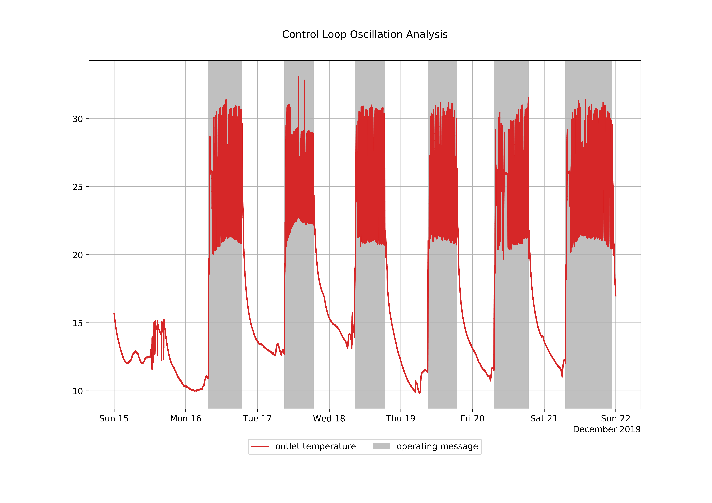

Figure 2 is a zoom of figure 1 to analyze the oscillation more into detail. The trajectory of the process value is common for control loops oscillating at medium frequency.

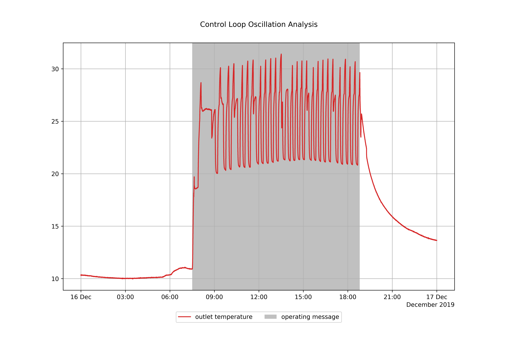

The _Control Loop Analysis_ evaluated this oscillation as significant, signal color _yellow_, and derived recommendation on how to adjust controller parameters for a smoother operation.



## Signal colors

| Signal color | Available | Info |
| :--- | :--- | :--- |
| red | No | _Red_ as a signal for a low cost measure with high impact on the building operation will not be provided. |
| yellow | Yes | An oscillating control loop is a symptom for suboptimal control parameters or component design. Investing the extra effort to identify the root cause and fixing it is strongly recommended. |
| green | Yes | No or only slight, in respect to usual tolerances in buildings, negligible oscillation |

## Interpretations

| Available | Info |
| :--- | :--- |
| Yes | Either the operational rule checks of the analysis were tested positive or not |

## Recommendations

| Available | Info |
| :--- | :--- |
| Yes | Recommendations on how to smooth the control loop oscillation. No recommendation, if oscillation is negligible |



## [thermal control loop](component-data-models.md#thermal-control-loop)

<table>
  <thead>
    <tr>
      <th style="text-align:left">Pin</th>
      <th style="text-align:left">Required</th>
      <th style="text-align:left">Mapping info</th>
    </tr>
  </thead>
  <tbody>
    <tr>
      <td style="text-align:left">operating message</td>
      <td style="text-align:left">no</td>
      <td style="text-align:left">
        
Strongly recommended

        
Default: Always on

      </td>
    </tr>
    <tr>
      <td style="text-align:left">outlet temperature</td>
      <td style="text-align:left">yes</td>
      <td style="text-align:left">The outlet temperature is the process value of a thermal control loop</td>
    </tr>
  </tbody>
</table>



## 
Recommended Time Span

### 1 day to 1 week

## **Recommended Repetition** 

### Weekly

* After changes of operational modes, e.g. transfers to heating mode
* After changes in the control system
* After maintenance or replacements



## **Dew Point Alert Analysis**

Building automation systems often have dew point alert messages which identify the possibility of unwanted condensation taking place in rooms. If the dew point alert message is active for any amount of time during the period of analysis, a recommendation is made to the user since rooms condensation in rooms can be damaging. Furthermore, if the temperature and relative humidity of the room are known, the _DewPointAlertAnalysis_ calculates the risk of condensation and takes these into account in the evaluation.  The _DewPointAlertAnalysis_ is recommended for any room with an existing dew point alert signal or with temperature and relative humidity sensors. 



## Value

* Avoids damage to rooms due to condensation

## Recommended for components

* Rooms

## Checked conditions

* Duration of dew point alert signal
* Duration in which the room temperature is between 2 K and 4 K above the dew point temperature
* Duration in which the room temperature is within 2 K of the dew point temperature



The _Dew Point  Alert Analysis_ was performed on a room for a week in February 2020. For this particular room, a dew point alert message is available but no temperature and relative humidity data. As is shown in figure 1, the dew point alert signal is only active for a very short amount of time during the week. 

The analysis returns a _red_ warning message to indicate that the dew point alert was active during some of the time period. This suggests that the condensation may have formed in the room. Note that only 'dew point alert' KPIs are generated since no temperature and humidity data are available in this example. 

| KPI | Value | Unit |
| :--- | :--- | :--- |
| dew point alert message.relative | 1.69 | % |
| dew point alert message.duration | 2.83 | h |



## Signal colors

| Signal color | Available | Info |
| :--- | :--- | :--- |
| red | Yes | Dew point alert message is active for some time or the temperature and humidity show a high chance of condensation.  |
| yellow | Yes | There is a moderate chance of condensation taking place in the room. |
| green | Yes | Dew point alert message is not active during analysis period. No risk of condensation.  |

## Interpretations

| Available | Info |
| :--- | :--- |
| Yes | Either the operational rule checks of the analysis were tested positive or not. |

## Recommendations

| Available | Info |
| :--- | :--- |
| Yes | Check room for condensation and mold. |

## KPIs

The KPIs which are generated by this analysis depend on the information available in the analysis. The 'dew point alert message' KPI's are generated if a dew point alert message is available. The condensation risk KPIs are generated using room temperature and relative humidity. 

The condensation risk is evaluated as moderate if the room temperature is between 2 K and 4 K above the dew point temperature. A high condensation risk is when the room temperature is within 2 K of the dew point temperature. 

### Dew point alert

| KPI Identifier | Description | Value Range | Unit |
| :--- | :--- | :--- | :--- |
| dew point alert message.relative | Time of active dew point alert message as a percentage of total time. | 0 to 100 | % |
| dew point alert message.duration | Total time of active dew point alert message. | 0 to inf | h |
| condensation risk moderate.relative | Time of moderate condensation risk as a percentage of total time.   | 0 to 100 | % |
| condensation risk moderate.duration | Total time of moderate condensation risk.  | 0 to inf | h |
| condensation risk high.relative | Time of high condensation risk as a percentage of total time.  | 0 to 100 | % |
| condensation risk high.duration | Total time of high condensation risk.  | 0 to inf | h |



## [room](component-data-models.md#room)

| Pin | Required | Mapping info |
| :--- | :--- | :--- |
| dew point alert message | no | The dew point alert message can be used as the only pin or in combination with temperature and humidity.  |
| temperature | no | If the temperature is mapped, humidity must also be mapped. Can be used in combination with dew point alert message. |
| humidity | no | If humidity is mapped, the temperature must also be mapped. Can be used in combination with dew point alert message. |



## Recommended Time Span

### 1 week to 1 month

## **Recommended Repetition**

### Every month

* After changes of operational modes, e.g. transfers to heating mode
* After changes in the control system
* After maintenance and replacement



## Fan Speed Analysis

The _Fan Speed Analysis_ evaluates whether a fan is controlled, based on its fan speed. This helps to identify problems with the fan control and ensures that fans are implemented more energy efficiently.



## Value

* Detect AHU fans that are not controlled
* Reduce costs through better fan speed control

## Recommended for components

* Fan

## Checked conditions

* Stationary fan speed



In this example we look at a _Fan Speed Analysis of_  the historic 7 day fan speed. While the Operating Message \(grey in the plot below\) show the times when the fan was operated, the fan speed \(blue in the plot below\) corresponds to the speed or load setting of the fan.

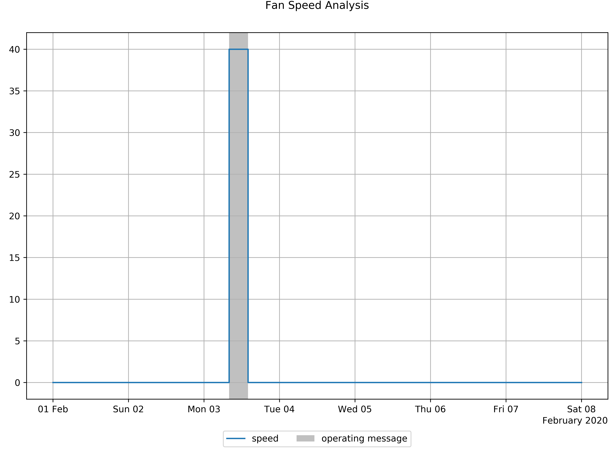

From the analysis results we can see that the fan was operated for 6 hours out of the 168 hours of the week or 3.57 % of the week. Additionally we get statistics of the fan speed, f.e. the fan was operated at an average of 40 % load.

This corresponds to a static fan speed setting that is currently not controlled. To improve energy efficiency and thermal comfort you can consider different control strategies outlined in the recommendations.

#### KPI - Statistics

| KPI | Value | Unit |
| :--- | :--- | :--- |
| operating time | 6 | h |
| operating time.relative | 3.57 | % |
| speed.maximum | 40 | % |
| speed.minimum | 40 | % |
| speed.mean | 40 | % |
| speed.median | 40 | % |



## Signal colors

| Signal color | Available | Info |
| :--- | :--- | :--- |
| red | No |  |
| yellow | Yes | Fan speed is not controlled |
| green | Yes | Fan speed is controlled |

## Interpretations

| Available | Info |
| :--- | :--- |
| Yes |  Information about the fan speed |

## Recommendations

| Available | Info |
| :--- | :--- |
| Yes | Recommendations to look into the different control options for this fan to save energy. |

## KPIs

### Statistics


statistics for "speed" will be calculated for all measured values that are not 0 %


| KPI Identifier | Description | Value Range | Unit |
| :--- | :--- | :--- | :--- |
| operating time | Total time of operation | 0 to inf | h |
| operating time.relative | Time of operation in relation to analysis period | 0 to 100 | % |
| speed.maximum | Largest observation recorded for fan speed during analysis period | 0 to 100 | % |
| speed.minimum | Smallest observation recorded for fan speed during analysis period | 0 to 100 | % |
| speed.mean | Time-weighted average of fan speed | 0 to 100 | % |
| speed.median | Time-weighted median of fan speed | 0 to 100 | % |



## ​[fan](https://docs.aedifion.io/docs/engineers/component-data-models#thermal-control-loop)​ 

| Pin | Required | Mapping info |
| :--- | :--- | :--- |
| operating message | No | ​​ |
| speed | Yes | Use this pin to connect the datapoint that reflects fan speed settings from 0 - 100 % load |



## Recommended Time Span

### 1 week

## **Recommended Repetition**

### Every month



## Filter Servicing Analysis

The _Filter Servicing Analysis_ predicts when a filter is due to be serviced or replaced, based on filter contamination or the pressure difference over the filter. This ensures that filters always function optimally and maintained or replaced as required.



## Value

* Ensures filter is serviced when required
* Improves energy efficiency

## Recommended for components

* Filter

## Checked conditions

* Filter contamination
* Expected time till filter service or replacement 



In this example, the filter contamination of an exhaust air filter in a combined heat and power plant was analyzed for a period of four months. As can be seen in figure 1, the filter contamination gradually increases over the analyzed period.

The signal analysis returns a green signal color since there is a significant amount of time before the filter is fully contaminated.

| KPI | Value | Unit |
| :--- | :--- | :--- |
| days until filter service  | 35 | d |
| expected date of filter service | 2020-05-20 | date |
| filter contamination | 79.3 | % |



## Signal colors

| Signal color | Available | Info |
| :--- | :--- | :--- |
| red | Yes | The filter is fully contaminated and should be serviced soon. |
| yellow | Yes | The filter is almost contaminated,  a filter service should scheduled. |
| green | Yes | The filter is in a good condition and does not need to be serviced. |

## Interpretations

| Available | Info |
| :--- | :--- |
| Yes |  Information regarding the filter condition and whether the filter needs to be serviced.  |

## Recommendations

| Available | Info |
| :--- | :--- |
| Yes | Make necessary arrangements for filter to be serviced. No recommendation if the filter does not need servicing within two weeks and the filter contamination is below 95%. |

## KPIs

| KPI Identifier | Description | Value Range | Unit |
| :--- | :--- | :--- | :--- |
| days until filter service | Number of days until filter expected filter service. | 0 to inf | d |
| expected date of filter service | Date on which filter is expected to require a service \(format: YYYY-MM-DD\) |  | date |
| filter contamination | Relative extent to which filter is contaminated. | 0 to 100 | % |



## ​filter  

| Pin | Required | Mapping info |
| :--- | :--- | :--- |
| filter contamination | No | Either **filter contamination \(preferred\)** or **pressure difference** must be mapped. If ~~~~both pins are mapped, **filter contamination** is used.  |
| pressure difference | No | Either **filter contamination \(preferred\)** or **pressure difference** must be mapped. If both pins are mapped, **filter contamination** is used.  |

| Attribute | Required | Mapping info |
| :--- | :--- | :--- |
| filter\_class | no | Default: F9 |
| initial\_pressure\_difference | no | Default: initial pressure difference of filter class \(50 Pa for filter class F9\). |
| final\_pressure\_difference | no | Default: final pressure difference of filter class \(300 Pa for filter class F9\). Setting this attribute is **highly recommended**.  |



## Recommended Time Span

### 1 month to 6 months

## **Recommended Repetition**

### Twice a month



## Humidity Conditioning Analysis 

The _Humidity Conditioning Analysis_ compares the outside air humidy with the actual supply air humidity of the a Air Handling Unit \(AHU\). 


This analysis does not take into account air recirculation and humidity recovery modes. Make sure that the system is operated without such operational modes.




## Value

* Detect operating conditions of AHUs that are not appropriate to the outside air conditions
* Avoids unnecessary changes in humidity, which cost a lot of energy
* Verifies sufficient supply air humidity

## Recommended for components

* Air handling units with humidity conditioning

## Checked conditions

* Compare actual operated hours with humidification, dehumidification and no operation with the corresponding expected hours



This example shows a week of analysis for a summer scenario in July. The AHU is operating throughout the week. Relative humidity conditions are displayed in red and orange, green and blue are temperature conditions and brown and purple are the water load conditions.

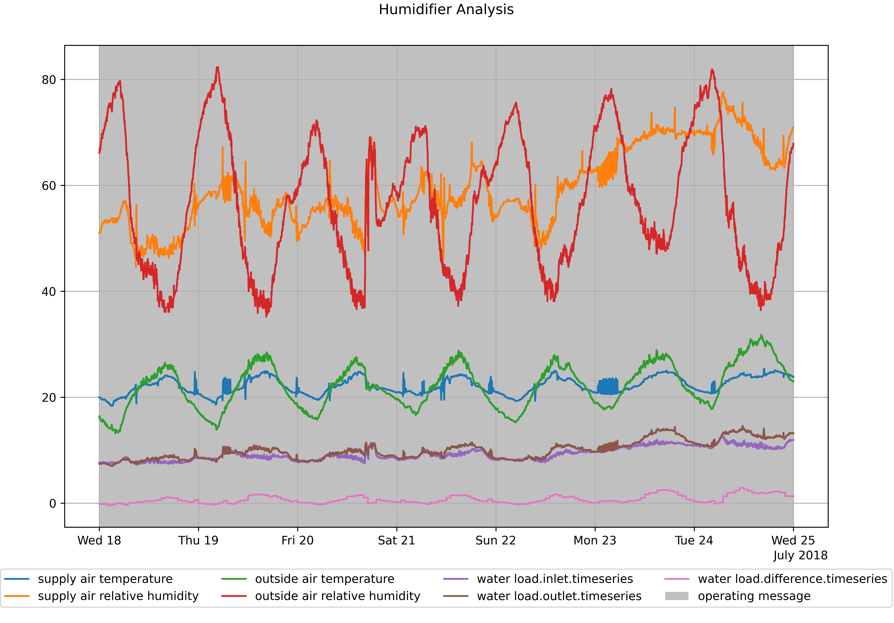

The analysis uses two positions, intake \(outside conditions\) and outlet \(supply conditions\) to calculate water loads. A difference of these water loads corresponds to the pink line at the bottom. The operating hours will now be divided into three categories. Hours of humidification, hours of dehumidification and hours of neither humidification nor dehumidification. These values are then compared to the expected hours in these categories derived from outside conditions. The total hours of correct operation \(according to the expectation\) and then evaluated for a recommendation.

| KPI | Value | Unit |
| :--- | :--- | :--- |
| operating time | 168 | h |
| operating time.relative | 100 | % |
| humidification detected | 135 | h |
| dehumidification detected | 18 | h |
| humidification necessary | 0 | h |
| dehumidification necessary | 49 | h |
| humidification missing | 0 | h |
| dehumidification missing | 49 | h |
| humidification unnecessary | 135 | h |
| dehumidification unnecessary | 18 | h |
| total hours savings possible.relative | 91.1 | % |
| total hours increase air quality.relative | 92.3 | % |



## Signal colors

| Signal color | Available | Info |
| :--- | :--- | :--- |
| red | No |   |
| yellow | Yes |  |
| green | Yes | The AHU operates in accordance to the expected operating conditions. |

## Interpretations

| Available | Info |
| :--- | :--- |
| Yes | Either the expected operating conditions are met by the operation of the AHU or the operating conditions do not fit. |

## Recommendations

| Available | Info |
| :--- | :--- |
| Yes | Recommendations regarding which operating mode \(humidification, dehumidification\) should be looked into to change the operating modes of the AHU. |

## KPIs

| KPI Identifier | Description | Value Range | Unit |
| :--- | :--- | :--- | :--- |
| operating time | Total time of operation | 0 to inf | h |
| operating time.relative | Total time component was operated compared to analysis period | 0 to 100 | % |

### Operating Conditions

| KPI Identifier | Description | Value Range | Unit |
| :--- | :--- | :--- | :--- |
| humidification detected | The amount of time the component operates in humidification mode according to inflow / outflow analysis | 0 to inf | h |
| dehumidification detected | The amount of time the component operates in dehumidification mode according to inflow / outflow analysis | 0 to inf | h |
| humidification necessary | The amount of time the component should operate in humidification mode according to outside air conditions | 0 to inf | h |
| dehumidification necessary | The amount of time the component should operate in dehumidification mode according to outside air conditions | 0 to inf | h |
| humidification missing | The amount of time the component did not operate in humidification mode but should | 0 to inf | h |
| dehumidification missing | The amount of time the component did not operate in dehumidification mode but should | 0 to inf | h |
| humidification unnecessary | The amount of time the component operated in humidification mode but should not | 0 to inf | h |
| dehumidification unnecessary | The amount of time the component operated in dehumidification mode but should not | 0 to inf | h |
| total hours savings possible.relative | Percentage of time de- or humidification can be switched off according to outside air conditions relative to operating time | 0 to 100 | % |
| total hours increase air quality.relative | Percentage of time de- or humidification should be switched on according to outside air conditons relative to operating time | 0 to 100 | % |



## [humidity conditioner](component-data-models.md#humidity-conditioner)

<table>
  <thead>
    <tr>
      <th style="text-align:left">Pin</th>
      <th style="text-align:left">Required</th>
      <th style="text-align:left">Mapping info</th>
    </tr>
  </thead>
  <tbody>
    <tr>
      <td style="text-align:left">supply air temperature</td>
      <td style="text-align:left">yes</td>
      <td style="text-align:left">conditioned air at supply side exit of AHU</td>
    </tr>
    <tr>
      <td style="text-align:left">supply air relative humidity</td>
      <td style="text-align:left">yes</td>
      <td style="text-align:left">conditioned air at supply side exit of AHU</td>
    </tr>
    <tr>
      <td style="text-align:left">outside air temperature</td>
      <td style="text-align:left">yes</td>
      <td style="text-align:left">intake air conditions</td>
    </tr>
    <tr>
      <td style="text-align:left">outside air relative humidity</td>
      <td style="text-align:left">yes</td>
      <td style="text-align:left">intake air conditions</td>
    </tr>
    <tr>
      <td style="text-align:left">operating message</td>
      <td style="text-align:left">no</td>
      <td style="text-align:left">
        
Mapping of <b>operating message </b>is strongly recommended.

        
Default: Always operating

      </td>
    </tr>
  </tbody>
</table>



## Recommended Time Span

### 1 week

## **Recommended Repetition**

### Every month

* After changes of operational modes
* After changes in the control system



## Operating Cycle Analysis

The _Operating Cycle Analysis_ identifies excessive start and stop processes which lead to energy losses, energy consumption peaks due to higher energy consumption on plant start, and higher wear and tear of the component compared to constant operation. Further, a frequently alternating operation of a component, e.g. a heat pump, has negative effects on adjacent components, which are enforced to alternate as well. Further, the algorithm takes low cycle rates as an indication of a possible under-supply of the adjacent systems.



## **Value**

* Lower operating costs
* Higher energy efficiency
* Peak energy consumption reduction
* Longer equipment and component lifetimes
* Smoother system integration

## Recommended for components

Energy conversion plants and components with high start-up energy consumption or wear, such as

* Heat pump
* Combined heat and power
* Boiler
* Fan

## Checked conditions

* Short cycling of component operation, evaluated component-specific
* Long cycling of component operation, evaluated component-specific
* Expected cycling of component operation, evaluated component-specific
* Condition checks on times of components operation



The **Operating Cycle Analysis** was applied to a real test bench, the heat pump of the E.ON Energy Research Center, RWTH Aachen University. Thus, a [heat pump component model ](component-data-models.md#heat-pump)was instanced and the respective datapoint mapped to the pin _operating message_. __Figure 1 shows the time series recorded for an exemplary period of 6 hours on a winter day.

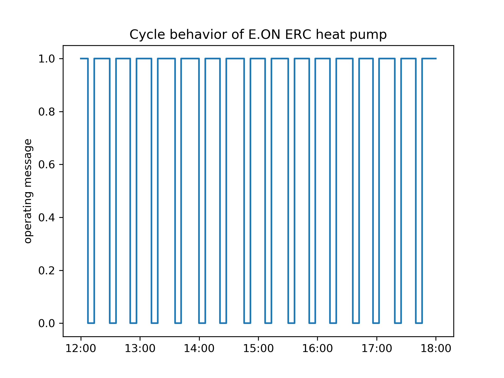

Short shut-down times between periods of duty indicate excessive start and stop processes of the heat pump, leading not only to energy losses and electricity consumption peaks but also to increased wear and tear of the heat pumps compressor. 

The automated interpretation confirms our visual analysis of the time series shown in the figure, summed up by the qualitative warning level "red". The recommendations provide further instruction on how to isolate and fix the cause for the increased number of start and stop processes. Further, the result offers an advanced set of KPIs, providing additional insights into the cycle behavior of the heat pump.



## Signal colors

| Signal color | Available | Info |
| :--- | :--- | :--- |
| red | No | The analysis identifies the symptom and recommends measures to investigate the root cause of short cycling respectively long cycling. _Red_ as a signal for a low cost measure with high impact on the building operation will not be provided. |
| yellow | Yes | Unwanted cycling rates are a strong symptom for suboptimal control and system performance. Investing the extra effort to identify the root cause and fixing it is strongly recommended. |
| green | Yes | Sufficient cycle rates in respect to usual operation in buildings |

## Interpretations

| Available | Info |
| :--- | :--- |
| Yes | Either the operational rule checks of the analysis were tested positive or not |

## Recommendations

| Available | Info |
| :--- | :--- |
| Yes | Recommendations on how to investigate the root cause of an unwanted cycle rate. No recommendation, if cycle rate is sufficient |

## KPIs

### 
Operating time

Operating times KPIs provide information on the total time of operation of the analysed component during the analysed time span.

| KPI Identifier | Description | Value Range | Unit |
| :--- | :--- | :--- | :--- |
|  operating time | Total time of operation | 0 to inf | h |
|  operating time.relative | Total time of operation divided by total time span | 0 to 100 | % |

### Start

The Start KPI is the count of starts of the analysed component during the analysed time span.

| KPI Identifier | Description | Value Range | Unit |
| :--- | :--- | :--- | :--- |
| starts | Count of starts | 0 to inf | count |

### Closed operating cycle

A _closed operating cycle_ is defined as _period of time between a start_ $$n_i$$_of the component an the next start_ $$n_{i+1}$$. The KPI _closed operating cycles_ represents the number of cycles observed during the analysed time span used to determine the operating cycle KPIs \(_cycle times, duty times, switch-off times_\).

| KPI Identifier | Description | Value Range | Unit |
| :--- | :--- | :--- | :--- |
| closed operating cycles | Count of closed operating cycles | 0 to inf | count |

### Cycle times

Cycle time KPIs evaluate the cycle times of the closed cycles observed during the analysed time span. The mean, time-weighted average, minimum, and maximum cycle period are determined. In case there were no closed operating cycles observed during the analysed time span, none of the KPI variables are returned on API call.

| KPI Identifier | Description | Value Range | Unit |
| :--- | :--- | :--- | :--- |
| cycle times.median | Median of cycle periods | 0 to inf | h |
| cycle times.mean | Time-weighted average of cycle periods | 0 to inf | h |
| cycle times.maximum | Longest cycle period | 0 to inf | h |
| cycle times.minimum | Shortest cycle period | 0 to inf | h |

### Duty times

Duty time KPIs evaluate the duty times of the closed cycles observed during the analysed time span. Duty time is defined as the time of component operation in a closed cycle. The mean, time-weighted average, minimum, and maximum duty period are determined. In case there were no closed operating cycles observed during the analysed time span, none of the KPI variables are returned on API call.

| KPI Identifier | Description | Value Range | Unit |
| :--- | :--- | :--- | :--- |
| duty times.median | Median of duty periods | 0 to inf | h |
| duty times.mean | Time-weighted average of duty periods | 0 to inf | h |
| duty times.maximum | Longest duty period | 0 to inf | h |
| duty times.minimum | Shortest duty period | 0 to inf | h |

### Switch-off times

Switch-off time KPIs evaluate the shutdown times of the closed cycles observed during the analysed time span. Switch-off time is defined as the time of component shutdown in a closed cycle. The mean, time-weighted average, minimum, and maximum switch-off period are determined. In case there were no closed operating cycles observed during the analysed time span, none of the KPI variables are returned on API call.

| KPI Identifier | Description | Value Range | Unit |
| :--- | :--- | :--- | :--- |
| switch-off times.median | Median of switch-off periods | 0 to inf | h |
| switch-off times.mean | Time-weighted average of switch-off periods | 0 to inf | h |
| switch-off times.maximum | Longest switch-off period | 0 to inf | h |
| switch-off times.minimum | Shortest switch-off period | 0 to inf | h |



## [boiler](component-data-models.md#boiler)

| Pin | Required | Mapping info |
| :--- | :--- | :--- |
| operating message | yes |  |

## [combined heat and power](component-data-models.md#combined-heat-and-power)

| Pin | Required | Mapping info |
| :--- | :--- | :--- |
| operating message | yes |  |

## [fan](component-data-models.md#heat-pump)

| Pin | Required | Mapping info |
| :--- | :--- | :--- |
| operating message | yes |  |

### [heat pump](https://docs.aedifion.io/docs/engineers/specifications/component-data-models#heat-pump)

| Pin | Required | Mapping info |
| :--- | :--- | :--- |
| operating message | yes |  |

### [thermal control loop](component-data-models.md#thermal-control-loop)

| Pin | Required | Mapping info |
| :--- | :--- | :--- |
| operating message | no | Mapping of either **operating message \(preferred\)** or **pump operating message** is **mandatory**. If both pins are mapped, operating message is used |
| pump operating message | no | Mapping of either **operating message \(preferred\)** or **pump operating message** is **mandatory**. If both pins are mapped, operating message is used |



## Recommended Time Span

### 1 day to 1 week

## **Recommended Repetition**

### Every month

* Cycle rates have a strong seasonal effect
* Frequent repetition allows to identify operational bad points
* After changes of operational modes, e.g. transfers to heating mode
* After changes in the control system
* After maintenance or replacements



## Reduced Load Analysis

The _Reduced Load Analysis_ identifies the presence of a reduced load mode based on temperature setpoints of the system under consideration. The temperature spread of the system is determined. A reduced load mode offers the possibility of operational cost and energy reductions. Additionally, a comparison with a user-defined schedule reveals times when the component could be in a reduced load operating mode.



## Value

* Lower operating costs
* Lower energy consumption

## Recommended for components

Heat and cold distribution systems, energy conversion plants and indoor areas, such as

* Heating loops
* Cooling loops
* Boilers
* Office rooms
* Schooling rooms

## Checked conditions

* Existence of a load reduction period, e.g. night-time temperature reduction for heating
* Condition checks on times of components operation
* Estimation of times when the load can be reduced according to a user-defined schedule



This example shows the results of a _Reduced Load Analysis_ performed on a heating circuit. Figure 1 shows the temperature setpoint. The setpoint changes from operation at normal load to reduced load according to the schedule in the table below. The detected temperature level shift corresponds to 10 Kelvin.

![Figure 1: outlet temperature setpoint \[&#xB0;C\]](../.gitbook/assets/reduced_load_analysis.png)

#### Schedule

| Day | Time |
| :--- | :--- |
| Mon | 05:00 - 18:00 |
| Tue | 05:00 - 18:00 |
| Wed | 05:00 - 18:00 |
| Thu | 05:00 - 18:00 |
| Fri | 05:00 - 18:00 |
| Sat | 07:00 - 14:00 |
| Sun | 07:00 - 14:00 |

| KPI | Value | Unit |
| :--- | :--- | :--- |
| reduced load operation | Yes | binary |
| temperature level shift | 10 | °C |
| operating time | 62.4 | h |
| operating time.normal load.reducible | 1.77 | h |
| operating time.normal load.reducible.relative | 2.84 | % |
| operating time.normal load.scheduled | 60.6 | h |



## Signal colors

| Signal color | Available | Info |
| :--- | :--- | :--- |
| red | Yes | No load reduction identified \(applied for thermal control loop\) |
| yellow | Yes | No load reduction identified \(applied for any other component than thermal control loop\) |
| green | Yes | Load reduction identified |

## Interpretations

| Available | Info |
| :--- | :--- |
| Yes | Either the operational rule checks of the analysis were tested positive or not |

## Recommendations

| Available | Info |
| :--- | :--- |
| Yes | Implementation hints for load reduction. No recommendation, in case of sufficient measurement quality |

## KPIs

### Identification of reduced load mode

<table>
  <thead>
    <tr>
      <th style="text-align:left">KPI Identifier</th>
      <th style="text-align:left">Description</th>
      <th style="text-align:left">Value Range</th>
      <th style="text-align:left">Unit</th>
    </tr>
  </thead>
  <tbody>
    <tr>
      <td style="text-align:left">reduced load operation</td>
      <td style="text-align:left">
        
Whether a reduced load mode was detected

        
No = no reduced load identified

        
Yes = reduced load identified

      </td>
      <td style="text-align:left">Yes, No</td>
      <td style="text-align:left">binary</td>
    </tr>
  </tbody>
</table>

### Statistics of temperature level shift

<table>
  <thead>
    <tr>
      <th style="text-align:left">KPI Identifier</th>
      <th style="text-align:left">Description</th>
      <th style="text-align:left">Value Range</th>
      <th style="text-align:left">Unit</th>
    </tr>
  </thead>
  <tbody>
    <tr>
      <td style="text-align:left">temperature level shift</td>
      <td style="text-align:left">
        
Difference between setpoint temperature levels at the time of load reduction

        
negative values = reduced temperature level for heating load reduction

        
positive values = raised temperature level for cooling load reduction

      </td>
      <td style="text-align:left">-inf to inf</td>
      <td style="text-align:left">&#xB0;C</td>
    </tr>
  </tbody>
</table>

### Schedule operating times

KPIs of this category analyse if the load reduction is in accordance to a schedule and if there are further savings by adjusting/implementing a load reduction schedule.

| KPI Identifier | Description | Value Range | Unit |
| :--- | :--- | :--- | :--- |
| operating time | Total time of operation | 0 to inf | h |
| operating time.normal load.reducible | Total time component was operated under normal load outside the reviewed schedule and therefor could be saved | 0 to inf | h |
| operating time.normal load.reducible.relative | Percentage of reducible operating time under normal load relative to the total operating time | 0 to 100 | % |
| operating time.normal load.scheduled | Total time of operation under normal load that is scheduled | 0 to inf | h |

## Timeseries

<table>
  <thead>
    <tr>
      <th style="text-align:left">KPI Identifier</th>
      <th style="text-align:left">Description</th>
      <th style="text-align:left">Value Range</th>
      <th style="text-align:left">Unit</th>
    </tr>
  </thead>
  <tbody>
    <tr>
      <td style="text-align:left">normal load.timeseries</td>
      <td style="text-align:left">
        
Timeseries of operating mode

        
0 = reduced load operation

        
1 = normal operation

      </td>
      <td style="text-align:left">0 or 1</td>
      <td style="text-align:left">binary</td>
    </tr>
  </tbody>
</table>



## [boiler](component-data-models.md#boiler)

| Pin | Required | Mapping info |
| :--- | :--- | :--- |
| outlet temperature setpoint | yes |  |

<table>
  <thead>
    <tr>
      <th style="text-align:left">Attribute</th>
      <th style="text-align:left">Required</th>
      <th style="text-align:left">Mapping info</th>
    </tr>
  </thead>
  <tbody>
    <tr>
      <td style="text-align:left">custom_day_schedules</td>
      <td style="text-align:left">no</td>
      <td style="text-align:left"></td>
    </tr>
    <tr>
      <td style="text-align:left">custom_holiday</td>
      <td style="text-align:left">no</td>
      <td style="text-align:left"></td>
    </tr>
    <tr>
      <td style="text-align:left">preconditioning</td>
      <td style="text-align:left">no</td>
      <td style="text-align:left"></td>
    </tr>
    <tr>
      <td style="text-align:left">regional_key</td>
      <td style="text-align:left">no</td>
      <td style="text-align:left"></td>
    </tr>
    <tr>
      <td style="text-align:left">schedule</td>
      <td style="text-align:left">no</td>
      <td style="text-align:left">times for operation at normal load</td>
    </tr>
    <tr>
      <td style="text-align:left">schedule_timezone</td>
      <td style="text-align:left">no</td>
      <td style="text-align:left">
        
Strongly recommended

        
Default: UTC

      </td>
    </tr>
    <tr>
      <td style="text-align:left">shutdown_flexibility</td>
      <td style="text-align:left">no</td>
      <td style="text-align:left"></td>
    </tr>
  </tbody>
</table>

## [room](component-data-models.md#room)

| Pin | Required | Mapping info |
| :--- | :--- | :--- |
| temperature setpoint | yes |  |

<table>
  <thead>
    <tr>
      <th style="text-align:left">Attribute</th>
      <th style="text-align:left">Required</th>
      <th style="text-align:left">Mapping info</th>
    </tr>
  </thead>
  <tbody>
    <tr>
      <td style="text-align:left">custom_day_schedules</td>
      <td style="text-align:left">no</td>
      <td style="text-align:left"></td>
    </tr>
    <tr>
      <td style="text-align:left">custom_holiday</td>
      <td style="text-align:left">no</td>
      <td style="text-align:left"></td>
    </tr>
    <tr>
      <td style="text-align:left">preconditioning</td>
      <td style="text-align:left">no</td>
      <td style="text-align:left"></td>
    </tr>
    <tr>
      <td style="text-align:left">regional_key</td>
      <td style="text-align:left">no</td>
      <td style="text-align:left"></td>
    </tr>
    <tr>
      <td style="text-align:left">schedule</td>
      <td style="text-align:left">no</td>
      <td style="text-align:left">times for operation at normal load</td>
    </tr>
    <tr>
      <td style="text-align:left">schedule_timezone</td>
      <td style="text-align:left">no</td>
      <td style="text-align:left">
        
Strongly recommended

        
Default: UTC

      </td>
    </tr>
    <tr>
      <td style="text-align:left">shutdown_flexibility</td>
      <td style="text-align:left">no</td>
      <td style="text-align:left"></td>
    </tr>
  </tbody>
</table>

## [thermal control loop](component-data-models.md#thermal-control-loop)

| Pin | Required | Mapping info |
| :--- | :--- | :--- |
| outlet temperature setpoint | yes |  |

<table>
  <thead>
    <tr>
      <th style="text-align:left">Attribute</th>
      <th style="text-align:left">Required</th>
      <th style="text-align:left">Mapping info</th>
    </tr>
  </thead>
  <tbody>
    <tr>
      <td style="text-align:left">custom_day_schedules</td>
      <td style="text-align:left">no</td>
      <td style="text-align:left"></td>
    </tr>
    <tr>
      <td style="text-align:left">custom_holiday</td>
      <td style="text-align:left">no</td>
      <td style="text-align:left"></td>
    </tr>
    <tr>
      <td style="text-align:left">preconditioning</td>
      <td style="text-align:left">no</td>
      <td style="text-align:left"></td>
    </tr>
    <tr>
      <td style="text-align:left">regional_key</td>
      <td style="text-align:left">no</td>
      <td style="text-align:left"></td>
    </tr>
    <tr>
      <td style="text-align:left">schedule</td>
      <td style="text-align:left">no</td>
      <td style="text-align:left">times for operation at normal load</td>
    </tr>
    <tr>
      <td style="text-align:left">schedule_timezone</td>
      <td style="text-align:left">no</td>
      <td style="text-align:left">
        
Strongly recommended

        
Default: UTC

      </td>
    </tr>
    <tr>
      <td style="text-align:left">shutdown_flexibility</td>
      <td style="text-align:left">no</td>
      <td style="text-align:left"></td>
    </tr>
  </tbody>
</table>



## Recommended Time Span

### 1 day to 1 week

## Recommended Repetition

### Every 3 months

* After changes of operational modes, e.g. transfers to heating mode
* After changes in the control system
* After maintenance or replacements



## Sensor Outage Analysis

The _Sensor Outage Analysis_ uses the time series data of the sensor to detect irregularities on observations. This implies manual overwriting of the sensor values, constant observations for expected volatile trajectories of the data points observations and also value plausibility checks by types of sensors.



## Value

* Confirm normal operation of sensors
* Identify faulty measurement setups inside your building automation system
* Detection of permanently manual overwritten sensors causing permanent manipulation of control loop

## Recommended for components

Any component with sensors measuring physical quantities

## Checked conditions

* Measurements of a sensor lie within a reasonable range
* Detects constant observation for sensors which expect volatile trajectories



For this example we are looking at a temperature sensor for room air temperature, that is connected to a component "room". The KPIs are generated according the mapped pins. For this setup we mapped a datapoint to pin pin "temperature", thus the result contains the three KPIs listed below.

The room temperature is measured by the sensor with values above the plausibility limit of 40 °C. The KPI "pin.temperature.above high limit = 1" indicates that the measured values lie not within a reasonable range for room temperatures.

If any of the KPIs have the boolean value of 1, a faulty sensor is detected and the signal color "red" is returned to alarm. A detected fault can be caused by various reasons ranging from manually overwritten sensors over a faulty sensor to a wrong configured measurement system.

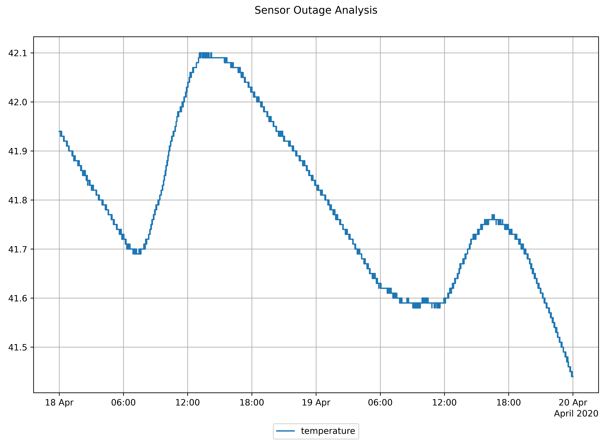

| KPI | Value | Unit |
| :--- | :--- | :--- |
| pin.temperature.below low limit | No | binary |
| pin.temperature.above high limit | Yes | binary |
| pin.temperature.faulty | No | binary |



## Signal colors

| Signal color | Available | Info |
| :--- | :--- | :--- |
| red | Yes | One or more Sensors have to be checked |
| yellow | No |  |
| green | Yes | no faulty sensors detected |

## Interpretations

| Available | Info |
| :--- | :--- |
| Yes | Detection of faulty of sensors or plausible observations |

## Recommendations

| Available | Info |
| :--- | :--- |
| Yes | Recommendations to correct the reason of the sensor fault |

## KPIs


PIN\_NAME refers to the actual pin on the component that the KPI belongs to.


#### Limit

<table>
  <thead>
    <tr>
      <th style="text-align:left">KPI Identifier</th>
      <th style="text-align:left">Description</th>
      <th style="text-align:left">Value Range</th>
      <th style="text-align:left">Unit</th>
    </tr>
  </thead>
  <tbody>
    <tr>
      <td style="text-align:left">pin.{PIN NAME}.below low limit</td>
      <td style="text-align:left">
        
Time Series values of pin &quot;PIN_NAME&quot; below low limit

        
0 = observations in plausible range

        
1 = observations below lowest plausible value detected

      </td>
      <td style="text-align:left">Yes, No</td>
      <td style="text-align:left">binary</td>
    </tr>
    <tr>
      <td style="text-align:left">pin.{PIN NAME}.above high limit</td>
      <td style="text-align:left">
        
Time Series values of pin &quot;PIN_NAME&quot; above high limit

        
0 = observations in plausible range

        
1 = observations above highest plausible value detected

      </td>
      <td style="text-align:left">Yes, No</td>
      <td style="text-align:left">binary</td>
    </tr>
  </tbody>
</table>

#### Sensor Fault

| KPI Identifier | Description | Value Range | Unit |
| :--- | :--- | :--- | :--- |
| pin.{PIN NAME}.faulty | Sensor of pin "PIN\_NAME" below low limit | Yes, No | binary |



## boiler

<table>
  <thead>
    <tr>
      <th style="text-align:left">Pin</th>
      <th style="text-align:left">Required</th>
      <th style="text-align:left">Mapping Info</th>
    </tr>
  </thead>
  <tbody>
    <tr>
      <td style="text-align:left">inlet temperature</td>
      <td style="text-align:left">no</td>
      <td style="text-align:left">
        
low limit = 1

        
high limit = 100

      </td>
    </tr>
    <tr>
      <td style="text-align:left">outlet temperature</td>
      <td style="text-align:left">no</td>
      <td style="text-align:left">
        
low limit = 1

        
high limit = 100

      </td>
    </tr>
  </tbody>
</table>

## combine heat and power

<table>
  <thead>
    <tr>
      <th style="text-align:left">Pin</th>
      <th style="text-align:left">Required</th>
      <th style="text-align:left">Mapping info</th>
    </tr>
  </thead>
  <tbody>
    <tr>
      <td style="text-align:left">inlet temperature</td>
      <td style="text-align:left">no</td>
      <td style="text-align:left">
        
low limit = 1

        
high limit = 100

      </td>
    </tr>
    <tr>
      <td style="text-align:left">outlet temperature</td>
      <td style="text-align:left">no</td>
      <td style="text-align:left">
        
low limit = 1

        
high limit = 100

      </td>
    </tr>
  </tbody>
</table>

## heat meter

<table>
  <thead>
    <tr>
      <th style="text-align:left">Pin</th>
      <th style="text-align:left">Required</th>
      <th style="text-align:left">Mapping Info</th>
    </tr>
  </thead>
  <tbody>
    <tr>
      <td style="text-align:left">inlet temperature</td>
      <td style="text-align:left">no</td>
      <td style="text-align:left">
        
low limit = 1

        
high limit = 100

      </td>
    </tr>
    <tr>
      <td style="text-align:left">outlet temperature</td>
      <td style="text-align:left">no</td>
      <td style="text-align:left">
        
low limit = 1

        
high limit = 100

      </td>
    </tr>
  </tbody>
</table>

## heat pump

<table>
  <thead>
    <tr>
      <th style="text-align:left">Pin</th>
      <th style="text-align:left">Required</th>
      <th style="text-align:left">Mapping Info</th>
    </tr>
  </thead>
  <tbody>
    <tr>
      <td style="text-align:left">condenser inlet temperature</td>
      <td style="text-align:left">no</td>
      <td style="text-align:left">
        
low limit = -50

        
high limit = 100

      </td>
    </tr>
    <tr>
      <td style="text-align:left">condenser outlet temperature</td>
      <td style="text-align:left">no</td>
      <td style="text-align:left">
        
low limit = -50

        
high limit = 100

      </td>
    </tr>
    <tr>
      <td style="text-align:left">evaporator inlet temperature</td>
      <td style="text-align:left">no</td>
      <td style="text-align:left">
        
low limit = -50

        
high limit = 100

      </td>
    </tr>
    <tr>
      <td style="text-align:left">evaporator outlet temperature</td>
      <td style="text-align:left">no</td>
      <td style="text-align:left">
        
low limit = -50

        
high limit = 100

      </td>
    </tr>
  </tbody>
</table>

## room

<table>
  <thead>
    <tr>
      <th style="text-align:left">Pin</th>
      <th style="text-align:left">Required</th>
      <th style="text-align:left">Mapping Info</th>
    </tr>
  </thead>
  <tbody>
    <tr>
      <td style="text-align:left">temperature</td>
      <td style="text-align:left">no</td>
      <td style="text-align:left">
        
low limit = 5

        
high limit = 40

      </td>
    </tr>
    <tr>
      <td style="text-align:left">humdity</td>
      <td style="text-align:left">no</td>
      <td style="text-align:left">
        
low limit = 0

        
high limit = 100

      </td>
    </tr>
  </tbody>
</table>

## thermal control loop

<table>
  <thead>
    <tr>
      <th style="text-align:left">Pin</th>
      <th style="text-align:left">Required</th>
      <th style="text-align:left">Low Limit</th>
    </tr>
  </thead>
  <tbody>
    <tr>
      <td style="text-align:left">inlet temperature</td>
      <td style="text-align:left">no</td>
      <td style="text-align:left">
        
low limit = -50

        
high limit = 100

      </td>
    </tr>
    <tr>
      <td style="text-align:left">outlet temperature</td>
      <td style="text-align:left">no</td>
      <td style="text-align:left">
        
low limit = -50

        
high limit = 100

      </td>
    </tr>
    <tr>
      <td style="text-align:left">inlet temperature recirculation</td>
      <td style="text-align:left">no</td>
      <td style="text-align:left">
        
low limit = -50

        
high limit = 100

      </td>
    </tr>
    <tr>
      <td style="text-align:left">valve position</td>
      <td style="text-align:left">no</td>
      <td style="text-align:left">
        
low limit = 0

        
high limit = 100

      </td>
    </tr>
  </tbody>
</table>

## weather station

<table>
  <thead>
    <tr>
      <th style="text-align:left">Pin</th>
      <th style="text-align:left">Required</th>
      <th style="text-align:left">Low Limit</th>
    </tr>
  </thead>
  <tbody>
    <tr>
      <td style="text-align:left">temperature</td>
      <td style="text-align:left">no</td>
      <td style="text-align:left">
        
low limit = -50

        
high limit = 50

      </td>
    </tr>
  </tbody>
</table>



## Recommended Time Span

### 1 week - several weeks

## **Recommended Repetition**

### Every Week

* A Sensor fault can occur at any moment



## Room Air Quality Analysis

The _Room Air Quality Analysis_ checks and interprets the compliance of carbon dioxide concentration in the air to the recommendations of DIN EN 13776: 2007-09. In the case of poor air quality, measures for improvement are recommended. Human performance is significantly influenced by air quality. In addition, the algorithm identifies calibration errors by physical plausibility checks.



## Value

* Higher occupant comfort, health, and performance

## Recommended for components

* Rooms
* Occupied indoor areas

## **Checked conditions**

* Indoor CO2 concentration evaluation based on DIN EN 13776: 2007-09
* Identification of higher room ventilation needs
* Sensor calibration check by the plausibility of minimal measured concentration levels
* Condition checks on times of components operation




The setpoint deviation analysis was applied to a real test bench, a heating system at the E.ON Energy Research Center, RWTH Aachen University. Thus, a room component model was instanced and the respective datapoints mapped to this component.

In this scenario, figure 1 shows the timeseries recorded for an exemplary period of 12 hours on a working day in August. The CO2 concentration in the air remained between what is considered "good" and "medium" for most of the day. However, for about 7 percent of the period, air quality was poor, with a maximum CO2 concentration of 1463 ppm, so that a complete evaluation on that day indicates poor air quality. The results provide an advanced set of KPIs that provide quantitative insights into the air quality of the rooms and support the human reasoning for analysis. A number of suggestions for possible countermeasures are given, and further investigation of the root cause of air quality problems is possible through the aedifion front-end data visualization.



## Signal colors

| Signal color | Available | Info |
| :--- | :--- | :--- |
| red | Yes | CO2 concentrations critical for human health |
| yellow | Yes | CO2 concentrations reducing human comfort, decisiveness, and performance or wrongly calibrated CO2 sensors |
| green | Yes | CO2 concentrations sufficient for high comfort |

## Interpretations

| Available | Info |
| :--- | :--- |
| Yes | Either the operational rule checks of the analysis were tested positive or not |

## Recommendations

| Available | Info |
| :--- | :--- |
| Yes | Recommendations to improve fresh air supply, if necessary or re-calibrate the sensor, if physically implausible measures are observed. No recommendation, in case of sufficient air quality |

## KPIs

### Air quality classification

How long was the air quality in the room \(based on carbon dioxide concentrations\) considered “good”, “medium”, “moderate” or “poor”? Assessments are based on EU regulation classifications of Indoor Air Quality \(IDA\) classes 1 \(“good”\) to 4 \(“poor”\).

| KPI Identifier | Description | Value Range | Unit |
| :--- | :--- | :--- | :--- |
| co2 duration.IDA1.relative | Duration with “good“ indoor air quality | 0 to 100 | % |
| co2 duration.IDA2.relative | Duration with “medium “ indoor air quality | 0 to 100 | % |
| co2 duration.IDA3.relative | Duration with “moderate “ indoor air quality | 0 to 100 | % |
| co2 duration.IDA4.relative | Duration with “poor “ indoor air quality | 0 to 100 | % |
| co2 duration.IDA1 | Duration with “good“ indoor air quality | 0 to inf | h |
| co2 duration.IDA2 | Duration with “medium “ indoor air quality | 0 to inf | h |
| co2  duration.IDA3 | Duration with “moderate “ indoor air quality | 0 to inf | h |
| co2 duration.IDA4 | Duration with “poor “ indoor air quality | 0 to inf | h |

### Statistics of CO2 concentration

Providing deeper insights to the carbon dioxide concentrations over the analysed period.

| KPI Identifier | Description | Value Range | Unit |
| :--- | :--- | :--- | :--- |
| co2.maximum | Largest CO2 concentrations | 0 to inf | ppm |
| co2.minimum | Smallest CO2 concentrations | 0 to inf | ppm |
| co2.mean | Average CO2 concentrations | 0 to inf | ppm |
| co2.median | Median CO2 concentrations | 0 to inf | ppm |



## \*\*\*\*[**room**](https://docs.aedifion.io/docs/engineers/specifications/component-data-models#room)\*\*\*\*

<table>
  <thead>
    <tr>
      <th style="text-align:left">Pin</th>
      <th style="text-align:left">Required</th>
      <th style="text-align:left">Mapping info</th>
    </tr>
  </thead>
  <tbody>
    <tr>
      <td style="text-align:left">co2</td>
      <td style="text-align:left">yes</td>
      <td style="text-align:left"></td>
    </tr>
    <tr>
      <td style="text-align:left">operating message</td>
      <td style="text-align:left">no</td>
      <td style="text-align:left">
        
Mapping of either <b>presence (preferred)</b> or <b>operating message</b> is
          strongly recommended. If both pins are mapped, pressence is used

        
Default: Always presence

      </td>
    </tr>
    <tr>
      <td style="text-align:left">presence</td>
      <td style="text-align:left">no</td>
      <td style="text-align:left">
        
Mapping of either <b>presence (preferred)</b> or <b>operating message</b> is
          strongly recommended. If both pins are mapped, pressence is used

        
Default: Always presence

      </td>
    </tr>
  </tbody>
</table>



## 
 Recommended Time Span

### 1 days to 1 week

* Utilize on days with room occupation

## **Recommended Repetition** 

### Every month

* After changes of room occupation or usage
* After changes of operational modes, e.g. transfers to heating mode
* After changes in the control system of the ventilation systems
* After maintenance or replacements in ventilation systems



## Schedule Analysis

The _Schedule Analysis_ is used to compare the actual occurred switch on/switch off times of the component with a schedule/timetable stored inside analytics. This analysis aims at identifying the amount of hours the component is active outside of the scheduled times. In addition to a one-time check, the analysis is suitable for permanent checks, e.g. to identify manual overwriting of the operating schedule. The analysis allows to respect holidays and exceptional day schedules.



## Value

* Lower operating times of HVAC components
* Lower energy consumption
* Lower maintenance costs due to less component operating time

## Recommended for components

Any HVAC component or room whose usage follows a recurrent schedule, such as

* Fans
* Thermal control loops
* Office rooms
* Sales rooms

## Checked conditions

* Component operation outside a user defined schedule
* Component operation during a user defined schedule
* Condition checks on times of components operation



This example shows a **schedule analysis** for a component "[fan](https://docs.aedifion.io/docs/engineers/specifications/component-data-models#fan)" connected to a supply fan operating message of a HVAC machine. The switch on/off times of the machine are shown as a blue line in figure 1, blue regions in the background correspond to the anticipated schedule.

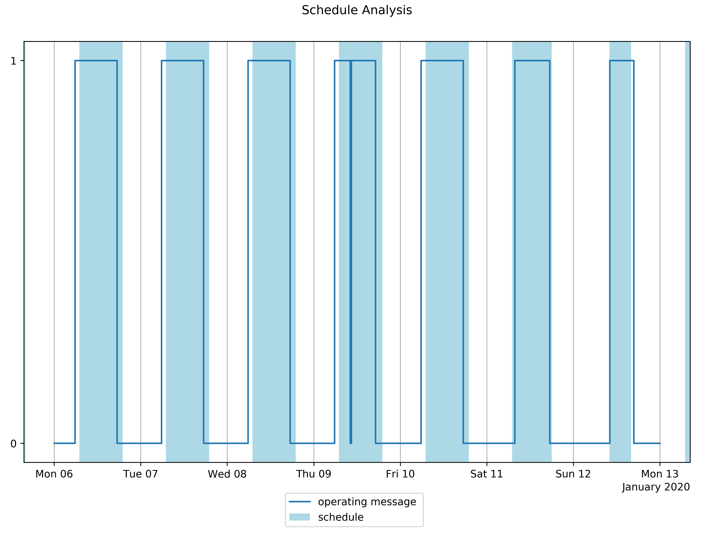

The following KPIs show that a reduction of ~9% of the total operating time is possible. With the help of the plot we can also see, that the times were we can reduce the operating time are distributed over the workdays of the week.

| KPI | Value | Unit |
| :--- | :--- | :--- |
| operating time | 74 | h |
| operating time.reducible | 6.94 | h |
| operating time.reducible.relative | 9.38 | % |
| operating time.scheduled | 67.1 | h |
| savings.daily | 1.53 | €/d |



## Signal colors

| Signal color | Available | Info |
| :--- | :--- | :--- |
| red | Yes | Significant operation times outside of the parameterized schedule identified |
| yellow | Yes | Partial operation times outside of the parameterized schedule identified |
| green | Yes | Sufficient operation according to the parameterized schedule |

## Interpretations

| Available | Info |
| :--- | :--- |
| Yes | Either the operational rule checks of the analysis were tested positive or not |

## Recommendations

| Available | Info |
| :--- | :--- |
| Yes | Recommendations to improve scheduled operation of the component. No recommendation, in case of sufficient measurement quality |

## KPIs

<table>
  <thead>
    <tr>
      <th style="text-align:left">KPI Identifier</th>
      <th style="text-align:left">Description</th>
      <th style="text-align:left">Value Range</th>
      <th style="text-align:left">Unit</th>
    </tr>
  </thead>
  <tbody>
    <tr>
      <td style="text-align:left">operating time</td>
      <td style="text-align:left">Total time of operation</td>
      <td style="text-align:left">0 to inf</td>
      <td style="text-align:left">h</td>
    </tr>
    <tr>
      <td style="text-align:left">operating time.reducible</td>
      <td style="text-align:left">Total time component was operated outside the reviewed schedule and therefor
        could be saved</td>
      <td style="text-align:left">0 to inf</td>
      <td style="text-align:left">h</td>
    </tr>
    <tr>
      <td style="text-align:left">operating time.reducible.relative</td>
      <td style="text-align:left">Percentage of reducible time relative to the total operating time</td>
      <td
      style="text-align:left">0 to 100</td>
        <td style="text-align:left">%</td>
    </tr>
    <tr>
      <td style="text-align:left">operating time.scheduled</td>
      <td style="text-align:left">Total time of operation during schedule</td>
      <td style="text-align:left">0 to inf</td>
      <td style="text-align:left">h</td>
    </tr>
    <tr>
      <td style="text-align:left">savings.daily</td>
      <td style="text-align:left">
        
Identified savings potential for adjusting components operation to the
          schedule.

        
Provided as savings per day. Available for component fan only.

      </td>
      <td style="text-align:left">0 to inf</td>
      <td style="text-align:left">&#x20AC;/d</td>
    </tr>
  </tbody>
</table>



## [boiler](component-data-models.md#boiler)

| Pin | Required | Mapping info |
| :--- | :--- | :--- |
| operating message | yes |  |

<table>
  <thead>
    <tr>
      <th style="text-align:left">Attribute</th>
      <th style="text-align:left">Required</th>
      <th style="text-align:left">Mapping info</th>
    </tr>
  </thead>
  <tbody>
    <tr>
      <td style="text-align:left">custom_day_schedules</td>
      <td style="text-align:left">no</td>
      <td style="text-align:left"></td>
    </tr>
    <tr>
      <td style="text-align:left">custom_holiday</td>
      <td style="text-align:left">no</td>
      <td style="text-align:left"></td>
    </tr>
    <tr>
      <td style="text-align:left">preconditioning</td>
      <td style="text-align:left">no</td>
      <td style="text-align:left"></td>
    </tr>
    <tr>
      <td style="text-align:left">regional_key</td>
      <td style="text-align:left">no</td>
      <td style="text-align:left"></td>
    </tr>
    <tr>
      <td style="text-align:left">schedule</td>
      <td style="text-align:left">yes</td>
      <td style="text-align:left"></td>
    </tr>
    <tr>
      <td style="text-align:left">schedule_timezone</td>
      <td style="text-align:left">no</td>
      <td style="text-align:left">
        
Strongly recommended

        
Default: UTC

      </td>
    </tr>
    <tr>
      <td style="text-align:left">shutdown_flexibility</td>
      <td style="text-align:left">no</td>
      <td style="text-align:left"></td>
    </tr>
  </tbody>
</table>

## [combined heat and power](component-data-models.md#combined-heat-and-power)

| Pin | Required | Mapping info |
| :--- | :--- | :--- |
| operating message | yes |  |

<table>
  <thead>
    <tr>
      <th style="text-align:left">Attribute</th>
      <th style="text-align:left">Required</th>
      <th style="text-align:left">Mapping info</th>
    </tr>
  </thead>
  <tbody>
    <tr>
      <td style="text-align:left">custom_day_schedules</td>
      <td style="text-align:left">no</td>
      <td style="text-align:left"></td>
    </tr>
    <tr>
      <td style="text-align:left">custom_holiday</td>
      <td style="text-align:left">no</td>
      <td style="text-align:left"></td>
    </tr>
    <tr>
      <td style="text-align:left">preconditioning</td>
      <td style="text-align:left">no</td>
      <td style="text-align:left"></td>
    </tr>
    <tr>
      <td style="text-align:left">regional_key</td>
      <td style="text-align:left">no</td>
      <td style="text-align:left"></td>
    </tr>
    <tr>
      <td style="text-align:left">schedule</td>
      <td style="text-align:left">yes</td>
      <td style="text-align:left"></td>
    </tr>
    <tr>
      <td style="text-align:left">schedule_timezone</td>
      <td style="text-align:left">no</td>
      <td style="text-align:left">
        
Strongly recommended

        
Default: UTC

      </td>
    </tr>
    <tr>
      <td style="text-align:left">shutdown_flexibility</td>
      <td style="text-align:left">no</td>
      <td style="text-align:left"></td>
    </tr>
  </tbody>
</table>

## [fan](component-data-models.md#thermal-control-loop)

| Pin | Required | Mapping info |
| :--- | :--- | :--- |
| operating message | yes |  |

<table>
  <thead>
    <tr>
      <th style="text-align:left">Attribute</th>
      <th style="text-align:left">Required</th>
      <th style="text-align:left">Mapping info</th>
    </tr>
  </thead>
  <tbody>
    <tr>
      <td style="text-align:left">custom_day_schedules</td>
      <td style="text-align:left">no</td>
      <td style="text-align:left"></td>
    </tr>
    <tr>
      <td style="text-align:left">custom_holiday</td>
      <td style="text-align:left">no</td>
      <td style="text-align:left"></td>
    </tr>
    <tr>
      <td style="text-align:left">preconditioning</td>
      <td style="text-align:left">no</td>
      <td style="text-align:left"></td>
    </tr>
    <tr>
      <td style="text-align:left">regional_key</td>
      <td style="text-align:left">no</td>
      <td style="text-align:left"></td>
    </tr>
    <tr>
      <td style="text-align:left">schedule</td>
      <td style="text-align:left">yes</td>
      <td style="text-align:left"></td>
    </tr>
    <tr>
      <td style="text-align:left">schedule_timezone</td>
      <td style="text-align:left">no</td>
      <td style="text-align:left">
        
Strongly recommended

        
Default: UTC

      </td>
    </tr>
    <tr>
      <td style="text-align:left">shutdown_flexibility</td>
      <td style="text-align:left">no</td>
      <td style="text-align:left"></td>
    </tr>
  </tbody>
</table>

## [heat pump](component-data-models.md#heat-pump)

| Pin | Required | Mapping info |
| :--- | :--- | :--- |
| operating message | yes |  |

<table>
  <thead>
    <tr>
      <th style="text-align:left">Attribute</th>
      <th style="text-align:left">Required</th>
      <th style="text-align:left">Mapping info</th>
    </tr>
  </thead>
  <tbody>
    <tr>
      <td style="text-align:left">custom_day_schedules</td>
      <td style="text-align:left">no</td>
      <td style="text-align:left"></td>
    </tr>
    <tr>
      <td style="text-align:left">custom_holiday</td>
      <td style="text-align:left">no</td>
      <td style="text-align:left"></td>
    </tr>
    <tr>
      <td style="text-align:left">preconditioning</td>
      <td style="text-align:left">no</td>
      <td style="text-align:left"></td>
    </tr>
    <tr>
      <td style="text-align:left">regional_key</td>
      <td style="text-align:left">no</td>
      <td style="text-align:left"></td>
    </tr>
    <tr>
      <td style="text-align:left">schedule</td>
      <td style="text-align:left">yes</td>
      <td style="text-align:left"></td>
    </tr>
    <tr>
      <td style="text-align:left">schedule_timezone</td>
      <td style="text-align:left">no</td>
      <td style="text-align:left">
        
Strongly recommended

        
Default: UTC

      </td>
    </tr>
    <tr>
      <td style="text-align:left">shutdown_flexibility</td>
      <td style="text-align:left">no</td>
      <td style="text-align:left"></td>
    </tr>
  </tbody>
</table>

## [thermal control loop](component-data-models.md#thermal-control-loop)

| Pin | Required | Mapping info |
| :--- | :--- | :--- |
| operating message | no | Mapping of either **operating message \(preferred\)** or **pump operating message** is **mandatory**. If both pins are mapped, operating message is used |
| pump operating message | no | Mapping of either **operating message \(preferred\)** or **pump operating message** is **mandatory**. If both pins are mapped, operating message is used |

<table>
  <thead>
    <tr>
      <th style="text-align:left">Attribute</th>
      <th style="text-align:left">Required</th>
      <th style="text-align:left">Mapping info</th>
    </tr>
  </thead>
  <tbody>
    <tr>
      <td style="text-align:left">custom_day_schedules</td>
      <td style="text-align:left">no</td>
      <td style="text-align:left"></td>
    </tr>
    <tr>
      <td style="text-align:left">custom_holiday</td>
      <td style="text-align:left">no</td>
      <td style="text-align:left"></td>
    </tr>
    <tr>
      <td style="text-align:left">preconditioning</td>
      <td style="text-align:left">no</td>
      <td style="text-align:left"></td>
    </tr>
    <tr>
      <td style="text-align:left">regional_key</td>
      <td style="text-align:left">no</td>
      <td style="text-align:left"></td>
    </tr>
    <tr>
      <td style="text-align:left">schedule</td>
      <td style="text-align:left">yes</td>
      <td style="text-align:left"></td>
    </tr>
    <tr>
      <td style="text-align:left">schedule_timezone</td>
      <td style="text-align:left">no</td>
      <td style="text-align:left">
        
Strongly recommended

        
Default: UTC

      </td>
    </tr>
    <tr>
      <td style="text-align:left">shutdown_flexibility</td>
      <td style="text-align:left">no</td>
      <td style="text-align:left"></td>
    </tr>
  </tbody>
</table>

## [room](component-data-models.md#room)

| Pin | Required | Mapping info |
| :--- | :--- | :--- |
| operating message | yes |  |

<table>
  <thead>
    <tr>
      <th style="text-align:left"><b>Attribute</b>
      </th>
      <th style="text-align:left">Required</th>
      <th style="text-align:left">Mapping info</th>
    </tr>
  </thead>
  <tbody>
    <tr>
      <td style="text-align:left">custom_day_schedules</td>
      <td style="text-align:left">no</td>
      <td style="text-align:left"></td>
    </tr>
    <tr>
      <td style="text-align:left">custom_holiday</td>
      <td style="text-align:left">no</td>
      <td style="text-align:left"></td>
    </tr>
    <tr>
      <td style="text-align:left">preconditioning</td>
      <td style="text-align:left">no</td>
      <td style="text-align:left"></td>
    </tr>
    <tr>
      <td style="text-align:left">regional_key</td>
      <td style="text-align:left">no</td>
      <td style="text-align:left"></td>
    </tr>
    <tr>
      <td style="text-align:left">schedule</td>
      <td style="text-align:left">yes</td>
      <td style="text-align:left"></td>
    </tr>
    <tr>
      <td style="text-align:left">schedule_timezone</td>
      <td style="text-align:left">no</td>
      <td style="text-align:left">
        
Strongly recommended

        
Default: UTC

      </td>
    </tr>
    <tr>
      <td style="text-align:left">shutdown_flexibility</td>
      <td style="text-align:left">no</td>
      <td style="text-align:left"></td>
    </tr>
  </tbody>
</table>



## 
Recommended Time Span

### 1 week

## **Recommended Repetition** 

### Every week

* After adjustment of usage times of the analyzed component
* After changes of operational modes, e.g. transfers to heating mode
* After changes in the control system
* After maintenance or replacements



## Thermal Comfort Analysis

The _Thermal Comfort Analysis_ evaluates the comfort level of a room by determining the indicators PMV \(Predicted Mean Vote\) and PPD \(Predicted Percentage of Dissatisfied\). They are calculated from room air temperature, room air humidity, and expected level of clothing depending on the outdoor temperature. Influences on thermal comfort in rooms like thermal exchange by radiation and influences of drafts are simplified in the determination.



## Value

* Check and evaluate the room comfort level
* Higher occupant comfort, health and performance

## Recommended for components

* Rooms with usual conditioning like offices, schools, salesrooms

## Checked conditions

* Sufficient thermal comfort 



For this example we look at a room for an analysis period of two days. In this time we can categorize the room comfort level according to the comfort level categories in the table below. The PMV level stayes inside the neutral category for the whole 48 hours.

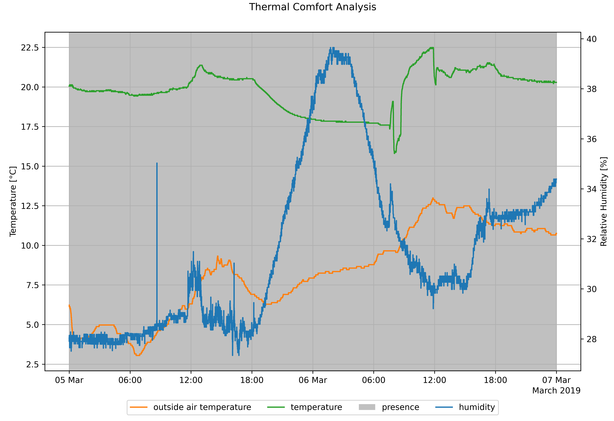

| KPI | Value | Unit |
| :--- | :--- | :--- |
| operating time | 48 | h |
| operating time.relative | 100 | % |
| predicted percentage of dissatisfied.mean | 11.3 | % |
| predicted percentage of dissatisfied.median | 9.66 | % |
| predicted percentage of dissatisfied.maximum | 41.1 | % |
| predicted percentage of dissatisfied.minimum | 5.0 | % |
| predicted mean vote.mean | -0.483 | - |
| predicted mean vote.median | -0.472 | - |
| predicted mean vote.maximum | 0.0831 | - |
| predicted mean vote.minimum | -1.32 | - |
| duration.predicted mean vote.hot | 0 | h |
| duration.predicted mean vote.warm | 0 | h |
| duration.predicted mean vote.warmish | 0 | h |
| duration.predicted mean vote.neutral | 25 | h |
| duration.predicted mean vote.coolish | 23 | h |
| duration.predicted mean vote.cool | 0 | h |
| duration.predicted mean vote.cold | 0 | h |
| duration.category A.relative | 8.33 | % |
| duration.category B.relative | 43.8 | % |
| duration.category C.relative | 22.9 | % |
| duration.no category.relative | 25.0 | % |
| duration.predicted mean vote.neutral | 48 | h |



## Signal colors

| Signal color | Available | Info |
| :--- | :--- | :--- |
| red | Yes | Room comfort level is insufficient |
| yellow | Yes | Room comfort level is sufficient |
| green | Yes | Room comfort level is good |

## Interpretations

| Available | Info |
| :--- | :--- |
| Yes | Evaluation of the room comfort level for peak and average values  |

## Recommendations

| Available | Info |
| :--- | :--- |
| Yes | Recommendations to improve the room comfort level |

## KPIs

### Temperatures

| KPI Identifier | Description | Value Range | Unit |
| :--- | :--- | :--- | :--- |
| room.temperature.mean | Average room temperature during presence and analysis period | inf | °C |
| room.relative humidity.mean | Average relative humidity for room during presence and analysis period | 0 to 100 | % |
| outdoor temperature.mean | Average outdoor temperature during presence and analysis period | inf | °C |

### Operating time

| KPI Identifier | Description | Value Range | Unit |
| :--- | :--- | :--- | :--- |
| operating time | Duration of presence, respectively active room control if presence is not measured | 0 to inf | h |
| operating time.relative | Duration of presence, respectively active room control if presence is not measured, relative to analysed time | 0 to 100 | % |

### Predicted Mean Vote - PMV

Following the Climate Assessment Scale of DIN EN ISO 7730, 2006 with

| PMV Value | classification |
| :--- | :--- |
| pmv &gt; 2.5 | hot |
| 1.5 &lt; pmv &lt;= 2.5 | warm |
| 0.5 &lt; pmv &lt;= 1.5 | warmish |
| -0.5 &lt;= pmv &lt;= 0.5 | neutral |
| -1.5 &lt;= pmv &lt; -0.5 | coolish |
| -2.5 &lt;= pmv &lt; -1.5 | cool |
| pmv &lt; -2.5 | cold |

| KPI Identifier | Description | Value Range | Unit |
| :--- | :--- | :--- | :--- |
| predicted mean vote.mean | Average of PMV for analysis period | -3 to 3 | - |
| predicted mean vote.median | Median of PMV for analysis period | -3 to 3 | - |
| predicted mean vote.maximum | Maximum PMV reached during analysis period | -3 to 3 | - |
| predicted mean vote.minimum | Minimum PMV reached during analysis period | -3 to 3 | - |
| duration.predicted mean vote.hot | Duration the PMV is classfied as hot | 0 to inf | h |
| duration.predicted mean vote.warm | Duration the PMV is classfied as warm | 0 to inf | h |
| duration.predicted mean vote.warmish | Duration the PMV is classfied as warmish | 0 to inf | h |
| duration.predicted mean vote.neutral | Duration the PMV is classfied as neutral | 0 to inf | h |
| duration.predicted mean vote.coolish | Duration the PMV is classfied as coolish | 0 to inf | h |
| duration.predicted mean vote.cool | Duration the PMV is classfied as cool | 0 to inf | h |
| duration.predicted mean vote.cold | Duration the PMV is classfied as cold | 0 to inf | h |

### Predicted Percentage of Dissatisfied - PPD

| KPI Identifier | Description | Value Range | Unit |
| :--- | :--- | :--- | :--- |
| predicted percentage of dissatisfied.mean | Average of PPD for analysis period | 0 to 100 | % |
| predicted percentage of dissatisfied.median | Median of PPD for analysis period | 0 to 100 | % |
| predicted percentage of dissatisfied.maximum | Maximum PPD reached during analysis period | 0 to 100 | % |
| predicted percentage of dissatisfied.minimum | Minimum PPD reached during analysis period | 0 to 100 | % |

### Comfort Level Categories

According to norm DIN EN 15251, 2007

| Category | PMV |
| :--- | :--- |
| A | -0,2 &lt; PMV &lt; +0,2 |
| B | -0,5 &lt; PMV &lt; +0,5 |
| C | -0,7 &lt; PMV &lt; +0,7 |

| KPI Identifier | Description | Value Range | Unit |
| :--- | :--- | :--- | :--- |
| duration.category A.relative | Percentage of time the room comfort level corresponds to category A  | 0 to 100 | % |
| duration.category A | Duration that the room comfort level corresponds to category A  | 0 to inf | h |
| duration.category B.relative | Percentage of time the room comfort level corresponds to category B | 0 to 100 | % |
| duration.category B | Duration that the room comfort level corresponds to category B | 0 to inf | h |
| duration.category C.relative | Percentage of time the room comfort level corresponds to category C | 0 to 100 | % |
| duration.category C | Duration that the room comfort level corresponds to category C | 0 to inf | h |
| duration.no category.relative | Percentage of time the room comfort level corresponds to no category | 0 to 100 | % |
| duration.no category | Duration that the room comfort level corresponds to no category | 0 to inf | h |

## Timeseries

| KPI Identifier | Description | Value Range | Unit |
| :--- | :--- | :--- | :--- |
| predicted mean vote.timeseries | Timeseries with the PMV value for each observation | -3 to 3 | - |
| predicted percentage of dissatisfied.timeseries | Timeseries with the PPD value for each observation | 0 to 100 | % |
| category.timeseries | Timeseries with a category classification for each observation | A, B, C, NOCAT | string |



## [**room**](https://docs.aedifion.io/docs/engineers/specifications/component-data-models#room)\*\*\*\*

<table>
  <thead>
    <tr>
      <th style="text-align:left">Pin</th>
      <th style="text-align:left">Required</th>
      <th style="text-align:left">Mapping info</th>
    </tr>
  </thead>
  <tbody>
    <tr>
      <td style="text-align:left">temperature</td>
      <td style="text-align:left">yes</td>
      <td style="text-align:left"></td>
    </tr>
    <tr>
      <td style="text-align:left">humdity</td>
      <td style="text-align:left">yes</td>
      <td style="text-align:left"></td>
    </tr>
    <tr>
      <td style="text-align:left">outside temperature</td>
      <td style="text-align:left">yes</td>
      <td style="text-align:left"></td>
    </tr>
    <tr>
      <td style="text-align:left">operating message</td>
      <td style="text-align:left">no</td>
      <td style="text-align:left">
        
Mapping of either <b>presence (preferred)</b> or <b>operating message</b> is
          strongly recommended. If both pins are mapped, pressence is used

        
Default: Always presence

      </td>
    </tr>
    <tr>
      <td style="text-align:left">presence</td>
      <td style="text-align:left">no</td>
      <td style="text-align:left">
        
Mapping of either <b>presence (preferred)</b> or <b>operating message</b> is
          strongly recommended. If both pins are mapped, pressence is used

        
Default: Always presence

      </td>
    </tr>
  </tbody>
</table>



## Recommended Time Span

### 1 week

## **Recommended Repetition**

### Every month

* After changes of presence or room schedules



## Setpoint Deviation Analysis

The _Setpoint Deviation Analysis_ identifies insufficient setpoint attainment by comparing the actual value of a controlled system to its setpoint value. Insufficient setpoint attainment is a symptom that can be traced back to plenty of different causes. E.g., insufficient supply of a controlled system with the required temperature level, suboptimal controller software, and parameters, or a blocked valve. The Setpoint Deviation Analysis supports narrowing down the root cause of insufficient setpoint attainment and is especially recommended in complex energy systems.



## Value

Setpoint deviation is a strong symptom for faulty control loop operation, e.g. caused by

* Technical defects in the control loop supply,
* Control loop malfunctions, and
* Faulty control loop parameter settings.

Benefits of improving insufficient setpoint value attainment are:

* Higher occupant comfort, health, and performance
* Lower operating costs
* Higher energy efficiency

## Recommended for components

Control loops, such as

* Heating systems
* Ventilation systems
* Air-conditioning systems

## Checked conditions

* Process value value overshooting its setpoint, evaluated component specific
* Process value value undershooting its setpoint, evaluated component specific
* Process value value sufficiently achieving its setpoint, evaluated component specific
* Condition checks on times of components operation



The setpoint deviation analysis was applied to a real test bench, a heating system at the E.ON Energy Research Center, RWTH Aachen University. Thus, a thermal control loop component model was instanced and the respective datapoints mapped to this component.

In this scenario,  figure 1 shows the time series recorded for an exemplary period of 36 hours on a November workday. The temperature setpoint and the actual measured value started to drift apart around 12 am on the 19th. Since then, the control loop did not comply with the setpoint temperatures although the control loop was operating.

The automated interpretation confirms our visual analysis of the time series shown in the figure, summed up by the qualitative warning level "red". The recommendations provide further instruction on how to isolate and fix the cause for the inadequate setpoint compliance. Further, the result offers an advanced set of KPIs, providing additional insights into the control loop behaviour. They support human reasoning for a case-by-case analysis.

For example, the drop in temperatures is peculiar and could point to a technical defect or malfunction, such as a blocked valve. Another cause might be a sudden drop in the temperatures supplied to the distribution system, such as an heat-pump or boiler issue. Further investigation of the root cause is possible via data visualization on the aedifion front-end.



## Signal colors

| Signal color | Available | Info |
| :--- | :--- | :--- |
| red | No | The analysis identifies the symptom and recommends measures to investigate the root cause of the setpoint deviation. _Red_ as a signal for a low cost measure with high impact on the building operation will not be provided. |
| yellow | Yes | Setpoint deviation is a strong symptom for suboptimal control and system performance. Investing the extra effort to identify the root cause and fixing it is strongly recommended. |
| green | Yes | Sufficient setpoint compliance in respect to usual tolerances in buildings |

## Interpretations

| Available | Info |
| :--- | :--- |
| Yes | Either the operational rule checks of the analysis were tested positive or not |

## Recommendations

| Available | Info |
| :--- | :--- |
| Yes | Recommendations on how to investigate the root cause of a setpoint deviation. No recommendation, if setpoint compliance is sufficient |

## KPIs

### Incidence of setpoint deviation

Duration of the setpoint deviations, bundled by threshold value ranges.

| KPI Identifier | Description | Value Range | Unit |
| :--- | :--- | :--- | :--- |
| setpoint deviation.lower threshold | Component specific lower threshold for evaluation of the extent of the setpoint deviation | 0 to inf | unit of setpoint |
| setpoint deviation.upper threshold | Component specific upper threshold for evaluation of the extent of the setpoint deviation | 0 to inf | unit of setpoint |
| setpoint deviation.above lower threshold and below upper threshold | Duration with absolute value of setpoint deviation between lower and upper threshold | 0 to inf | h |
| setpoint deviation.above lower threshold and below upper threshold.relative | Duration with absolute value of setpoint deviation between lower and upper threshold relative to total time of analysis | 0 to 100 | % |
| setpoint deviation.above upper threshold | Duration with absolute value of setpoint higher than upper threshold | 0 to inf | h |
| setpoint deviation.above upper threshold.relative | Duration with absolute value of setpoint higher than upper threshold relative to total time of analysis | 0 to 100 | % |
| setpoint deviation.below lower threshold | Duration with absolute value of setpoint smaller than lower threshold | 0 to inf | h |
| setpoint deviation.below lower threshold.relative | Duration with absolute value of setpoint smaller than lower threshold relative to total time of analysis | 0 to 100 | % |

### Operating time

Operating time KPIs provide information on the total time of operation of the analysed component during the analysed time frame.

| KPI Identifier | Description | Value Range | Unit |
| :--- | :--- | :--- | :--- |
| operating time | Total operating time | 0 to inf | h |
| operating time.relative | Relative operating time | 0 to 100 | % |

### Statistics of setpoint deviation

General information KPIs to give further insight into the setpoint compliance over the analysed time frame.

| KPI Identifier | Description | Value Range | Unit |
| :--- | :--- | :--- | :--- |
| setpoint deviation.maximum | Largest setpoint deviation | -inf to inf | unit of setpoint |
| setpoint deviation.mean | Average setpoint deviation | -inf to inf | unit of setpoint |
| setpoint deviation.median | Median setpoint deviation | -inf to inf | unit of setpoint |



## [boiler](component-data-models.md#boiler)

<table>
  <thead>
    <tr>
      <th style="text-align:left">Pin</th>
      <th style="text-align:left">Required</th>
      <th style="text-align:left">Mapping info</th>
    </tr>
  </thead>
  <tbody>
    <tr>
      <td style="text-align:left">operating message</td>
      <td style="text-align:left">no</td>
      <td style="text-align:left">
        
Mapping strongly recommended

        
Default: Always operating

      </td>
    </tr>
    <tr>
      <td style="text-align:left">outlet temperature</td>
      <td style="text-align:left">yes</td>
      <td style="text-align:left"></td>
    </tr>
    <tr>
      <td style="text-align:left">outlet temperature setpoint</td>
      <td style="text-align:left">yes</td>
      <td style="text-align:left"></td>
    </tr>
  </tbody>
</table>

## [combined heat and power](component-data-models.md#combined-heat-and-power)

<table>
  <thead>
    <tr>
      <th style="text-align:left">Pin</th>
      <th style="text-align:left">Required</th>
      <th style="text-align:left">Mapping info</th>
    </tr>
  </thead>
  <tbody>
    <tr>
      <td style="text-align:left">operating message</td>
      <td style="text-align:left">no</td>
      <td style="text-align:left">
        
Mapping strongly recommended

        
Default: Always operating

      </td>
    </tr>
    <tr>
      <td style="text-align:left">outlet temperature</td>
      <td style="text-align:left">yes</td>
      <td style="text-align:left"></td>
    </tr>
    <tr>
      <td style="text-align:left">outlet temperature setpoint</td>
      <td style="text-align:left">yes</td>
      <td style="text-align:left"></td>
    </tr>
  </tbody>
</table>

## [heat pump](component-data-models.md#heat-pump)

<table>
  <thead>
    <tr>
      <th style="text-align:left">Pin</th>
      <th style="text-align:left">Required</th>
      <th style="text-align:left">Mapping info</th>
    </tr>
  </thead>
  <tbody>
    <tr>
      <td style="text-align:left">condenser outlet temperature</td>
      <td style="text-align:left">no</td>
      <td style="text-align:left">Required, if condenser shall be analysed</td>
    </tr>
    <tr>
      <td style="text-align:left">
        

        
condenser outlet temperature setpoint

      </td>
      <td style="text-align:left">no</td>
      <td style="text-align:left">Required, if condenser shall be analysed</td>
    </tr>
    <tr>
      <td style="text-align:left">evaporator outlet temperature</td>
      <td style="text-align:left">no</td>
      <td style="text-align:left">Required, if evaporator shall be analysed</td>
    </tr>
    <tr>
      <td style="text-align:left">evaporator outlet temperature setpoint</td>
      <td style="text-align:left">no</td>
      <td style="text-align:left">Required, if evaporator shall be analysed</td>
    </tr>
    <tr>
      <td style="text-align:left">operating message</td>
      <td style="text-align:left">no</td>
      <td style="text-align:left">
        
Mapping strongly recommended

        
Default: Always operating

      </td>
    </tr>
  </tbody>
</table>

## [**room**](https://docs.aedifion.io/docs/engineers/specifications/component-data-models#room)\*\*\*\*

<table>
  <thead>
    <tr>
      <th style="text-align:left">Pin</th>
      <th style="text-align:left">Required</th>
      <th style="text-align:left">Mapping info</th>
    </tr>
  </thead>
  <tbody>
    <tr>
      <td style="text-align:left">operating message</td>
      <td style="text-align:left">no</td>
      <td style="text-align:left">
        
Mapping strongly recommended

        
Default: Always operating

      </td>
    </tr>
    <tr>
      <td style="text-align:left">temperature</td>
      <td style="text-align:left">yes</td>
      <td style="text-align:left"></td>
    </tr>
    <tr>
      <td style="text-align:left">temperature setpoint</td>
      <td style="text-align:left">yes</td>
      <td style="text-align:left"></td>
    </tr>
  </tbody>
</table>

## \*\*\*\*[**thermal control loop**](https://docs.aedifion.io/docs/engineers/specifications/component-data-models#thermal-control-loop)\*\*\*\*

<table>
  <thead>
    <tr>
      <th style="text-align:left">Pin</th>
      <th style="text-align:left">Required</th>
      <th style="text-align:left">Mapping info</th>
    </tr>
  </thead>
  <tbody>
    <tr>
      <td style="text-align:left">inlet temperature</td>
      <td style="text-align:left">yes</td>
      <td style="text-align:left"></td>
    </tr>
    <tr>
      <td style="text-align:left">operating message</td>
      <td style="text-align:left">no</td>
      <td style="text-align:left">
        
Mapping of either <b>operating message (preferred)</b> or <b>pump operating message </b>is
          strongly recommended. If operating message and pump operating message are
          mapped, operating message will be used

        
Default: Always operating

      </td>
    </tr>
    <tr>
      <td style="text-align:left">outlet temperature</td>
      <td style="text-align:left">yes</td>
      <td style="text-align:left"></td>
    </tr>
    <tr>
      <td style="text-align:left">pump operating message</td>
      <td style="text-align:left">no</td>
      <td style="text-align:left">
        
Mapping of either <b>operating message (preferred)</b> or <b>pump operating message </b>is
          strongly recommended. If operating message and pump operating message are
          mapped, operating message will be used

        
Default: Always operating

      </td>
    </tr>
  </tbody>
</table>



## Recommended Time Span

### 1 day to 1 week

## **Recommended Repetition** 

### Every week

* After changes of operational modes, e.g. transfers to heating mode
* After changes in the control system
* After maintenance or replacements



## Synchronized Operation Analysis

The _Synchronized Operatio_n _Analysis_ detects whether the operation of the analyzed components is synchronized correctly. E.g., the pump of a thermal control loop is operating while the 2-way valve is closed or rather almost closed. If pumps continue to be operated with the valve closed, this leads to unnecessary power consumption and higher wear of the pump due to the additional running time. A valve opening of 10 % or less is considered as closed.



## Value

* Reduce energy cost
* Increase lifespan of pumps in heating and cooling circuits

## Recommended for components

Any liquid media supply system, such as

* thermal control loop with 2-way valve and pump

## Checked conditions

* Pump is shutdown, if two-way valve is closed
* Pump is still operation although the two-way valve is closed
* Condition checks on times of components operation



For this example we use a heating circuit with a 2-way-valve. 

Figure 1 shows the pump operating message and valve position of a thermal control loop. During the analysis period the valve position lies between 0 and 20 %. With the KPI _pump operating time.valve closed.relative_ we can estimate that the valve is nearly closed for ~40 % of the operating time.

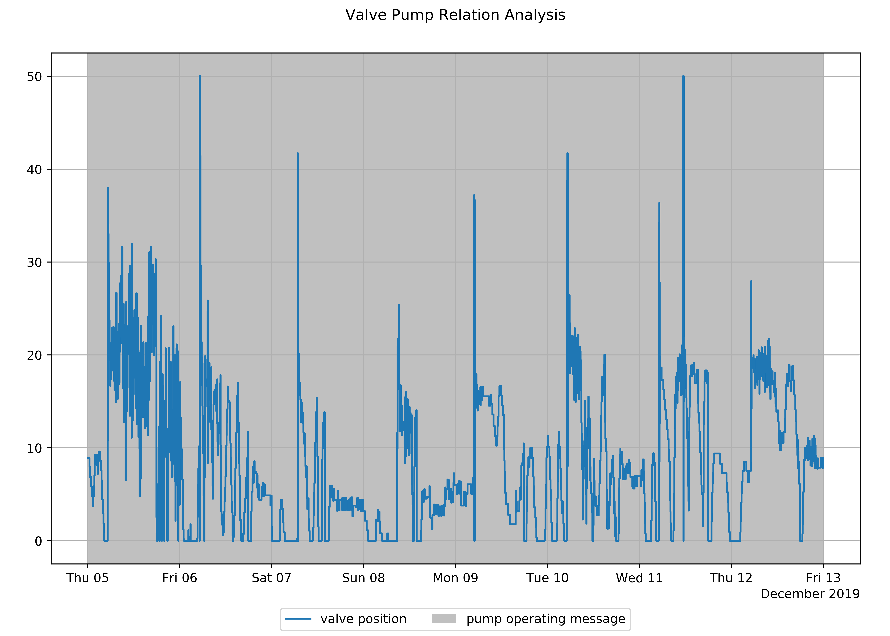

|  KPI | Value | Unit |
| :--- | :--- | :--- |
| pump operating time.valve closed.relative | 39.7 | % |
| pump operating time.valve closed | 76.2 | h |
| pump operating time.relative | 100 | % |



## Signal colors

| Signal color | Available | Info |
| :--- | :--- | :--- |
| red | Yes | Significant pump operation times although two-way valve was closed identified |
| yellow | Yes | Partial operation times outside of the parameterized schedule identified |
| green | Yes | Sufficient operation according to the parameterized schedule |

## Interpretations

| Available | Info |
| :--- | :--- |
| Yes | Either the operational rule checks of the analysis were tested positive or not |

## Recommendations

| Available | Info |
| :--- | :--- |
| Yes | Recommendations to improve synchronized operation of components. No recommendation, in case of sufficient measurement quality |

## KPIs

| KPI Identifier | Description | Value Range | Unit |
| :--- | :--- | :--- | :--- |
| pump operating time.valve closed.relative | Percentage of time the pump is active while the 2-way valve is nearly closed based on total operating time | 0 to 100 | % |
| pump operating time.valve closed | The amount of time the pump is active while the 2-way valve is nearly closed | 0 to inf | h |
| pump operating time.relative | Percentage of time the pump is active based on the whole analysis period | 0 to 100 | % |
| pump operating time | Time the pump is active based on the whole analysis period | 0 to inf | h |



## [thermal control loop](component-data-models.md#thermal-control-loop)


Apply only for 2-way valve systems


| Pin | Required | Mapping info |
| :--- | :--- | :--- |
| operating message | no | Mapping of either **pump operating message \(preferred\)** or **operating message** is **mandatory**. If both pins are mapped, pump operating message is used |
| pump operating message | no | Mapping of either **pump operating message \(preferred\)** or **operating message** is **mandatory**. If both pins are mapped, pump operating message is used |
| valve position | no | Mapping of either **valve position \(preferred\)** or **valve position setpoint** is **mandatory**. If both pins are mapped, valve position is used |
| valve position setpoint | no | Mapping of either **valve position \(preferred\)** or **valve position setpoint** is **mandatory**. If both pins are mapped, valve position is used |



## 
Recommended Time Span

### 1 week

## **Recommended Repetition** 

### Every 3 months

* after changes of operational modes, e.g. transfers to heating mode
* after changes in the control system
* after maintenance or replacements



## **Temperature Spread Analysis**

The _Temperature Spread Analysis_ assesses the temperature difference between a supply and return temperature sensor of a heat or cold distribution system during the systems operation. While a small temperature spread indicates the potential for volume flow and therefor pump power consumption reduction, a huge spread indicates thermal under supply of the downstream systems and consumers.



## Value

* Higher occupant comfort, health and performance
* Higher energy efficiency
* Lower operating costs

## Recommended for components

Heat and cold distribution systems, such as

* Thermal control loop

## Checked conditions

* Temperature spread is too small causing too high volume flows, evaluated component-specific
* Temperature spread is too large and risk sufficient energy supply, evaluated component-specific
* Temperature spread is as expected, evaluated component-specific
* Condition checks on times of components operation



The **temperature spread analysis** was applied to a heating circuit instanciated as a [thermal control loop](https://docs.aedifion.io/docs/engineers/specifications/component-data-models#thermal-control-loop).

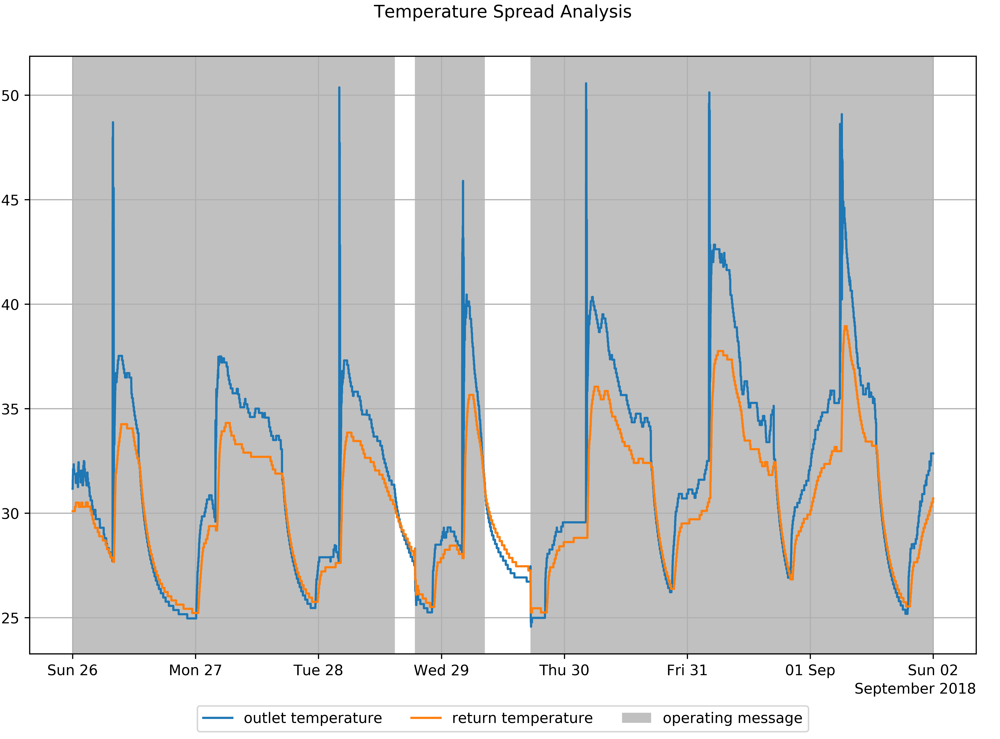

A analysis for one week in the beginning of September 2018 is shown in figure 1. A small temperature spread is detected through the KPI "**temperature spread.average**" of 1.56 K.

| KPI | Value | Unit |
| :--- | :--- | :--- |
| temperature spread.average | 1.56 | Kelvin |
| temperature spread.minimum | -0.716 | Kelvin |
| temperature spread.maximum | 22.8 | Kelvin |



## Signal colors

| Signal color | Available | Info |
| :--- | :--- | :--- |
| red | No | _Red_ as a signal for a low cost measure with high impact on the building operation will not be provided. |
| yellow | Yes | Temperature spreads usually can be optimized by volume flow adjustments. Savings allow for medium-term amortization |
| green | Yes | Sufficient temperature spread in respect to usual tolerances in buildings |

## Interpretations

| Available | Info |
| :--- | :--- |
| Yes | Either the operational rule checks of the analysis were tested positive or not |

## Recommendations

| Available | Info |
| :--- | :--- |
| Yes | Recommendations on how to adjust volume flows for a higher energy efficiency or better energy provision. No recommendation, if temperature spread is sufficient |

## KPIs


**Heat pump:** The KPI identifiers are extended by the prefix _condenser_ or _evaporator_ to specify the side of the heat pump the _temperature spread analysis_ is applied on. E.g.:

_temperature spread.minimum_ will be _evaporator temperature spread.minimum_


### Statistics of temperature spread

| KPI Identifier | Description | Value Range | Unit |
| :--- | :--- | :--- | :--- |
| temperature spread.maximum | Maximum of temperature spread | -inf to inf | °C |
| temperature spread.mean | Mean of temperature spread | -inf to inf | °C |
| temperature spread.median | Median of temperature spread | -inf to inf | °C |
| temperature spread.minimum | Minimum of temperature spread | -inf to inf | °C |



## [boiler](component-data-models.md#boiler)

<table>
  <thead>
    <tr>
      <th style="text-align:left">Pin</th>
      <th style="text-align:left">Required</th>
      <th style="text-align:left">Mapping info</th>
    </tr>
  </thead>
  <tbody>
    <tr>
      <td style="text-align:left">inlet temperature</td>
      <td style="text-align:left">yes</td>
      <td style="text-align:left"></td>
    </tr>
    <tr>
      <td style="text-align:left">operating message</td>
      <td style="text-align:left">no</td>
      <td style="text-align:left">
        
Strongly recommended

        
Default: Always on

      </td>
    </tr>
    <tr>
      <td style="text-align:left">outlet temperature</td>
      <td style="text-align:left">yes</td>
      <td style="text-align:left"></td>
    </tr>
  </tbody>
</table>

## [combined heat and power](component-data-models.md#combined-heat-and-power)

<table>
  <thead>
    <tr>
      <th style="text-align:left">Pin</th>
      <th style="text-align:left">Required</th>
      <th style="text-align:left">Mapping info</th>
    </tr>
  </thead>
  <tbody>
    <tr>
      <td style="text-align:left">inlet temperature</td>
      <td style="text-align:left">yes</td>
      <td style="text-align:left"></td>
    </tr>
    <tr>
      <td style="text-align:left">operating message</td>
      <td style="text-align:left">no</td>
      <td style="text-align:left">
        
Strongly recommended

        
Default: Always on

      </td>
    </tr>
    <tr>
      <td style="text-align:left">outlet temperature</td>
      <td style="text-align:left">yes</td>
      <td style="text-align:left"></td>
    </tr>
  </tbody>
</table>

## [heat pump](component-data-models.md#heat-pump)

<table>
  <thead>
    <tr>
      <th style="text-align:left">Pin</th>
      <th style="text-align:left">Required</th>
      <th style="text-align:left">Mapping info</th>
    </tr>
  </thead>
  <tbody>
    <tr>
      <td style="text-align:left">condenser inlet temperature</td>
      <td style="text-align:left">no</td>
      <td style="text-align:left">Required, if condenser shall be analysed</td>
    </tr>
    <tr>
      <td style="text-align:left">
        

        
condenser outlet temperature

      </td>
      <td style="text-align:left">no</td>
      <td style="text-align:left">Required, if condenser shall be analysed</td>
    </tr>
    <tr>
      <td style="text-align:left">evaporator inlet temperature</td>
      <td style="text-align:left">no</td>
      <td style="text-align:left">Required, if evaporator shall be analysed</td>
    </tr>
    <tr>
      <td style="text-align:left">evaporator outlet temperature</td>
      <td style="text-align:left">no</td>
      <td style="text-align:left">Required, if evaporator shall be analysed</td>
    </tr>
    <tr>
      <td style="text-align:left">operating message</td>
      <td style="text-align:left">no</td>
      <td style="text-align:left">
        
Mapping strongly recommended

        
Default: Always operating

      </td>
    </tr>
  </tbody>
</table>

## [thermal control loop](component-data-models.md#thermal-control-loop)

<table>
  <thead>
    <tr>
      <th style="text-align:left">Pin</th>
      <th style="text-align:left">Required</th>
      <th style="text-align:left">Mapping info</th>
    </tr>
  </thead>
  <tbody>
    <tr>
      <td style="text-align:left">operating message</td>
      <td style="text-align:left">no</td>
      <td style="text-align:left">
        
Mapping of either <b>pump operating message (preferred)</b> or <b>operating message </b>is <b>strongly recommended</b>.
          If both pins are mapped, pump operating message is used

        
Default: Always on

      </td>
    </tr>
    <tr>
      <td style="text-align:left">outlet temperature</td>
      <td style="text-align:left">yes</td>
      <td style="text-align:left"></td>
    </tr>
    <tr>
      <td style="text-align:left">pump operating message</td>
      <td style="text-align:left">no</td>
      <td style="text-align:left">
        
Mapping of either <b>pump operating message (preferred)</b> or <b>operating message </b>is <b>strongly recommended</b>.
          If both pins are mapped, pump operating message is used

        
Default: Always on

      </td>
    </tr>
    <tr>
      <td style="text-align:left">inlet temperature recirculation</td>
      <td style="text-align:left">yes</td>
      <td style="text-align:left"></td>
    </tr>
  </tbody>
</table>



## Recommended Time Span

### 1 day to 1 week

## **Recommended Repetition**

### Every month

* After changes of operational modes, e.g. transfers to heating mode
* After changes in the control system
* After maintenance or replacements



## Virtual Heat Meter Analysis

The _Virtual Heat Meter_ determines the heat flow and energy delivered in heating/cooling piping networks such as thermal control loops or energy conversion plants. The determination is either based on the temperature difference and volume flow over measurement point, or on the readings from a physical heat meter in the field. It substitutes physical heat meters and enables energy flow tracing.



## Value

Quantifies heat flow and heat:

* Traces energy flow
* Enable other analytics functions
* Enables comparison to hardware heat meters

## Recommended for components

Heat and cold conversion or distribution systems, such as

* Thermal control loops
* Heat pumps
* Boilers
* Heat meters

## Checked conditions

* Determines heat flow from temperature difference and volume flow for several components
* Condition checks on times of components operation
* Compares the measured heat with the virtual heat \(calculated by analysis\), if both available




The _Virtual Heat Meter_ ****was tested in the field, on a boilder at the E.ON Energy Research Center, RWTH Aachen University. Thus, a [boiler ](component-data-models.md#heat-pump)was instanced and the respective datapoints pinned to it. __Figure 1 shows the inlet- and outlet timeseries recorded for an exemplary period, along with the heat flow calculated. The volume flow during the observed period was constant.





The analysis only returns recommendations and evaluations if both a measured heat/heat flow is available and a virtual heat is calculated. Otherwise only KPI results and timeseries are returned. 


## Signal colors

| Signal color | Available | Info |
| :--- | :--- | :--- |
| red | No |  |
| yellow | Yes | There is a significant difference between the virtual heat and the measured heat for this component or its sub-components.  |
| green | Yes | There is no significant difference between the virtual heat and the measured heat for this component and all of its sub-components. |

## Interpretations

| Available | Info |
| :--- | :--- |
| Yes |  Either the operational rule checks of the analysis were tested positive or not |

## Recommendations

| Available | Info |
| :--- | :--- |
| Yes |  Consider re-calibrating the heat meter |

## KPIs

### Statistics of heat flow

Providing insights into value range of the heat flow.


Negative values indicate cooling, while positive indicate heating.



**Virtual and measured heat:** The 'virtual heat' refers to heat calculated using temperatures and volume flows where 'measured heat' refers heats supplied by physical heat meters. The KPIs and timeseries are available for both cases and referred to as either measured or virtual heats e.g.:

_measured heat flow_ is the heat flow measured by a heat meter



**Heat pump:** The KPI identifiers are extended by the prefix _condenser_ or _evaporator_ to specify the side of the heat pump the virtual heat meter is applied on. E.g.:

_heat flow.maximum_ will be _evaporator heat flow.maximum_


| KPI Identifier | Description | Value Range | Unit |
| :--- | :--- | :--- | :--- |
| heat flow.maximum | Largest heat flow | -inf to inf | kW |
| heat flow.minimum | Smallest heat flow | -inf to inf | kW |
| heat flow.mean | Average heat flow | -inf to inf | kW |
| heat flow.median | Median heat flow | -inf to inf | kW |
| heat | Aggregated heat transferred | -inf to inf | MWh |
| heat difference | Difference between measured and virtual heat | -inf to inf | MWh |
| heat difference.relative | Percentage difference between virtual and measured heat | 0 to 100 | % |

## Timeseries

| KPI Identifier | Description | Value Range | Unit |
| :--- | :--- | :--- | :--- |
| heat flow.timeseries | Timeseries of transferred heat | -inf to inf | kW |
| heat flow.cumulated | Timeseries of cumulated transferred heat | -inf to inf | MWh |



## [boiler](https://docs.aedifion.io/docs/engineers/specifications/component-data-models#boiler)

<table>
  <thead>
    <tr>
      <th style="text-align:left">Pin</th>
      <th style="text-align:left">Required</th>
      <th style="text-align:left">Mapping info</th>
    </tr>
  </thead>
  <tbody>
    <tr>
      <td style="text-align:left">inlet temperature</td>
      <td style="text-align:left">no</td>
      <td style="text-align:left"></td>
    </tr>
    <tr>
      <td style="text-align:left">outlet temperature</td>
      <td style="text-align:left">no</td>
      <td style="text-align:left"></td>
    </tr>
    <tr>
      <td style="text-align:left">operating message</td>
      <td style="text-align:left">no</td>
      <td style="text-align:left">
        
Mapping strongly recommended

        
Default: Always operating

      </td>
    </tr>
    <tr>
      <td style="text-align:left">volume flow</td>
      <td style="text-align:left">no</td>
      <td style="text-align:left"></td>
    </tr>
    <tr>
      <td style="text-align:left">heat</td>
      <td style="text-align:left">no</td>
      <td style="text-align:left"></td>
    </tr>
    <tr>
      <td style="text-align:left">heat flow</td>
      <td style="text-align:left">no</td>
      <td style="text-align:left"></td>
    </tr>
  </tbody>
</table>

| **Attribute** | Required | Mapping info |
| :--- | :--- | :--- |
| volume\_flow\_unit | no | Default: litersPerSecond |

## [combined heat and power](component-data-models.md#combined-heat-and-power)

<table>
  <thead>
    <tr>
      <th style="text-align:left">Pin</th>
      <th style="text-align:left">Required</th>
      <th style="text-align:left">Mapping info</th>
    </tr>
  </thead>
  <tbody>
    <tr>
      <td style="text-align:left">inlet temperature</td>
      <td style="text-align:left">no</td>
      <td style="text-align:left"></td>
    </tr>
    <tr>
      <td style="text-align:left">outlet temperature</td>
      <td style="text-align:left">no</td>
      <td style="text-align:left"></td>
    </tr>
    <tr>
      <td style="text-align:left">operating message</td>
      <td style="text-align:left">no</td>
      <td style="text-align:left">
        
Mapping strongly recommended

        
Default: Always operating

      </td>
    </tr>
    <tr>
      <td style="text-align:left">volume flow</td>
      <td style="text-align:left">no</td>
      <td style="text-align:left"></td>
    </tr>
    <tr>
      <td style="text-align:left">heat</td>
      <td style="text-align:left">no</td>
      <td style="text-align:left"></td>
    </tr>
    <tr>
      <td style="text-align:left">heat flow</td>
      <td style="text-align:left">no</td>
      <td style="text-align:left"></td>
    </tr>
  </tbody>
</table>

| **Attribute** | Required | Mapping info |
| :--- | :--- | :--- |
| volume\_flow\_unit | no | Default: litersPerSecond |

## [**heat meter**](https://docs.aedifion.io/docs/engineers/specifications/component-data-models#heat-meter)\*\*\*\*

| Pin | Required | Mapping info |
| :--- | :--- | :--- |
| inlet temperature | no |  |
| outlet temperature | no |  |
| volume flow | no |  |
| heat | no  |  |
| heat flow | no |  |

| **Attribute** | Required | Mapping info |
| :--- | :--- | :--- |
| volume\_flow\_unit | no | Default: litersPerSecond |

## \*\*\*\*[**heat pump**](https://docs.aedifion.io/docs/engineers/specifications/component-data-models#heat-pump)\*\*\*\*


The Virtual Heat Meter is determined on the condenser and evaporator side depending on the mapped datapoints.


<table>
  <thead>
    <tr>
      <th style="text-align:left">Pin</th>
      <th style="text-align:left">Required</th>
      <th style="text-align:left">Mapping info</th>
    </tr>
  </thead>
  <tbody>
    <tr>
      <td style="text-align:left">condenser inlet temperature</td>
      <td style="text-align:left">no</td>
      <td style="text-align:left"></td>
    </tr>
    <tr>
      <td style="text-align:left">condenser outlet temperature</td>
      <td style="text-align:left">no</td>
      <td style="text-align:left"></td>
    </tr>
    <tr>
      <td style="text-align:left">condenser volume flow</td>
      <td style="text-align:left">no</td>
      <td style="text-align:left"></td>
    </tr>
    <tr>
      <td style="text-align:left">condenser heat</td>
      <td style="text-align:left">no</td>
      <td style="text-align:left"></td>
    </tr>
    <tr>
      <td style="text-align:left">condenser heat flow</td>
      <td style="text-align:left">no</td>
      <td style="text-align:left"></td>
    </tr>
    <tr>
      <td style="text-align:left">evaporator inlet temperature</td>
      <td style="text-align:left">no</td>
      <td style="text-align:left"></td>
    </tr>
    <tr>
      <td style="text-align:left">evaporator outlet temperature</td>
      <td style="text-align:left">no</td>
      <td style="text-align:left"></td>
    </tr>
    <tr>
      <td style="text-align:left">evaporator volume flow</td>
      <td style="text-align:left">no</td>
      <td style="text-align:left"></td>
    </tr>
    <tr>
      <td style="text-align:left">evaporator heat</td>
      <td style="text-align:left">no</td>
      <td style="text-align:left"></td>
    </tr>
    <tr>
      <td style="text-align:left">evaporator heat flow</td>
      <td style="text-align:left">no</td>
      <td style="text-align:left"></td>
    </tr>
    <tr>
      <td style="text-align:left">operating message</td>
      <td style="text-align:left">no</td>
      <td style="text-align:left">
        
Mapping strongly recommended

        
Default: Always operating

      </td>
    </tr>
  </tbody>
</table>

| **Attribute** | Required | Mapping info |
| :--- | :--- | :--- |
| volume\_flow\_unit | no | Default: litersPerSecond |

## Attributes

#### volume\_flow\_unit:

The unit used in this datapoint needs to be specified in order for the analysis to yield correct result. If unspecified, the default unit assumed for this measurement is _litersPerSecond_. Acceptable inputs for this attribute include: 

* _cubicMetersPerSecond_
* _cubicMetersPerMinute_
* _cubicMetersPerHour_
* _litersPerSecond_
* _litersPerMinute_
* _litersPerHour_



## Recommended Time Span

### 1 day to 1 month

## **Recommended Repetition**

### Every month



## Weather Station Analysis

Two important sensors for HVAC system control are the outdoor air temperature sensor and the outdoor air humidity sensor. Many control decisions, e.g. what amount of heat/humidity is it to be provided and the switching between heating and cooling modes, are made based on the measured outdoor temperature and humidity. The sensors are prone to wear out over the life time of the building. Furthermore, the sensors are often influenced by solar radiation or heat emitted from components in its surrounding. Wrongly measured outside air temperature or humidity directly corresponds to a thermal over/under supply of the building or incorrect indoor humidity, often leading to poor user comfort and an increased energy consumption.

The _Weather Station Analysis_ identifies installation errors and measurement offsets of the outdoor air temperature and humidity sensors in order to improve measurements.



## Value

* Higher operational performance due to reliable information about outside air conditions
* Higher occupant comfort, health and performance
* Lower operating costs
* Better system coordination in systems with redundant sensors

## Recommended for components

* Weather station

## Checked conditions

* Offset between measured outdoor air temperature and weather service reference data
* Offset between measured outdoor air humidity and weather service reference data
* Outdoor air temperature sensor is influenced by solar radiation
* Outdoor air temperature sensor is influenced by it's surrounding, e.g. exhaust gases
* Outdoor air measures are compliant to weather service reference data



For this _Weather Station Analysis_ we instantiated a [weather station](https://docs.aedifion.io/docs/engineers/specifications/component-data-models#weather-station) component and analyzed a week of weather data. The following plot shows the measured temperature of a sensor located at a building facade. During the reviewed period in the summer the sensor is influenced in the afternoon.

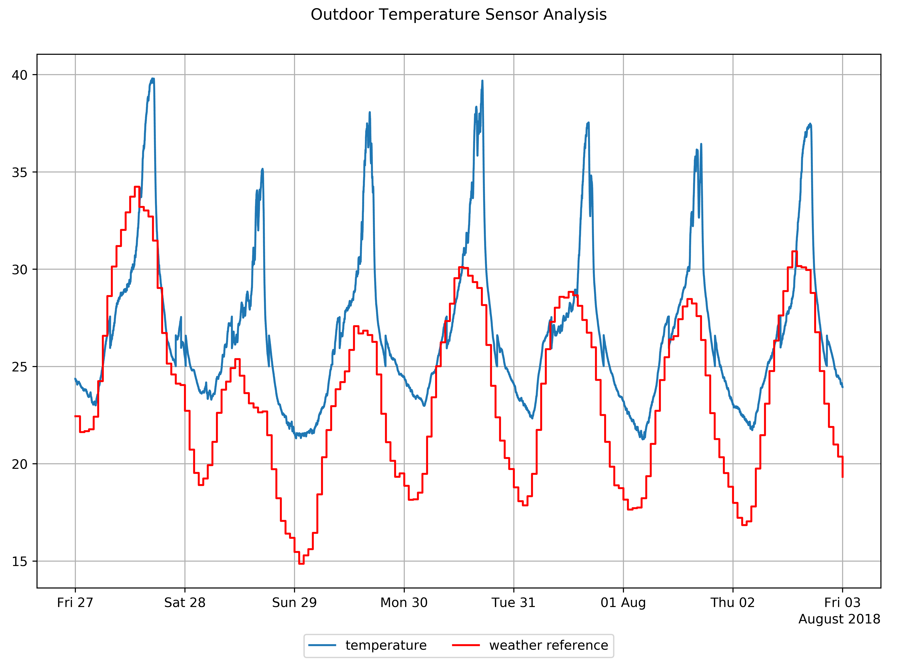

In figure 1 you can see a significant difference between sensor and weather reference data. This is also reflected in the value of the calculated KPIs. During the analysis period all 7 days are recognized by the KPI "radiation influenced days". Additionally the offset at night is elevated and thus a larger "sensor offset squared error" is present. The humidity sensor is checked accordingly. 

| KPI | Value | Unit |
| :--- | :--- | :--- |
| radiation influenced.relative | 100 | % |
| radiation influenced days | 7 | count |
| offset RMSE | 7.3 | K |
| offset ME | 6.4 | K |



## Signal colors

| Signal color | Available | Info |
| :--- | :--- | :--- |
| red | Yes | The comparison with the reference weather data indicates that a sensor is impaired or influenced by solar radiation.  |
| yellow | Yes | The comparison with the reference weather data indicates that a sensor may be impaired or influenced by solar radiation.  |
| green | Yes | Sensor offset is negligible. No influence of solar radiation detected.  |

## Interpretations

| Available | Info |
| :--- | :--- |
| Yes | Either the operational rule checks of the analysis were tested positive or not. |

## Recommendations

| Available | Info |
| :--- | :--- |
| Yes | Recommendations to improve outdoor air temperature/humidity measurement, if necessary or re-calibrate the sensor, if physically implausible measurements are observed. |

## KPIs

### Sun radiation influence

| KPI Identifier | Description | Value Range | Unit |
| :--- | :--- | :--- | :--- |
| radiation influenced days.relative | Ratio of days with more than one hour of sun radiation influence to days analyzed | 0 to 100 | % |
| radiation influenced days | Days with more than one hour of sun radiation influence | 0 - inf | days |

### Sensor errors

| KPI Identifier | Description | Value Range | Unit |
| :--- | :--- | :--- | :--- |
| Temperature RMSE | Root mean square error between the measured outdoor air temperature and the reference data set. | 0 to inf | K |
| Temperature ME | Mean error between the measured outdoor air temperature and the reference data set. | -inf to inf | K |
| Humidity RMSE | Root mean square error between the measured outdoor relative humidity and the reference data set. | 0 to 100 | % |
| Humidity ME | Mean error between the measured outdoor relative humidity and the reference data set. | -100 to 100 | % |



## [weather station](component-data-models.md#weather-station)

| Pin | Required | Mapping info |
| :--- | :--- | :--- |
| temperature | no | Mandatory for outside air temperature checkup |
| humidity | no | Mandatory for outside air humidity checkup |

| Attribute | Required | Mapping info |
| :--- | :--- | :--- |
| latitude | yes |  |
| longitude | yes |  |



## Recommended Time Span

### 1 month

## **Recommended Repetition**

### Every month

* After changes of operational modes, e.g. transfers to heating mode
* After changes in the control system
* After maintenance or replacements



## Information

The library of analytics functions is constantly expanded. If you are missing an analytics function, wish to implement your own functions, or want us to implement it for you, feel free to [contact us](../contact.md#support).

