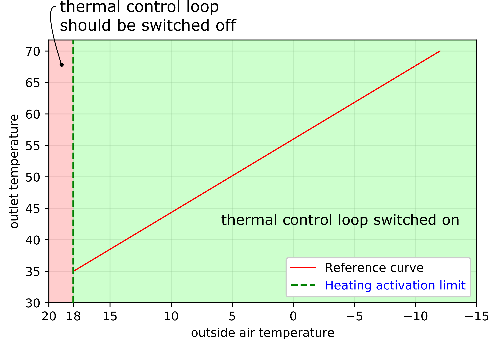
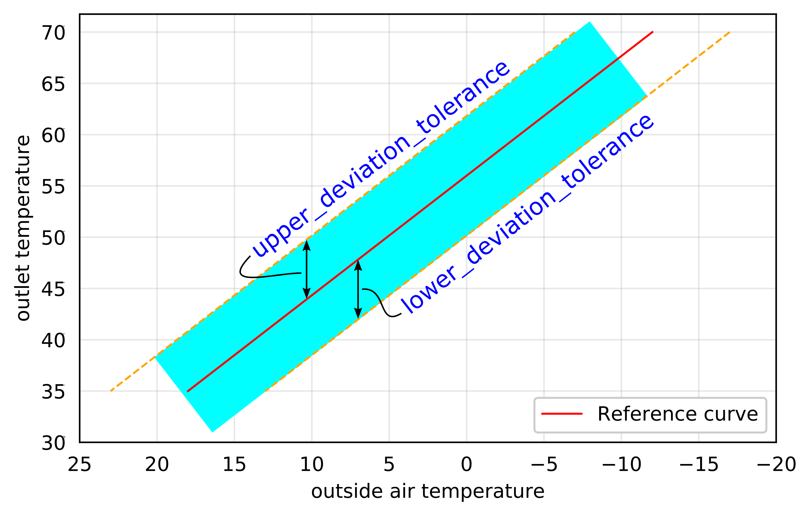

# Component data models

## Available component data models

* [Boiler](component-data-models.md#boiler)
  * [Condensing Boiler](component-data-models.md#condensing-boiler)
  * [Low-Temperature Boiler](component-data-models.md#low-temperature-boiler)
* [Combined Heat and Power](component-data-models.md#combined-heat-and-power)
* [Fan](component-data-models.md#heat-pump)
* [Heat Meter](component-data-models.md#heat-meter)
* [Heat Pump](https://docs.aedifion.io/docs/engineers/specifications/component-data-models#heat-pump)
* [Room](component-data-models.md#room)
* [Thermal Control Loop](component-data-models.md#thermal-control-loop)
* [Weather Station](component-data-models.md#weather-station)

## Application notes

Hints for a smooth application of [component data models](../glossary.md#component-data-model) and their mapping.

* **1-to-n mapping:** One [datapoint](../glossary.md#datapoint) can be mapped to several [instantiated components](../glossary.md#instanced-component) to allow data models of different granularity.
* **Unit sensitivity:** To this state, our algorithms are unit sensitive. Every [pin ](../glossary.md#pin)and [attribute ](../glossary.md#attribute)is specified with an unit. Mind the specifications.


If unit conventions are disregarded, this can lead to errors and even misleading results of algorithms.


* **Incomplete mapping:** [Pins ](../glossary.md#pin)and [attributes](../glossary.md#attribute), are placeholders which might or might not be [mapped ](../glossary.md#mapping)to data. Algorithms will work on incomplete mapped components, they require mapping for specific placeholders though. Check the [algorithm documentation](analytics.md) for required mappings.

## Example Component

This example leads through our description of [component data models](../glossary.md#component-data-model) by providing exemplary values and descriptions. The first paragraph of a component data model provides information regarding the component and the data model itself, special features, exceptions and so forth.



### example\_component

_The **Component Identifier** is the string identifier of the component. It is used as input parameter for some endpoints \(_[_example endpoint_](https://api.aedifion.io/ui/#!/Analytics/get_component_analysisfunctions)_\)._



_The **Pins** table lists basic information on each pin of the component._


 **Mind the units.**


| Name | Info | Unit |
| :--- | :--- | :--- |
| example pin | Placeholder for any information on the requested datapoint. | kW |
| ... | ... | ... |



_The **Attributes** table lists basic information on each attribute of the component._

_The **Key** parameter is the string identifier of the attribute used for our API._

_The **Type** parameter is the value type expected, e.g. float, string, json, etc._

_The **Unit** parameter is the unit of the value expected._


Mind the units.


## Example Attribute

_Default Values are implemented within the analytics function themselves, they do not appear on API calls._

Attributes are starting with a short description.

| Key | Type | Default Value | Unit |
| :--- | :--- | :--- | :--- |
| example\_attribute | float or integer | 42.0 | kW |
| ... | ... |  | ... |

## Another Example Attribute

...



_The **Available Functions** tab provide a list of functions available for the component data model. For more information click the regarding function._

## [Example Function](analytics.md#example-analysis)

Exemplary specification of the function, if applied to this component.

## [Another Example Function](analytics.md#example-analysis)

Exemplary specification of the function, if applied to this component.



## Boiler

The **Boiler** is the basic model of the heat conversion plant boiler. Further component data models like the [Condensing Boiler](component-data-models.md#condensing-boiler) and [Low-Temperature Boiler ](component-data-models.md#low-temperature-boiler)inherit this component_._ Boilers __burn fuels like oil, natural gas, pallets etc. to heat up a heat carrier fluid \(water in general\).



### **boiler**




Mind the units.


<table>
  <thead>
    <tr>
      <th style="text-align:left">Name</th>
      <th style="text-align:left">Info</th>
      <th style="text-align:left">Unit</th>
    </tr>
  </thead>
  <tbody>
    <tr>
      <td style="text-align:left">exhaust co</td>
      <td style="text-align:left">Carbon monoxide concentration in exhaust gas.</td>
      <td style="text-align:left">ppm</td>
    </tr>
    <tr>
      <td style="text-align:left">exhaust nox</td>
      <td style="text-align:left">Nitrogen oxide concentration in exhaust gas.</td>
      <td style="text-align:left">ppm</td>
    </tr>
    <tr>
      <td style="text-align:left">exhaust o2</td>
      <td style="text-align:left">Oxygen concentration in exhaust gas.</td>
      <td style="text-align:left">%</td>
    </tr>
    <tr>
      <td style="text-align:left">exhaust temperature</td>
      <td style="text-align:left">Temperature of exhaust gas.</td>
      <td style="text-align:left">&#xB0;C</td>
    </tr>
    <tr>
      <td style="text-align:left">heat flow</td>
      <td style="text-align:left">Thermal power transferred to heat carrier fluid (water).</td>
      <td style="text-align:left">kW</td>
    </tr>
    <tr>
      <td style="text-align:left">heat meter</td>
      <td style="text-align:left">Thermal energy transferred to heat carrier fluid (water). Cumulating counter.</td>
      <td
      style="text-align:left">kWh</td>
    </tr>
    <tr>
      <td style="text-align:left">inlet temperature</td>
      <td style="text-align:left">Temperature of heat carrier fluid (water) entering the component. Also
        referred to as <b>return temperature</b>.</td>
      <td style="text-align:left">&#xB0;C</td>
    </tr>
    <tr>
      <td style="text-align:left">malfunction message</td>
      <td style="text-align:left">
        
Informs about technical availability of component.

        
1 = malfunction

        
0 = no malfunction

      </td>
      <td style="text-align:left">binary</td>
    </tr>
    <tr>
      <td style="text-align:left">operating message</td>
      <td style="text-align:left">
        
Informs about operational state of component.

        
1 = operating

        
0 = switched-off

      </td>
      <td style="text-align:left">binary</td>
    </tr>
    <tr>
      <td style="text-align:left">outlet temperature</td>
      <td style="text-align:left">Temperature of heat carrier fluid (water) exiting the component. Also
        referred to as <b>supply temperature</b>.</td>
      <td style="text-align:left">&#xB0;C</td>
    </tr>
    <tr>
      <td style="text-align:left">power consumption</td>
      <td style="text-align:left">Fuel power consumed by component.</td>
      <td style="text-align:left">kW</td>
    </tr>
    <tr>
      <td style="text-align:left">power consumption meter</td>
      <td style="text-align:left">Fuel energy consumed. Cumulating counter.</td>
      <td style="text-align:left">kWh</td>
    </tr>
    <tr>
      <td style="text-align:left">volume flow</td>
      <td style="text-align:left">Volume flow of heat carrier fluid (water).</td>
      <td style="text-align:left">l/s</td>
    </tr>
  </tbody>
</table>



No attributes defined for this component data model.



## [Operating Cycle Analysis](analytics.md#operating-cycle-analysis)

Checks for appropriate cycle behavior and provides recommendation on how to improve.

## [Schedule Analysis](analytics.md#schedule-analysis)

Checks if plant is operated according to a provided schedule.



### Condensing Boiler

The **Condensing Boiler** is a specific type of [boiler](component-data-models.md#boiler). One of the flue gas components of fuel combustion is gaseous water. A condensing boiler liquefies the water from the flue gases. The condensate heat released is used to heat the heat carrier fluid.



### **condensing\_boiler**




Mind the units.


<table>
  <thead>
    <tr>
      <th style="text-align:left">Name</th>
      <th style="text-align:left">Info</th>
      <th style="text-align:left">Unit</th>
    </tr>
  </thead>
  <tbody>
    <tr>
      <td style="text-align:left">exhaust co</td>
      <td style="text-align:left">Carbon monoxide concentration in exhaust gas.</td>
      <td style="text-align:left">ppm</td>
    </tr>
    <tr>
      <td style="text-align:left">exhaust nox</td>
      <td style="text-align:left">Nitrogen oxide concentration in exhaust gas.</td>
      <td style="text-align:left">ppm</td>
    </tr>
    <tr>
      <td style="text-align:left">exhaust o2</td>
      <td style="text-align:left">Oxygen concentration in exhaust gas.</td>
      <td style="text-align:left">%</td>
    </tr>
    <tr>
      <td style="text-align:left">exhaust temperature</td>
      <td style="text-align:left">Temperature of exhaust gas.</td>
      <td style="text-align:left">&#xB0;C</td>
    </tr>
    <tr>
      <td style="text-align:left">heat flow</td>
      <td style="text-align:left">Thermal power transferred to heat carrier fluid (water).</td>
      <td style="text-align:left">kW</td>
    </tr>
    <tr>
      <td style="text-align:left">heat meter</td>
      <td style="text-align:left">Thermal energy transferred to heat carrier fluid (water). Cumulating counter.</td>
      <td
      style="text-align:left">kWh</td>
    </tr>
    <tr>
      <td style="text-align:left">inlet temperature</td>
      <td style="text-align:left">Temperature of heat carrier fluid (water) entering the component. Also
        referred to as <b>return temperature</b>.</td>
      <td style="text-align:left">&#xB0;C</td>
    </tr>
    <tr>
      <td style="text-align:left">malfunction message</td>
      <td style="text-align:left">
        
Informs about technical availability of component.

        
1 = malfunction

        
0 = no malfunction

      </td>
      <td style="text-align:left">binary</td>
    </tr>
    <tr>
      <td style="text-align:left">operating message</td>
      <td style="text-align:left">
        
Informs about operational state of component.

        
1 = operating

        
0 = switched-off

      </td>
      <td style="text-align:left">binary</td>
    </tr>
    <tr>
      <td style="text-align:left">outlet temperature</td>
      <td style="text-align:left">Temperature of heat carrier fluid (water) exiting the component. Also
        referred to as <b>supply temperature</b>.</td>
      <td style="text-align:left">&#xB0;C</td>
    </tr>
    <tr>
      <td style="text-align:left">power consumption</td>
      <td style="text-align:left">Fuel power consumed by component.</td>
      <td style="text-align:left">kW</td>
    </tr>
    <tr>
      <td style="text-align:left">power consumption meter</td>
      <td style="text-align:left">Fuel energy consumed. Cumulating counter.</td>
      <td style="text-align:left">kWh</td>
    </tr>
    <tr>
      <td style="text-align:left">volume flow</td>
      <td style="text-align:left">Volume flow of heat carrier fluid (water).</td>
      <td style="text-align:left">l/s</td>
    </tr>
  </tbody>
</table>



No attributes defined for this component data model.



## [Operating Cycle Analysis](analytics.md#operating-cycle-analysis)

Checks for appropriate cycle behavior and provides recommendation on how to improve.

## [Schedule Analysis](analytics.md#schedule-analysis)

Checks if plant is operated according to a provided schedule.



### Low-Temperature Boiler

The **Low-Temperature Boiler** is a specific type of [boiler](component-data-models.md#boiler). It is defined by the low temperature level of the supply temperature output provided by the boiler.



### low-temperature\_boiler




Mind the units.


<table>
  <thead>
    <tr>
      <th style="text-align:left">Name</th>
      <th style="text-align:left">Info</th>
      <th style="text-align:left">Unit</th>
    </tr>
  </thead>
  <tbody>
    <tr>
      <td style="text-align:left">exhaust co</td>
      <td style="text-align:left">Carbon monoxide concentration in exhaust gas.</td>
      <td style="text-align:left">ppm</td>
    </tr>
    <tr>
      <td style="text-align:left">exhaust nox</td>
      <td style="text-align:left">Nitrogen oxide concentration in exhaust gas.</td>
      <td style="text-align:left">ppm</td>
    </tr>
    <tr>
      <td style="text-align:left">exhaust o2</td>
      <td style="text-align:left">Oxygen concentration in exhaust gas.</td>
      <td style="text-align:left">%</td>
    </tr>
    <tr>
      <td style="text-align:left">exhaust temperature</td>
      <td style="text-align:left">Temperature of exhaust gas.</td>
      <td style="text-align:left">&#xB0;C</td>
    </tr>
    <tr>
      <td style="text-align:left">heat flow</td>
      <td style="text-align:left">Thermal power transferred to heat carrier fluid (water).</td>
      <td style="text-align:left">kW</td>
    </tr>
    <tr>
      <td style="text-align:left">heat meter</td>
      <td style="text-align:left">Thermal energy transferred to heat carrier fluid (water). Cumulating counter.</td>
      <td
      style="text-align:left">kWh</td>
    </tr>
    <tr>
      <td style="text-align:left">inlet temperature</td>
      <td style="text-align:left">Temperature of heat carrier fluid (water) entering the component. Also
        referred to as <b>return temperature</b>.</td>
      <td style="text-align:left">&#xB0;C</td>
    </tr>
    <tr>
      <td style="text-align:left">malfunction message</td>
      <td style="text-align:left">
        
Informs about technical availability of component.

        
1 = malfunction

        
0 = no malfunction

      </td>
      <td style="text-align:left">binary</td>
    </tr>
    <tr>
      <td style="text-align:left">operating message</td>
      <td style="text-align:left">
        
Informs about operational state of component.

        
1 = operating

        
0 = switched-off

      </td>
      <td style="text-align:left">binary</td>
    </tr>
    <tr>
      <td style="text-align:left">outlet temperature</td>
      <td style="text-align:left">Temperature of heat carrier fluid (water) exiting the component. Also
        referred to as <b>supply temperature</b>.</td>
      <td style="text-align:left">&#xB0;C</td>
    </tr>
    <tr>
      <td style="text-align:left">power consumption</td>
      <td style="text-align:left">Fuel power consumed by component.</td>
      <td style="text-align:left">kW</td>
    </tr>
    <tr>
      <td style="text-align:left">power consumption meter</td>
      <td style="text-align:left">Fuel energy consumed. Cumulating counter.</td>
      <td style="text-align:left">kWh</td>
    </tr>
    <tr>
      <td style="text-align:left">volume flow</td>
      <td style="text-align:left">Volume flow of heat carrier fluid (water).</td>
      <td style="text-align:left">l/s</td>
    </tr>
  </tbody>
</table>



No attributes defined for this component data model.



## [Operating Cycle Analysis](analytics.md#operating-cycle-analysis)

Checks for appropriate cycle behavior and provides recommendation on how to improve.

## [Schedule Analysis](analytics.md#schedule-analysis)

Checks if plant is operated according to a provided schedule.



## Combined Heat and Power

The **Combined Heat and Power** component data model represents various kinds of combined heat and power generation. It does not differ in the method of energy conversion.



### **combined\_heat\_and\_power**




Mind the units.


<table>
  <thead>
    <tr>
      <th style="text-align:left">Name</th>
      <th style="text-align:left">Info</th>
      <th style="text-align:left">Unit</th>
    </tr>
  </thead>
  <tbody>
    <tr>
      <td style="text-align:left">exhaust co</td>
      <td style="text-align:left">Carbon monoxide concentration in exhaust gas.</td>
      <td style="text-align:left">ppm</td>
    </tr>
    <tr>
      <td style="text-align:left">exhaust nox</td>
      <td style="text-align:left">Nitrogen oxide concentration in exhaust gas.</td>
      <td style="text-align:left">ppm</td>
    </tr>
    <tr>
      <td style="text-align:left">exhaust o2</td>
      <td style="text-align:left">Oxygen concentration in exhaust gas.</td>
      <td style="text-align:left">%</td>
    </tr>
    <tr>
      <td style="text-align:left">exhaust temperature</td>
      <td style="text-align:left">Temperature of exhaust gas.</td>
      <td style="text-align:left">&#xB0;C</td>
    </tr>
    <tr>
      <td style="text-align:left">heat flow</td>
      <td style="text-align:left">Thermal power transferred to heat carrier fluid (water).</td>
      <td style="text-align:left">kW</td>
    </tr>
    <tr>
      <td style="text-align:left">heat meter</td>
      <td style="text-align:left">Thermal energy transferred to heat carrier fluid (water). Cumulating counter.</td>
      <td
      style="text-align:left">kWh</td>
    </tr>
    <tr>
      <td style="text-align:left">inlet temperature</td>
      <td style="text-align:left">Temperature of heat carrier fluid (water) entering the component. Also
        referred to as <b>return temperature</b>.</td>
      <td style="text-align:left">&#xB0;C</td>
    </tr>
    <tr>
      <td style="text-align:left">malfunction message</td>
      <td style="text-align:left">
        
Informs about technical availability of component.

        
1 = malfunction

        
0 = no malfunction

      </td>
      <td style="text-align:left">binary</td>
    </tr>
    <tr>
      <td style="text-align:left">operating message</td>
      <td style="text-align:left">
        
Informs about operational state of component.

        
1 = operating

        
0 = switched-off

      </td>
      <td style="text-align:left">binary</td>
    </tr>
    <tr>
      <td style="text-align:left">outlet temperature</td>
      <td style="text-align:left">Temperature of heat carrier fluid (water) exiting the component. Also
        referred to as <b>supply temperature</b>.</td>
      <td style="text-align:left">&#xB0;C</td>
    </tr>
    <tr>
      <td style="text-align:left">power consumption</td>
      <td style="text-align:left">Fuel power consumed by component.</td>
      <td style="text-align:left">kW</td>
    </tr>
    <tr>
      <td style="text-align:left">power consumption meter</td>
      <td style="text-align:left">Fuel energy consumed. Cumulating counter.</td>
      <td style="text-align:left">kWh</td>
    </tr>
    <tr>
      <td style="text-align:left">power generation</td>
      <td style="text-align:left">Net electrical power generation by component.</td>
      <td style="text-align:left">kW</td>
    </tr>
    <tr>
      <td style="text-align:left">power generation meter</td>
      <td style="text-align:left">Net electricity production. Cumulating counter.</td>
      <td style="text-align:left">kWh</td>
    </tr>
    <tr>
      <td style="text-align:left">volume flow</td>
      <td style="text-align:left">Volume flow of heat carrier fluid (water).</td>
      <td style="text-align:left">l/s</td>
    </tr>
  </tbody>
</table>



No attributes defined for this component data model.



## [Operating Cycle Analysis](analytics.md#operating-cycle-analysis)

Checks for appropriate cycle behavior and provides recommendation on how to improve.

## [Schedule Analysis](analytics.md#schedule-analysis)

Checks if plant is operated according to a provided schedule.



## Fan

The **Fan** component data model represents various kinds of fans.



### fan




Mind the units.


<table>
  <thead>
    <tr>
      <th style="text-align:left">Name</th>
      <th style="text-align:left">Info</th>
      <th style="text-align:left">Unit</th>
    </tr>
  </thead>
  <tbody>
    <tr>
      <td style="text-align:left">differential pressure</td>
      <td style="text-align:left">Pressure increase by fan. static pressure difference.</td>
      <td style="text-align:left">Pa</td>
    </tr>
    <tr>
      <td style="text-align:left">inverter speed</td>
      <td style="text-align:left">Represents fan speed and ventilation partial load.</td>
      <td style="text-align:left">%</td>
    </tr>
    <tr>
      <td style="text-align:left">malfunction message</td>
      <td style="text-align:left">
        
Informs about technical availability of component.

        
1 = malfunction

        
0 = no malfunction

      </td>
      <td style="text-align:left">binary</td>
    </tr>
    <tr>
      <td style="text-align:left">operating message</td>
      <td style="text-align:left">
        
Informs about operational state of component.

        
1 = operating

        
0 = switched-off

      </td>
      <td style="text-align:left">binary</td>
    </tr>
    <tr>
      <td style="text-align:left">power consumption</td>
      <td style="text-align:left">Electrical power consumed by component.</td>
      <td style="text-align:left">kW</td>
    </tr>
    <tr>
      <td style="text-align:left">power consumption meter</td>
      <td style="text-align:left">Electrical energy consumed. Cumulating counter.</td>
      <td style="text-align:left">kWh</td>
    </tr>
    <tr>
      <td style="text-align:left">volume flow</td>
      <td style="text-align:left">Air flow rate.</td>
      <td style="text-align:left">m&#xB3;/h</td>
    </tr>
  </tbody>
</table>



No attributes defined for this component data model.



## [Operating Cycle Analysis](analytics.md#operating-cycle-analysis)

Checks for appropriate cycle behavior and provides recommendation on how to improve.

## [Schedule Analysis](analytics.md#schedule-analysis)

Checks if plant is operated according to a provided schedule.



## Heat Meter

The **Heat Meter** component data model represents a heat meter. It can be physically present in the energy system or virtually on the aedifion platform.



### heat\_meter




Mind the units.


| Name | Info | Unit |
| :--- | :--- | :--- |
| heat flow |  | kW |
| heat meter | Thermal energy transferred to heat carrier fluid \(water\). Cumulating counter. | kWh |
| inlet temperature | Temperature of heat carrier fluid \(water\) entering the heat meter. | °C |
| outlet temperature | Temperature of heat carrier fluid \(water\) exiting the heat meter. | °C |
| volume flow | Volume flow of heat carrier fluid \(water\). | l/s |




Mind the units.


No attributes defined for this component data model.



under construction



## Heat Pump

The **Heat Pump** component data model is representative for components which are able to raise the temperature level between two heat carrier loops \(water/water\) via thermal compression.



### **heat\_pump**




Mind the units.


<table>
  <thead>
    <tr>
      <th style="text-align:left">Name</th>
      <th style="text-align:left">Info</th>
      <th style="text-align:left">Unit</th>
    </tr>
  </thead>
  <tbody>
    <tr>
      <td style="text-align:left">condenser heat flow</td>
      <td style="text-align:left">Thermal power transferred to heat carrier fluid (water). Condenser side.</td>
      <td
      style="text-align:left">kW</td>
    </tr>
    <tr>
      <td style="text-align:left">condenser heat meter</td>
      <td style="text-align:left">Thermal energy transferred to heat carrier fluid (water). Cumulating counter.
        Condenser side.</td>
      <td style="text-align:left">kWh</td>
    </tr>
    <tr>
      <td style="text-align:left">condenser inlet temperature</td>
      <td style="text-align:left">Temperature of heat carrier fluid (water) entering the component. Also
        referred to as <b>return temperature</b>. Condenser side.</td>
      <td style="text-align:left">&#xB0;C</td>
    </tr>
    <tr>
      <td style="text-align:left">condenser outlet temperature</td>
      <td style="text-align:left">Temperature of heat carrier fluid (water) exiting the component. Also
        referred to as <b>supply temperature</b>. Condenser side.</td>
      <td style="text-align:left">&#xB0;C</td>
    </tr>
    <tr>
      <td style="text-align:left">condenser volume flow</td>
      <td style="text-align:left">Volume flow of heat carrier fluid (water). Condenser side.</td>
      <td style="text-align:left">l/s</td>
    </tr>
    <tr>
      <td style="text-align:left">evaporator heat flow</td>
      <td style="text-align:left">Thermal power transferred to heat carrier fluid (water). Condenser side.</td>
      <td
      style="text-align:left">kW</td>
    </tr>
    <tr>
      <td style="text-align:left">evaporator heat meter</td>
      <td style="text-align:left">Thermal energy transferred to heat carrier fluid (water). Cumulating counter.
        Condenser side.</td>
      <td style="text-align:left">kWh</td>
    </tr>
    <tr>
      <td style="text-align:left">evaporator inlet temperature</td>
      <td style="text-align:left">Temperature of heat carrier fluid (water) entering the component. Also
        referred to as <b>return temperature</b>. Condenser side.</td>
      <td style="text-align:left">&#xB0;C</td>
    </tr>
    <tr>
      <td style="text-align:left">evaporator outlet temperature</td>
      <td style="text-align:left">Temperature of heat carrier fluid (water) exiting the component. Also
        referred to as <b>supply temperature</b>. Condenser side.</td>
      <td style="text-align:left">&#xB0;C</td>
    </tr>
    <tr>
      <td style="text-align:left">evaporator volume flow</td>
      <td style="text-align:left">Volume flow of heat carrier fluid (water). Condenser side.</td>
      <td style="text-align:left">l/s</td>
    </tr>
    <tr>
      <td style="text-align:left">malfunction message</td>
      <td style="text-align:left">
        
Informs about technical availability of component.

        
1 = malfunction

        
0 = no malfunction

      </td>
      <td style="text-align:left">binary</td>
    </tr>
    <tr>
      <td style="text-align:left">operating message</td>
      <td style="text-align:left">
        
Informs about operational state of component.

        
1 = operating

        
0 = switched-off

      </td>
      <td style="text-align:left">binary</td>
    </tr>
    <tr>
      <td style="text-align:left">power consumption</td>
      <td style="text-align:left">Electrical power consumed by component.</td>
      <td style="text-align:left">kW</td>
    </tr>
    <tr>
      <td style="text-align:left">power consumption meter</td>
      <td style="text-align:left">Electrical energy consumed. Cumulating counter.</td>
      <td style="text-align:left">kWh</td>
    </tr>
  </tbody>
</table>



No attributes defined for this component data model.



## [Operating Cycle Analysis](analytics.md#operating-cycle-analysis)

Checks for appropriate cycle behavior and provides recommendation on how to improve.

## [Schedule Analysis](analytics.md#schedule-analysis)

Checks if plant is operated according to a provided schedule.



## Room

The **Room** component data model is the basis component model for rooms.



### room




Mind the units.


<table>
  <thead>
    <tr>
      <th style="text-align:left">Name</th>
      <th style="text-align:left">Info</th>
      <th style="text-align:left">Unit</th>
    </tr>
  </thead>
  <tbody>
    <tr>
      <td style="text-align:left">co2</td>
      <td style="text-align:left">CO2 concentration in the room air.</td>
      <td style="text-align:left">ppm</td>
    </tr>
    <tr>
      <td style="text-align:left">co2 setpoint</td>
      <td style="text-align:left">Setpoint of the CO2 concentration in the room air.</td>
      <td style="text-align:left">ppm</td>
    </tr>
    <tr>
      <td style="text-align:left">dew point alarm</td>
      <td style="text-align:left">
        
Alarm in case room conditions reach dew risk.

        
0 = no alarm

        
1 = alarm

      </td>
      <td style="text-align:left">binary</td>
    </tr>
    <tr>
      <td style="text-align:left">humidity</td>
      <td style="text-align:left">Relative humidity of the room air.</td>
      <td style="text-align:left">%</td>
    </tr>
    <tr>
      <td style="text-align:left">operating message</td>
      <td style="text-align:left">
        
Operating message of room control.

        
1 = operating

        
0 = switched-off

      </td>
      <td style="text-align:left">binary</td>
    </tr>
    <tr>
      <td style="text-align:left">outside air temperature</td>
      <td style="text-align:left">Temperature of outside air.</td>
      <td style="text-align:left">&#xB0;C</td>
    </tr>
    <tr>
      <td style="text-align:left">presence</td>
      <td style="text-align:left">
        
Presence of one or more persons inside the room.

        
1 = presence

        
0 = no presence

      </td>
      <td style="text-align:left">binary</td>
    </tr>
    <tr>
      <td style="text-align:left">temperature</td>
      <td style="text-align:left">Inside air temperature in the room.</td>
      <td style="text-align:left">&#xB0;C</td>
    </tr>
    <tr>
      <td style="text-align:left">temperature setpoint</td>
      <td style="text-align:left">Setpoint of the inside air temperature in the room.</td>
      <td style="text-align:left">&#xB0;C</td>
    </tr>
    <tr>
      <td style="text-align:left">voc</td>
      <td style="text-align:left">Volatile organic compound concentration in the room air.</td>
      <td style="text-align:left">ppm</td>
    </tr>
    <tr>
      <td style="text-align:left">window opening</td>
      <td style="text-align:left">
        
Status if window is opened or not.

        
1 = window open

        
0 = window closed

      </td>
      <td style="text-align:left">binary</td>
    </tr>
  </tbody>
</table>




Mind the units.No attributes defined for this component data model.




under construction



## Thermal Control Loop

The **Thermal Control Loop** component data model is representative for thermal control loops. It is not agnostic of its controller output like valve position or pump revolution speed.



### thermal\_control\_loop








Mind the units.


<table>
  <thead>
    <tr>
      <th style="text-align:left">Name</th>
      <th style="text-align:left">Info</th>
      <th style="text-align:left">Unit</th>
    </tr>
  </thead>
  <tbody>
    <tr>
      <td style="text-align:left">heat flow</td>
      <td style="text-align:left">Thermal power transferred to consumer circuit.</td>
      <td style="text-align:left">kW</td>
    </tr>
    <tr>
      <td style="text-align:left">heat meter</td>
      <td style="text-align:left">Thermal energy transferred to consumer circuit. Cumulating counter.</td>
      <td
      style="text-align:left">kWh</td>
    </tr>
    <tr>
      <td style="text-align:left">inlet temperature</td>
      <td style="text-align:left">Temperature of heat carrier fluid (water, brine) entering the control
        loop. Also referred to as <b>uncontrolled supply temperature</b> of the control
        loop.</td>
      <td style="text-align:left">&#xB0;C</td>
    </tr>
    <tr>
      <td style="text-align:left">operating message</td>
      <td style="text-align:left">
        
Informs about operational state of component.

        
1 = operating

        
0 = switched-off

      </td>
      <td style="text-align:left">binary</td>
    </tr>
    <tr>
      <td style="text-align:left">outlet temperature</td>
      <td style="text-align:left">Temperature of heat carrier fluid (water, brine) exiting the control loop.
        Also referred to as <b>controlled supply temperature</b>, or <b>consumer supply temperature</b>.</td>
      <td
      style="text-align:left">&#xB0;C</td>
    </tr>
    <tr>
      <td style="text-align:left">outlet temperature setpoint</td>
      <td style="text-align:left">Setpoint temperature of heat carrier fluid (water, brine) exiting the
        control loop. Also referred to as <b>setpoint of supply temperature</b>.</td>
      <td
      style="text-align:left">&#xB0;C</td>
    </tr>
    <tr>
      <td style="text-align:left">outside air temperature</td>
      <td style="text-align:left">Temperature of outside air.</td>
      <td style="text-align:left">&#xB0;C</td>
    </tr>
    <tr>
      <td style="text-align:left">pump operating message</td>
      <td style="text-align:left">
        
Operating message of pump within the control loop.

        
1 = operating

        
0 = switched-off

      </td>
      <td style="text-align:left">binary</td>
    </tr>
    <tr>
      <td style="text-align:left">pump revolution speed</td>
      <td style="text-align:left">Revolution speed of pump within the control loop.</td>
      <td style="text-align:left">rpm</td>
    </tr>
    <tr>
      <td style="text-align:left">return temperature</td>
      <td style="text-align:left">Temperature of heat carrier fluid (water, brine) returning from consumer
        circuit. Also referred to as <b>consumer return temperature</b>.</td>
      <td
      style="text-align:left">&#xB0;C</td>
    </tr>
    <tr>
      <td style="text-align:left">valve position</td>
      <td style="text-align:left">
        
Degree of valve opening.

        
0 = fully closed

        
100 = fully opened

      </td>
      <td style="text-align:left">%</td>
    </tr>
    <tr>
      <td style="text-align:left">valve position setpoint</td>
      <td style="text-align:left">
        
Setpoint for degree of valve opening.

        
0 = fully closed

        
100 = fully opened

      </td>
      <td style="text-align:left">%</td>
    </tr>
    <tr>
      <td style="text-align:left">volume flow</td>
      <td style="text-align:left">Volume flow of heat carrier fluid (water, brine).</td>
      <td style="text-align:left">l/s</td>
    </tr>
  </tbody>
</table>




Do not map the attribute **Cooling activation limit** and **Heating activation limit** for the same [instanced component](../glossary.md#instanced-component).



Mind the units.


## Reference curve

In case the _Thermal Control Loop_ is controlled in respect to the outside air temperature: The **Reference curve** represents the dependency of outlet temperature setpoint on outside air temperature. It can be used for cooling as well as heating. In case the _Thermal Control Loop_ is used for heating, the reference curve is also referred to as **heat curve**.

The _Reference curve_ is created from two points. It is a linear curve. Copy-past the example json and fill in the numbers to specify the _Reference curve_ for the instanced _Thermal Control Loop._

<table>
  <thead>
    <tr>
      <th style="text-align:left">Key</th>
      <th style="text-align:left">Type</th>
      <th style="text-align:left">Default Value</th>
      <th style="text-align:left">Unit</th>
    </tr>
  </thead>
  <tbody>
    <tr>
      <td style="text-align:left">reference_curve</td>
      <td style="text-align:left">json</td>
      <td style="text-align:left">
        
{

        
&quot;p1_outside_air_temperature&quot;: &quot;-12.0&quot;, &quot;p1_outlet_temperature_setpoint&quot;:
          &quot;70.0&quot;, &quot;p2_outside_air_temperature&quot;: &quot;18&quot;,
          &quot;p2_outlet_temperature_setpoint&quot;: &quot;35&quot;

        
}

      </td>
      <td style="text-align:left">&#xB0;C</td>
    </tr>
  </tbody>
</table>
The json values are float formatted strings.


## Cooling activation limit

In case the _Thermal Control Loop_ is controlled in respect to the outside air temperature: Cooling is activated for outside air temperature above the threshold mapped to the attribute **Cooling activation limit**. Mapping this attribute implicitly defines the component as _Cooling Loop._ Do not map the attribute **Cooling activation limit** and **Heating activation limit** for the same [instanced component](../glossary.md#instanced-component).

| Key | Type | Default Value | Unit |
| :--- | :--- | :--- | :--- |
| cooling\_activation\_limit | float or integer | 26.0 | °C |

## Heating activation limit

In case the _Thermal Control Loop_ is controlled in respect to the outside air temperature: Heating is activated for outside air temperature below this threshold. Mapping this attribute implicitly defines the component as _Heating Loop._ Do not map the attribute **Cooling activation limit** and **Heating activation limit** for the same [instanced component](../glossary.md#instanced-component).

| Key | Type | Default Value | Unit |
| :--- | :--- | :--- | :--- |
| heating\_activation\_limit | float or integer | 18.0 | °C |

### Upper/Lower deviation tolerance

## Upper deviation tolerance

The **Upper deviation tolerance** is an **optional** parameter to override the default values for tolerable overshoots of the actual outlet temperature above its setpoint. The default value is 2.0 °C.

| Key | Type | Default Value | Unit |
| :--- | :--- | :--- | :--- |
| upper\_deviation\_tolerance | float or integer | 5.0 | °C |

## Lower deviation tolerance

The **Lower deviation tolerance** is an **optional** parameter to override the default values for tolerable undercuts of the actual outlet temperature below its setpoint. The default value is 2.0 °C.

| Key | Type | Default Value | Unit |
| :--- | :--- | :--- | :--- |
| lower\_deviation\_tolerance | float or integer | 5.0 | °C |



## [Heating Curve Analysis](analytics.md#heating-curve-analysis)

Checks for quality of heat curve control and provides recommendation on how to improve.

## [Schedule Analysis](analytics.md#schedule-analysis)

Checks if control loop is operated according to a provided schedule.



## Weather Station

The **Weather Station** component data model links weather sensors and correlating data points.



### **weather\_station**




Mind the units.


| Name | Info | Unit |
| :--- | :--- | :--- |
| cloud cover | Percent of sky covered by clouds. Measurement in order to e.g. differentiate between direct and indirect solar irradiation. | % |
| co2 | CO2 concentration of outside air. | ppm |
| dew point | Dew point temperature of outside air. | °C |
| global solar irradiation | Current lobal solar irradiation. | W/m² |
| humidity | Relative humidity of outside air. | % |
| temperature | Temperature of outside air. | °C |
| voc | Volatile organic compounds concentration of outside air. | ppm |




Mind the units.


## Latitude

Geographical latitude of weather station.

| Key | Type | Default Value | Unit |
| :--- | :--- | :--- | :--- |
| latitude | float | 6.9403 | ° |

## Longitude

Geographical longitude of weather station.

| Key | Type | Default Value | Unit |
| :--- | :--- | :--- | :--- |
| longitude | float | 50.9407 | ° |




Outside air sensor checkup is under construction.




## Information

The library of component data models is constantly expanded. If you are missing a component data model, or want us to implement it for you, feel free to [contact us](../contact.md#support).

