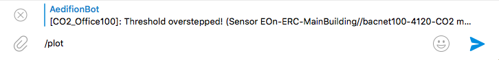

# Alarming

## Overview

In this article, you will learn how to set up alarms on time series and meta-data on the aedifion.io platform. Currently, the aedifion.io platform supports two types of alarms: i\) alarms on the observations for a datapoint and ii\) alarms on the throughput \(i.e., received observations per time interval\) of a certain datapoint or whole project \(please refer to our [Glossary](../glossary.md) if the terms datapoint and observation seem strange to you\). You will specify one of each and configure it to send out notifications on alarm events via the Telegram instant messenger or email.

### Types of alarms

The aedifion.io platform supports two versatile types of alarms:

* _Threshold alarms_ are defined on single datapoints and trigger an alarm whenever the measured values for that datapoint exceed \(or fall below\) a certain threshold. A typical use case for threshold alarms is notifying about unwanted system conditions such as high CO2 concentration in offices.
* _Throughput alarms_ are defined on single datapoints or whole projects and trigger an alarm whenever the measured throughput for that datapoint or project falls below a certain threshold. Thresholds can be set at three different levels to indicate the severity of missing throughput. Typical use cases for throughput alarms is fault detection by monitoring of the operational health of the building automation systems, e.g., alerting about the unscheduled shut-down of a critical component or notifying when a sensor is dead.

Further types of alarms will be added in future. If you have a special request, please [contact us](../contact.md).

## Adding alarms

A new alarm is created through the `POST /v2/project/{project_id}/alert` endpoint. The parameters that specify the alarm must be encoded as a [JSON](https://www.json.org/) object and send in the body of the request. Since the list of parameters is quite involved, we start with the set of parameters for threshold alarms.

<table>
  <thead>
    <tr>
      <th style="text-align:left">Parameter</th>
      <th style="text-align:center">Datatype</th>
      <th style="text-align:center">Type</th>
      <th style="text-align:center">Required</th>
      <th style="text-align:left">Description</th>
      <th style="text-align:left">Example</th>
    </tr>
  </thead>
  <tbody>
    <tr>
      <td style="text-align:left"><b>name</b>
      </td>
      <td style="text-align:center">string</td>
      <td style="text-align:center">body (JSON)</td>
      <td style="text-align:center">yes</td>
      <td style="text-align:left">The name of the new alarm. The name needs to be unique within the project
        scope.</td>
      <td style="text-align:left">CO2_Office-100</td>
    </tr>
    <tr>
      <td style="text-align:left"><b>alert_<br />type</b>
      </td>
      <td style="text-align:center">string</td>
      <td style="text-align:center">
        <p>body</p>
        <p>(JSON)</p>
      </td>
      <td style="text-align:center">yes</td>
      <td style="text-align:left">The type of the alarm, either 'threshold' or 'throughput'.</td>
      <td style="text-align:left">threshold</td>
    </tr>
    <tr>
      <td style="text-align:left"><b>telegram_<br />chatid</b>
      </td>
      <td style="text-align:center">string</td>
      <td style="text-align:center">body (JSON)</td>
      <td style="text-align:center">no</td>
      <td style="text-align:left">The id of a Telegram chat where notifications are sent to when the alarm
        is triggered (must be a chat that involves @aedifion_bot)</td>
      <td style="text-align:left">-219643311</td>
    </tr>
    <tr>
      <td style="text-align:left"><b>email</b>
      </td>
      <td style="text-align:center">string</td>
      <td style="text-align:center">
        <p>body</p>
        <p>(JSON)</p>
      </td>
      <td style="text-align:center">no</td>
      <td style="text-align:left">A comma-separated list of email recipients to which notifications are
        sent when the alarm is triggered.</td>
      <td style="text-align:left">
        <p>john.doe@aedifion.com, jane.doe@aedifion.com,</p>
        <p>alarm@aedifion.com</p>
      </td>
    </tr>
    <tr>
      <td style="text-align:left"><b>dataPointID</b>
      </td>
      <td style="text-align:center">string</td>
      <td style="text-align:center">
        <p>body</p>
        <p>(JSON)</p>
      </td>
      <td style="text-align:center">yes</td>
      <td style="text-align:left">The alphanumeric id of the datapoint on which to send alarms.</td>
      <td
      style="text-align:left">bacnet100-4120-CO2</td>
    </tr>
    <tr>
      <td style="text-align:left"><b>threshold_<br />dead</b>
      </td>
      <td style="text-align:center">float</td>
      <td style="text-align:center">
        <p>body</p>
        <p>(JSON)</p>
      </td>
      <td style="text-align:center">yes</td>
      <td style="text-align:left">The threshold for observations below which the datapoint is considered
        dead, offline, or broken.</td>
      <td style="text-align:left">100</td>
    </tr>
    <tr>
      <td style="text-align:left"><b>threshold_<br />ok</b>
      </td>
      <td style="text-align:center">float</td>
      <td style="text-align:center">
        <p>body</p>
        <p>(JSON)</p>
      </td>
      <td style="text-align:center">yes</td>
      <td style="text-align:left">The threshold for observations below which the datapoint is considered
        in correct state and any active alarm is reset.</td>
      <td style="text-align:left">900</td>
    </tr>
    <tr>
      <td style="text-align:left"><b>threshold_<br />crit</b>
      </td>
      <td style="text-align:center">float</td>
      <td style="text-align:center">
        <p>body</p>
        <p>(JSON)</p>
      </td>
      <td style="text-align:center">yes</td>
      <td style="text-align:left">The threshold for observations above which the datapoint is considered
        to be in critical state.</td>
      <td style="text-align:left">1300</td>
    </tr>
    <tr>
      <td style="text-align:left"><b>threshold_<br />order</b>
      </td>
      <td style="text-align:center">string</td>
      <td style="text-align:center">
        <p>body</p>
        <p>(JSON)</p>
      </td>
      <td style="text-align:center">no</td>
      <td style="text-align:left">The order of the thresholds. 'asc' as described, or 'desc' to reverse
        the order, basically flipping all comparisons.</td>
      <td style="text-align:left">asc</td>
    </tr>
    <tr>
      <td style="text-align:left"><b>period</b>
      </td>
      <td style="text-align:center">string</td>
      <td style="text-align:center">
        <p>body</p>
        <p>(JSON)</p>
      </td>
      <td style="text-align:center">yes</td>
      <td style="text-align:left">The time period after which an alert is resent when in critical state.
        h = hours, m = minutes, s = seconds.</td>
      <td style="text-align:left">2h</td>
    </tr>
  </tbody>
</table>Have you noted the gap between the _threshold\_ok_ and _threshold\_crit?_ This is called a hysteresis. The alarm will enter critical state once observations exceed the _threshold\_crit_ then fire warnings every 2 hours until observations fall below _threshold\_ok._ Of course, you can set _threshold\_ok_ equal to _threshold\_crit_ if you want alarms to recover immediately when observations fall below the critical threshold.

Let's add the above alarm and see what happens.



```python
from requests import post, get, put, delete
project_id = 4
api_url = "https://api.aedifion.io"

newalert = {
    'name': 'CO2_Office100',
    'alert_type': 'threshold',
    'telegram_chatid': '-219643311',
    'email': 'john.doe@aedifion.com',
    'dataPointID': 'bacnet100-4120-CO2',
    'threshold_dead': 100,
    'threshold_ok': 900,
    'threshold_crit': 1300,
    'threshold_order': 'asc',
    'period': '2h'    
}

r = post(api_url + "/v2/project/{}/alert".format(project_id),
         auth=john,
         json=newalert)

print(f"{r.status_code} - {r.text}")
```



Coming soon 🐒



Coming soon 🐒



The JSON-formatted response confirms that the alarm was successfully created and returns the details of the alarm:


```javascript
{
    "success": true,
    "operation": "create",
    "resource": {
        "created": "2018-11-22T15:34:14.292927751Z",
        "dataPointID": "bacnet100-4120-CO2",
        "email": "john.doe@aedifion.com",
        "id": 6,
        "name": "CO2_Office100",
        "period":7200000000000,
        "project_id": 4,
        "status": "enabled",
        "telegram_chatid": "-219643311",
        "threshold_crit":1300,
        "threshold_dead":100,
        "threshold_ok":900
    }
}
```

Note that the alarm has received a unique numeric id \(6\), the period of 2 hours has been translated into nanoseconds, and it has already been enabled.

You may already receive alarms or could try to provoke some by gathering a few people in your office, or directly breathing into the CO2 sensor. Otherwise, don't worry and head over to the next section where we are going to speed things up a bit.

## Modifying alarms

The previous alarm might have been set to defensively and not trigger unless there is small party going on in your office. In order to provoke an alert, we now set a ridiculously low _threshold\_crit_ and also define a much shorter reminder period for the repetition of the alarms.



```python
alert_id = 6
updatealert = {
    'threshold_ok': 100,
    'threshold_crit': 200,
    'period': '30s'
}

r = put(api_url + f"/v2/project/{project_id}/alert/{alert_id}",
        auth=john,
        json=updatealert)

print(f"{r.status_code} - {r.text}")
```



Coming soon 🐒



Coming soon 🐒



The response confirms that the alarm has been updated as requested:

```javascript
{
    "success": true,
    "operation": "update",
    "resource": {
        "id":6,
        "created": "2018-11-22T15:34:14.292927751Z",
        "dataPointID": "bacnet100-4120-CO2", 
        "email": "john.doe@aedifion.com",
        "name": "CO2_Office100",
        "period": 30000000000,
        "project_id": 4,
        "status": "enabled",
        "telegram_chatid": "-270800953",
        "threshold_crit": 200,
        "threshold_dead": 100,
        "threshold_ok": 900
    }
}
```

You will soon see the alerts from @aedifion\_bot dropping in to your Telegram chat \(or to your mail account\).


## Plotting alarms in Telegram

When we receive an alarm, e.g., on Telegram, we want to get a quick idea of what triggered the alarm. The first thing is then to actually look at the time series. Conveniently, we can do this through @aedifion\_bot right there in Telegram where the alerts are received. 


Due to data privacy protection, the plotting feature must first be activated for your Telegram chat. Please [contact the technical support](../contact.md) in this matter.  If it is not yet activated you will receive an error message accordingly. 


Follow the next four steps to plot the time series of a datapoint on which a threshold alert was triggered:

1. Right-click on one of the alarms and hit _Reply_


2. Reply to the selected alert with the message "/plot" \(messages starting with a slash `/` are interpreted as commands to the bot by the Telegram Bot API.\).



  3. Select how much history you need.


  4. Wait for the plot to be generated and inspect it.


In this example, we can observe that CO2 level started to rise rapidly with the beginning of the workday. This is quite normal and nothing to worry about.

## Pausing alarms


## Listing alarms

You can list all alarams \(act

## Deleting alarms

 

