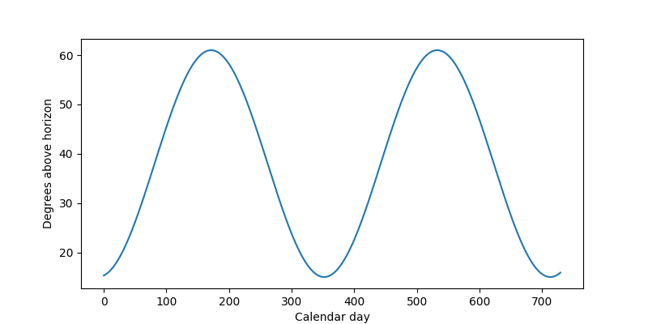

# Data import and export

## Overview

In this article, we will go through the process of first ingesting timeseries data into the platform by hand using CSV upload and later retrieving that timeseries data from the platform using different search criteria.

### Preliminaries

The examples provided in this article partly build on each other. For the sake of brevity, boiler plate code such as imports or variable definitions is only shown once and left out in subsequent examples.

To execute the examples provided in this tutorial, the following is needed:

* A valid login \(username and password\) to the aedifion.io platform. If you do not have a login yet, please [contact us](../../contact.md) regarding a demo login. The login used in the example will not work!
* A project configured for access to timeseries data.
* Optionally, a working installation of [Python](https://www.python.org/) or [Curl](https://curl.haxx.se/).

## Importing data

There are two ways of ingesting data into the aedifion.io platform:

* via [CSV upload](data-import.md#csv-upload)
* via MQTT as treated in the [MQTT Tutorial](../mqtt/) section

### CSV Upload

The `POST /v2/project/{project_id}/importTimeseries` endpoint allows uploading timeseries data in  [CSV format](https://en.wikipedia.org/wiki/Comma-separated_values). It accepts the following parameters:

<table>
  <thead>
    <tr>
      <th style="text-align:left">Parameter</th>
      <th style="text-align:center">Datatype</th>
      <th style="text-align:center">Type</th>
      <th style="text-align:center">Required</th>
      <th style="text-align:left">Description</th>
      <th style="text-align:left">Example</th>
    </tr>
  </thead>
  <tbody>
    <tr>
      <td style="text-align:left"><b>project_id</b>
      </td>
      <td style="text-align:center">int</td>
      <td style="text-align:center">path</td>
      <td style="text-align:center">yes</td>
      <td style="text-align:left">The numeric id of the project which to upload data to.</td>
      <td style="text-align:left">1</td>
    </tr>
    <tr>
      <td style="text-align:left"><b>format</b>
      </td>
      <td style="text-align:center">string</td>
      <td style="text-align:center">query</td>
      <td style="text-align:center">yes</td>
      <td style="text-align:left">The format of the uploaded data. Currently, only <code>csv</code> format
        is accepted.</td>
      <td style="text-align:left">csv</td>
    </tr>
    <tr>
      <td style="text-align:left"><b>on_error</b>
      </td>
      <td style="text-align:center">string</td>
      <td style="text-align:center">query</td>
      <td style="text-align:center">yes</td>
      <td style="text-align:left">How to handle parsing errors, either<em> </em><code>abort</code><em> </em>or <code>continue</code>.</td>
      <td
      style="text-align:left">abort</td>
    </tr>
    <tr>
      <td style="text-align:left"><b>import_<br />file</b>
      </td>
      <td style="text-align:center">file</td>
      <td style="text-align:center">formData</td>
      <td style="text-align:center">yes</td>
      <td style="text-align:left">The file containing the data to upload. The CSV dialect (delimiter, quote
        char, ...) is detected automatically.</td>
      <td style="text-align:left">
        <p>Datapoint1,20,2018-12-18</p>
        <p>Datapoint2,21,2018-12-19 9:00:00</p>
        <p>Datapoint3,39.5,2018-12-19 10:00:00+01</p>
      </td>
    </tr>
  </tbody>
</table>
**CSV Format**

The preferred CSV format for the uploaded data uses `,` as delimiter and `"` as quote character and has exactly the following three columns:

1. The datapoint identifier
2. The measurement value
3. The RFC3339-format timestamp of the measurement

E.g.,

```text
SimpleDPName,100,2018-12-18 8:00:00
"DP with spaces",102.2,2018-12-18 9:00:00
"DP with 'single' quotes, ""double"" qutoes, and delimiter",30,2018-12-18
...
```

Different CSV dialects \(column delimiters, quote chars, ...\) as well as datetime formats may be used. Differing formats are detected and processed automatically.


#### Example of correct file upload

As a first example, let's upload a correct file. We choose to abort on error, so that either the file is uploaded as a whole or nothing is uploaded at all. We're using the following test file which demonstrates different correct formats for datapoint identifiers and timestamps:

```text
"DP with blanks and delimiter ,",10,2018-12-17
DP with forward / slashes // in it,11.1,2018-12-17 1:00:00.000
"DP with single 'qutoes', double ""qutoes"", and the delimiter ','",12.3,2018-12-17T3:00:00+01
Emojimania 😄😁😅😂😌😍,100,2018-12-17 4:00:00+01:00
SimpleASCIIDatapoint,-1,2018-12-17 04:00:00Z
```

This test file is posted to the API endpoint together with the desired query parameters.



```python
from requests import post
api_url = "https://api.aedifion.io"
auth = ('john.doe@aedifion.com', 'mys3cr3tp4ssw0rd')
project_id = 1
query = {'format':'csv', 'on_error':'abort'}
filename = 'test_upload.csv'
r = post(f"{api_url}/v2/project/{project_id}/importTimeseries",
         auth=auth,
         params=query,
         files={'import_file':open(filename, 'rb')})
print(r.status_code, r.text)
```



```bash
curl https://api.aedifion.io/v2/project/1/importTimeseries?format=csv&on_error=abort
    -X POST 
    -u john.doe@aedifion.com:mys3cr3tp4assw0rd
    --header 'Content-Type: multipart/form-data' 
    -F 'import_file=@test_upload_file.csv'   
```


**Curl on windows cmd:**

The windows cmd handles quotes and special characters differently from other systems! This curl request on windows is, e.g.:


```bash
curl "https://api.aedifion.io/v2/project/1/importTimeseries?format=csv&on_error=abort"
    -X POST
    -u john.doe@aedifion.com:mys3cr3tp4assw0rd
    --header "Content-Type: multipart/form-data"
    -F "import_file=@test_upload_file.csv"
```



1. Point your browser to [https://api.aedifion.io/ui/](https://api.aedifion.io/ui/).
2. Click _Authorize_ on the upper right and provide your login.
3. From the main tags \(Meta, Company, ...\) select the _Project_ tag ,then the `POST /v2/project/{project_id}/importTimeseries` endpoint \(green\).
4. Choose `on_error = abort` and select a `test_upload_file.csv` from disk.
5. Click "_Try it out!_".
6. Inspect the response body and code.



The JSON-formatted response confirms how many lines were parsed and uploaded successfully and how many lines could not be processed. Those lines that could not be parsed are bounced back in the _error_ subfield of the _resource_ field.

```javascript
{
    "success":true,
    "operation": "create",
    "resource": {
        "total_lines_success": 5,
        "total_lines_error": 0,
        "errors":[],        
        "project_id": 1
    }
}
```

Go on and query the project's datapoints through `GET /v2/project/{project_id}` and verify that the uploaded datapoints are all there.

```javascript
[
  ...,
  "DP with blanks and delimiter ,",
  "DP with forward / slashes // in it",
  "DP with single 'qutoes', double \"qutoes\", and the delimiter ','",
  "Emojimania 😄😁😅😂😌😍",
  "SimpleASCIIDatapoint",
  ...
]
```

#### Example of incorrect file upload

As a second example, we now upload the following file that is full of errors:

```text
CorrectDatapoint,100,2018-12-18 4:00:00
"Datapoint with backslash \ in it",100,2018-12-18 4:00:00
IncorrectTimestamp,100,181218 40000
IncorrectValue,asdf,2018-12-18 4:00:00
UnescapedDelimiter,inDatapointName,100,2018-12-18 4:00:00
,100,2018-12-18 4:00:00
```

Using `on_error = abort`, the API will abort on the first encountered error, discarding any lines that have potentially been parsed successfully prior to the error:

```javascript
{
    "error": "Error in line 2: Datapoint identifier contains backslash: 'Datapoint with backslash \\ in it'",
    "operation": "create",
    "success": false
}
```

Using `on_error = continue`, the API will continue on error and try to parse the other lines. Note that the response code will always be `200 - OK` but will include all lines that could not be parsed.

```javascript
{
    "operation": "create",
    "resource": {
        "total_lines_success": 1,
        "total_lines_error": 5,
        "errors": [
            {"line_no":2, "error":"Datapoint identifier contains backslash: 'Datapoint with backslash \\ in it'"},
            {"line_no":3, "error":"Could not parse third field as datetime: '181218 40000'"},
            {"line_no":4, "error":"Could not parse second field as float: 'asdf'"},
            {"line_no":5, "error":"Could not parse second field as float: 'inDatapointName'"},
            {"line_no":6, "error":"Datapoint identifier is empty"}
        ]   
       "project_id": 1,
    },
    "success":true
}
```

The response tells us that only one line was imported successfully \(the _CorrectDatapoint_\) while all other lines contained different kinds of errors. Again, note that the endpoint will always return `200 - OK` if `on_error = continue` is set, even if not a single line could be successfully parsed.

## Exporting data

There are two ways of retrieving data from the aedifion.io platform:

* via JSON export
* via MQTT as treated in the [MQTT Tutorial](../mqtt/) section

### JSON export

The endpoint `GET /v2/datapoint/timeseries` allows querying the data of single [datapoints](../../glossary.md#datapoint) by start and end while optionally using down-sampling or limiting the number of returned [observations](../../glossary.md#observation). Down-sampling is performed by a zero order hold interpolation of the stored observations \(CoV based storage\).

| Parameter | Datatype | Type | Required | Description | Example |
| :--- | :---: | :---: | :---: | :--- | :--- |
| **project\_id** | int | query | yes | The numeric id of the project from which to query a datapoint. | 1 |
| **dataPointID** | string | query | yes | The alphanumeric identifier of the datapoint to query. | bacnet100-4120-CO2 |
| **start** | datetime | query | no | Return only observations _after_ this time. If _start_ is provided without _end_, the first _max_ elements after _start_ are returned. | 2018-12-18 00:00:00 |
| **end** | datetime | query | no | Return only observations _before_ this time. If _end_ is provided without _start_, the last _max_ elements before _end_ are returned. | 2018-12-18 23:59:00 |
| **max** | int | query | no | Maximum number of observations to return. This option is ignored when both _start_ and _end_ are provided. Setting `max = 0` returns all __available data points. | 0 |
| **samplerate** | string | query | no | The returned observations are sampled down to the specified interval. Allowed intervals are integers combined with durations, like seconds \(s\), minutes \(m\), hours \(h\), and days \(d\), e.g. `10s`or `2m`. | 1h |

Before we use that endpoint to shoot a couple of example queries for the data, let's insert some more useful data via the [CSV upload described above](data-import.md#csv-upload).



This dataset describes the degree of the sun over the horizon by calendar days. With day 0 equal to new year's, the data looks like this:



#### Querying by time window

Let's assume we only want to know the data for one year, e.g., 2018. We can query for this time window by setting the _start_ and _end_ parameters accordingly.



```python
from requests import get

api_url = "https://api.aedifion.io"
auth = ("john.doe@aedifion.com", "mys3cr3tp4ssw0rd")

query = {"project_id":1,"dataPointID":"SunDegreeOverHorizon","start":"2018-01-01","end":"2018-12-31"}
r = get("{}/v2/datapoint/timeseries".format(api_url),auth=auth,params=query)
print(r.status_code, r.text)
```



```bash
curl 'https://api.aedifion.io/v2/datapoint/timeseries?project_id=1&dataPointID=SunDegreeOverHorizon&start=2018-01-01&end=2018-12-31'
    -u john.doe@aedifion.com:mys3cr3tp4ssw0rd
```



1. Point your browser to [https://api.aedifion.io/ui/](https://api.aedifion.io/ui/).
2. Click _Authorize_ on the upper right and provide your login.
3. From the main tags \(Meta, Company, ...\) select the _Datapoint_ tag, then the `GET /v2/datapoint/timeseries` endpoint \(blue\).
4. Enter _start_ \(2018-01-01\) and _end_ \(2018-12-31\) parameter.
5. Click "_Try it out!_".
6. Inspect the response body and code.



```cpp
api_url = 'https://api.aedifion.io';
auth = weboptions('Username','john.doe@aedifion.com','Password','mys3cr3tp4ssw0rd');

project_id = 1;
Start = ['start=','2018-01-01'];
End = ['end=','2018-12-31'];
dataPointID = ['dataPointID=','SunDegreeOverHorizon'];

timeseries = webread([api_url,'/v2/datapoint/timeseries','?project_id=',num2str(project_id),'&',dataPointID,'&',Start,'&',End],auth);
struct2cell(timeseries.data)
```



The JSON-formatted response contains all observations that could be retrieved for this time period in the _data_ field sorted in ascending order by time. The field _dataPointID_ contains the identifier of the queried datapoint and the field _tags_ lists potential tags on this datapoint.

```javascript
{
    "data": [
        {"time":"2018-01-01T00:00:00Z","value":15.298911202642628},
        {"time":"2018-01-02T00:00:00Z","value":15.366655118104344},
        ...
        {"time":"2018-06-20T00:00:00Z","value":60.99433444799632},
        {"time":"2018-06-21T00:00:00Z","value":60.99973544587385},
        {"time":"2018-06-22T00:00:00Z","value":60.99817321953259},
        ...
        {"time":"2018-12-30T00:00:00Z","value":15.433282646399174},
        {"time":"2018-12-31T00:00:00Z","value":15.514008919830662}
    ],
    "dataPointID":"SunDegreeOverHorizon",
    "tags":[]
}
```

#### Querying with downsampling 

The above response returns 365 datapoints in roughly 21 KB of data. Now suppose we do not need such high fidelity data but are content with weekly data and would prefer a faster download. We just add `samplerate=7d` to the above query.



```bash
curl 'https://api.aedifion.io/v2/datapoint/timeseries?project_id=1&dataPointID=SunDegreeOverHorizon&start=2018-01-01&end=2018-12-31&samplerate=7d'
    -u john.doe@aedifion.com:mys3cr3tp4ssw0rd
```



The response now only contains 52 datapoints in 3 KB. Instead of the actual values, we now get the mean over the sample period while the timestamp denotes the _left_ boundary of the sample period, e.g., the mean over the sun's position in degrees over the horizon in the period `2017-12-28` to `2018-01-04` is `15.368...`

```javascript
{
    "data": [
        {"mean":15.36893921764112,"time":"2017-12-28T00:00:00Z"},
        {"mean":15.821112043330746,"time":"2018-01-04T00:00:00Z"},
        {"mean":16.71902616129376,"time":"2018-01-11T00:00:00Z"},
        ...
        {"mean":15.041726940133113,"time":"2018-12-13T00:00:00Z"},
        {"mean":15.074493316285318,"time":"2018-12-20T00:00:00Z"},
        {"mean":15.366242583489504,"time":"2018-12-27T00:00:00Z"}
    ],
    "dataPointID": "SunDegreeOverHorizon",
    "tags": []
}
```

#### Querying with limit

Finally, suppose we are only interested in the two days before and after midsummer, i.e., 2018-06-21. We can set `start=2018-06-19` and limit the query to five datapoints by setting `max=5`. Don't forget to remove the `end` parameter otherwise `max` is ignored.



```bash
curl 'https://api.aedifion.io/v2/datapoint/timeseries?project_id=1&dataPointID=SunDegreeOverHorizon&start=2018-06-19&max=5'
    -u john.doe@aedifion.com:mys3cr3tp4ssw0rd
```



```javascript
{
    "data": [
        {"time":"2018-06-19T00:00:00Z","value":60.981971861064864},
        {"time":"2018-06-20T00:00:00Z","value":60.99433444799632},
        {"time":"2018-06-21T00:00:00Z","value":60.99973544587385},
        {"time":"2018-06-22T00:00:00Z","value":60.99817321953259},
        {"time":"2018-06-23T00:00:00Z","value":60.98964824194026}
    ],
    "dataPointID": "SunDegreeOverHorizon",
    "tags": []
}
```

Indeed, midsummer is the brightest day in the year where the sun reaches a maximum of nearly 71° above the horizon.

